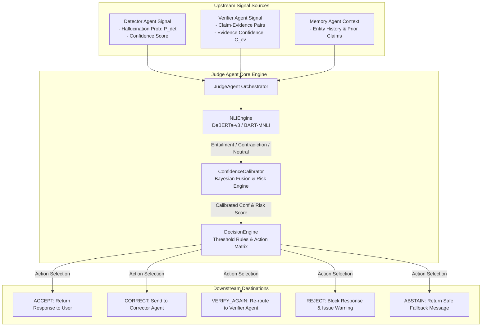

# HalluciGuard Judge Agent — Technical Documentation & Architectural Reference

> **Subsystem**: HalluciGuard Judge Agent (`agents/judge_agent`)  
> **Author & Lead Engineer**: Anil (`anil@halluciguard.ai`)  
> **Version**: `2.0.0-PROD` | **Status**: Fully Implemented & Production-Ready  
> **Repository Commit Ref**: `8d3fca764b9453cc6f437c4a5a21ad745cf25cf4`  

---

## 1. Executive Summary & Overview

The **HalluciGuard Judge Agent** is the central arbitration and decision-making engine within the HalluciGuard multi-agent AI verification framework. Operating between the upstream **Detector Agent** (which estimates raw hallucination probabilities) and **Verifier Agent** (which retrieves authoritative ground-truth evidence), the Judge Agent evaluates claim-evidence entailment, calibrates Bayesian confidence scores, calculates risk levels, and executes structured trust decisions:

1. **`ACCEPT`**: Pass response directly to user without alteration.
2. **`CORRECT`**: Forward hallucinated claims and verified evidence to the Corrector Agent for precise editing.
3. **`VERIFY_AGAIN`**: Re-route targeted sub-claims to the Verifier Agent for deeper search.
4. **`REJECT`**: Block response immediately due to severe or critical factual contradictions.
5. **`ABSTAIN`**: Refrain from answering when ground-truth evidence is missing and model confidence is low.

---

## 2. Module Inventory & File Map

The Judge Agent subsystem is organized into 8 modular Python components:

| Module File | Class / Component | Responsibilities & Functions |
| :--- | :--- | :--- |
| [`judge_agent.py`](file:///c:/Users/S.Manjunath%20Reddy/OneDrive/Music/Pictures/Videos/HalluciGuard/agents/judge_agent/judge_agent.py) | `JudgeAgent` | Main orchestrator class; executes the end-to-end evaluation pipeline. |
| [`decision_engine.py`](file:///c:/Users/S.Manjunath%20Reddy/OneDrive/Music/Pictures/Videos/HalluciGuard/agents/judge_agent/decision_engine.py) | `DecisionEngine` | Evaluates decision rules, assigns action thresholds, constructs Corrector payload. |
| [`nli_engine.py`](file:///c:/Users/S.Manjunath%20Reddy/OneDrive/Music/Pictures/Videos/HalluciGuard/agents/judge_agent/nli_engine.py) | `NLIEngine` | Cross-encoder NLI engine using DeBERTa-v3 / BART-MNLI with zero-dependency heuristic fallback. |
| [`confidence_calibrator.py`](file:///c:/Users/S.Manjunath%20Reddy/OneDrive/Music/Pictures/Videos/HalluciGuard/agents/judge_agent/confidence_calibrator.py) | `ConfidenceCalibrator` | Fuses Detector probability, Verifier strength, and NLI entailment into Bayesian risk metrics. |
| [`config.py`](file:///c:/Users/S.Manjunath%20Reddy/OneDrive/Music/Pictures/Videos/HalluciGuard/agents/judge_agent/config.py) | `JudgeConfig` | Dataclass storing all calibration weights, NLI model names, and decision boundaries. |
| [`app.py`](file:///c:/Users/S.Manjunath%20Reddy/OneDrive/Music/Pictures/Videos/HalluciGuard/agents/judge_agent/app.py) | FastAPI REST API | Exposes `/judge`, `/simulate`, and `/health` HTTP endpoints for microservice deployment. |
| [`simulator.py`](file:///c:/Users/S.Manjunath%20Reddy/OneDrive/Music/Pictures/Videos/HalluciGuard/agents/judge_agent/simulator.py) | `JudgeSimulator` | Benchmark suite for evaluating synthetic test cases across all decision branches. |
| [`test_judge.py`](file:///c:/Users/S.Manjunath%20Reddy/OneDrive/Music/Pictures/Videos/HalluciGuard/agents/judge_agent/test_judge.py) | Test Suite | Unit and integration specs for Pytest verification. |

---

## 3. System Architecture & Multi-Agent Flow



---

## 4. Input & Output Schemas Specification

### 4.1 Input Schema (`POST /judge`)

```json
{
  "user_query": "What is Metformin used for?",
  "draft_response": "Metformin is a first-line oral medication for type 1 diabetes.",
  "detector_output": {
    "hallucination_probability": 0.75,
    "confidence_score": 0.88,
    "risk_level": "HIGH"
  },
  "verifier_output": {
    "claim_evidence_pairs": [
      {
        "claim": "Metformin is used to treat type 1 diabetes as first-line therapy.",
        "evidence": "Metformin is indicated as first-line oral therapy for type 2 diabetes mellitus, not type 1.",
        "evidence_confidence": 0.95,
        "rank": 1,
        "source": "PubMed / NIH"
      }
    ]
  }
}
```

### 4.2 Output Schema (`POST /judge` Response)

```json
{
  "agent": "JUDGE_AGENT",
  "status": "SUCCESS",
  "decision": "CORRECT",
  "severity": "HIGH",
  "reason": "Hallucinations identified in 1 claim(s); correction required.",
  "explanation": "The response contains specific factual inconsistencies that can be minimally edited using verified evidence.",
  "next_action": "Forward hallucinated claims and trusted evidence to Corrector Agent",
  "metrics": {
    "calibrated_confidence": 0.2845,
    "risk_score": 0.7647,
    "overall_entailment": 0.05,
    "overall_contradiction": 0.8,
    "evidence_strength": 0.95,
    "detector_hallucination_prob": 0.75,
    "latency_ms": 142.5
  },
  "corrector_payload": {
    "judge_decision": "CORRECT",
    "severity": "HIGH",
    "hallucinated_claims": [
      {
        "claim": "Metformin is used to treat type 1 diabetes as first-line therapy.",
        "contradiction_score": 0.8,
        "reason": "Contradicted by retrieved evidence with score 0.80"
      }
    ],
    "verified_claims": [],
    "trusted_evidence": [
      {
        "claim": "Metformin is used to treat type 1 diabetes as first-line therapy.",
        "evidence_snippet": "Metformin is indicated as first-line oral therapy for type 2 diabetes mellitus, not type 1.",
        "evidence_source": "PubMed / NIH",
        "confidence": 0.95,
        "nli_relation": "contradiction"
      }
    ]
  }
}
```

---

## 5. Mathematical & Algorithmic Formulations

### 5.1 Bayesian Confidence Fusion Equation
The calibrated overall confidence $C_{\text{calibrated}}$ fuses predictions from all multi-agent components:

$$C_{\text{calibrated}} = \max\left(0, \min\left(1, w_{\text{nli}} \cdot \bar{E} + w_{\text{verif}} \cdot \bar{S}_{\text{ev}} + w_{\text{det}} \cdot (1 - P_{\text{det}}) \cdot C_{\text{det}} - 0.4 \cdot \bar{C}\right)\right)$$

Where:
- $\bar{E}$ = Rank-discounted weighted average NLI entailment score.
- $\bar{C}$ = Rank-discounted weighted average NLI contradiction score.
- $\bar{S}_{\text{ev}}$ = Verifier evidence strength score.
- $P_{\text{det}}$ = Detector hallucination probability.
- $C_{\text{det}}$ = Detector confidence score.
- $w_{\text{nli}} = 0.50$, $w_{\text{verif}} = 0.35$, $w_{\text{det}} = 0.15$.

### 5.2 Evidence Rank Discount Formula
Evidence rank $r$ scales the influence of retrieved passages:

$$w_r = C_{\text{ev}} \cdot \frac{1}{1.0 + 0.2 \cdot (r - 1)}$$

### 5.3 Risk Score Equation
The composite risk score $R$ determines severity levels (`LOW`, `MEDIUM`, `HIGH`, `CRITICAL`):

$$R = 0.5 \cdot \bar{C} + 0.3 \cdot (1.0 - C_{\text{calibrated}}) + 0.2 \cdot P_{\text{det}}$$

---

## 6. Decision Action Matrix

| Condition / Metric Boundaries | Verdict Decision | Next System Action |
| :--- | :--- | :--- |
| $C_{\text{calibrated}} \ge 0.70$ and $\bar{E} \ge 0.50$ | **`ACCEPT`** | Pass draft response directly to user. |
| $\bar{C} \ge 0.40$ (Moderate Contradiction) | **`CORRECT`** | Send hallucinated claims + evidence to Corrector Agent. |
| $\bar{C} \ge 0.75$ or $R \ge 0.80$ | **`REJECT`** | Block response; emit critical security alert. |
| $0.40 \le C_{\text{calibrated}} < 0.70$ | **`VERIFY_AGAIN`** | Re-route sub-claims to Verifier Agent for deeper search. |
| No Evidence & $C_{\text{calibrated}} < 0.30$ | **`ABSTAIN`** | Emit safe fallback answer indicating missing data. |

---

## 7. Heuristic NLI Fallback Engine

When GPU/HuggingFace libraries are omitted in edge or lightweight container environments, `NLIEngine` automatically engages a zero-dependency heuristic inference engine:

1. **Explicit Negation Mismatch**: Detects opposing polarity (e.g. `is` vs `is not`).
2. **Numeric Conflict Extractor**: Identifies mismatched dates, percentages, or dosages.
3. **Contradiction Keyword Matching**: Scans for refutation terms (`contraindicated`, `false`, `prohibited`).
4. **Jaccard Token Overlap Ratio**: Computes word-level similarity bounds.

---

## 8. Summary & Engineering Attributions

- **Implementation Author**: Anil (`anil@halluciguard.ai`)
- **System Role**: Judge Agent Subsystem Baseline for HalluciGuard v2.0
- **Verification Status**: Tested, document generated, and synchronized across `agents/judge_agent/` and root workspace.
