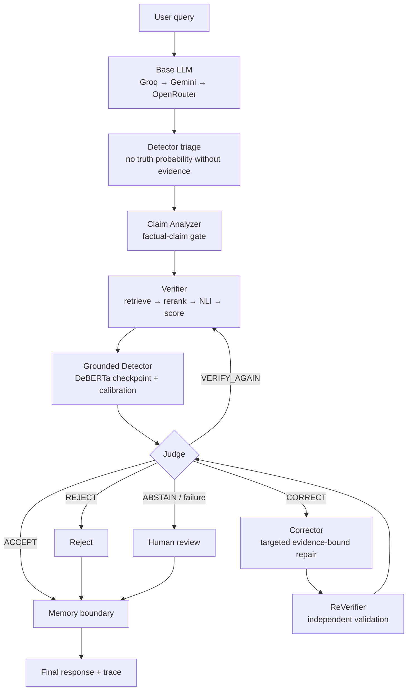
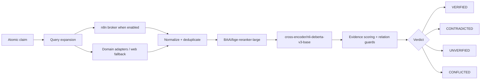

<div align="center">

# HalluciGuard

### Evidence-grounded hallucination detection, verification, correction, and memory for LLM answers

[](https://www.python.org/)
[](https://fastapi.tiangolo.com/)
[](https://langchain-ai.github.io/langgraph/)
[](https://nextjs.org/)
[](LICENSE)

[Live application](https://halluciguard-ai.vercel.app) · [Architecture](docs/architecture.md) · [Agent guide](docs/agents.md) · [API reference](docs/api.md) · [Run the demo](demo/README.md)

</div>

## What is HalluciGuard?

HalluciGuard is a research-oriented AI trust layer that takes a user question, generates an answer, decomposes it into checkable claims, retrieves external evidence, evaluates support and contradiction, and decides whether the answer may be released, corrected, rejected, or withheld for human review.

The design separates responsibilities deliberately. A language model can generate fluent text; it cannot certify its own facts. Retrieval can find passages; it cannot decide whether they entail a claim. A learned Detector can estimate evidence-conditioned risk; it is not an open-world truth oracle. The Verifier and Judge therefore remain independent factual and policy boundaries.

HalluciGuard does **not** claim perfect hallucination detection, universal factual coverage, or autonomous suitability for high-stakes decisions. Missing evidence remains missing evidence, and degraded components fail closed.

## Implemented architecture

The current backend has one Base LLM plus seven trust stages. The trained Detector has two phases: inexpensive pre-retrieval triage and evidence-grounded model inference after retrieval.



Retrieval may use the n8n webhook broker when configured. The Python Verifier owns ranking, NLI, evidence semantics, and verdicts; n8n is never treated as the factual authority.

## Why each stage exists

| Stage | Receives | Produces | Boundary it enforces |
|---|---|---|---|
| Base LLM | User query and optional history | Candidate response and provider trace | Generates text; assigns no factual trust |
| Claim Analyzer | Candidate response | Atomic factual claims and search queries | Removes opinion, discourse, instructions, and other non-checkable text; does not decide truth |
| Detector | Query, answer, then retrieved evidence | Calibrated risk, per-sentence labels, routing signal | Triage only; cannot replace verification |
| Verifier | Factual claims | Evidence, NLI labels, four-state claim verdicts | Establishes evidence-grounded support, contradiction, conflict, or uncertainty |
| Judge | Detector and Verifier contracts | `ACCEPT`, `CORRECT`, `VERIFY_AGAIN`, `REJECT`, or `ABSTAIN` | Owns release policy; does not retrieve or rewrite facts |
| Corrector | Judge-authorized claims and bound evidence | Minimal corrected candidate or explicit failure | May edit only authorized spans and may not invent unsupported facts |
| ReVerifier | Corrected candidate | Pass/fail and remaining contradictions | Independently prevents model echo, off-topic repair, and unverified release |
| Memory | Judge-approved verified reports | Stored, duplicate, failed, or skipped result | Persists accepted verified facts; memory is reusable context, not automatically current truth |

Detailed contracts and failure behavior are in [docs/agents.md](docs/agents.md) and the [agent documentation index](agents/README.md).

## Detector: trained, grounded, and calibrated

The production artifact at `artifacts/detector-best/` is a fine-tuned `microsoft/deberta-v3-xsmall` three-class sequence classifier over `(evidence, sentence)` pairs. It was trained from RAGTruth human annotations converted to `SUPPORTED`, `CONTRADICTED`, and `NOT_ENOUGH_INFO` sentence labels.

| Recorded artifact fact | Value |
|---|---:|
| Train examples | 29,832 |
| Development examples | 10,873 |
| Untouched test examples | 18,777 |
| Training run | 1 epoch, batch size 16, seed 42 |
| Calibration | Temperature scaling, `T = 0.7586` |
| Decision threshold | `0.6216` |
| Held-out accuracy | `0.8655` |
| Held-out F1 | `0.3907` |
| Held-out ROC-AUC | `0.8212` |
| Held-out ECE | `0.1296` |

These are checkpoint metrics from [`test_metrics.json`](artifacts/detector-best/test_metrics.json), not claims of open-world production accuracy. See the [model card](halluciguard_detector/MODEL_CARD.md) and [detector guide](halluciguard_detector/README.md).

## Verification pipeline



## Live E2E demonstration

The September 25, 2026 live run for `Who founded Microsoft?` exercised the production graph and local models:

| Stage | Observed result |
|---|---|
| Base LLM | Groq `openai/gpt-oss-120b` generated Bill Gates and Paul Allen with the April 4, 1975 date |
| Claim Analyzer | 2 factual claims |
| Verifier | 2 `VERIFIED` claims with Wikipedia evidence |
| Grounded Detector | Artifact loaded; inference executed; calibration applied; probability `0.5596`; risk `MEDIUM` |
| Judge | `ACCEPT` — all claims verified |
| Corrector / ReVerifier | `NOT_REQUIRED` for this accepted answer |
| Memory | 2 facts stored in that run |
| Terminal status | `accepted` / `verified_and_accepted` |

This is a live demonstration, not a benchmark. Re-run it with the query-only CLI:

```powershell
python demo_7_agents.py "Who founded Microsoft?"
```

## Quick start

```powershell
git clone https://github.com/Manju10092006/HalluciGuard.git
cd HalluciGuard
python -m venv .venv
.\.venv\Scripts\Activate.ps1
python -m pip install -r requirements.txt
Copy-Item .env.example .env
```

Add server-side credentials to `.env`, then run one of:

```powershell
python demo_7_agents.py --interactive
python run_server.py
uvicorn orchestration.api:app --host 0.0.0.0 --port 8000
```

The first model-backed request can take longer while local Transformers models initialize.

## Configuration

The checked-in [`.env.example`](.env.example) contains placeholders and safe defaults. Credentials belong only in the ignored `.env` file.

| Area | Variables |
|---|---|
| LLM providers | `GROQ_API_KEY`, `GEMINI_API_KEY`, `OPENROUTER_API_KEY`, `HALLUCIGUARD_LLM_PROVIDER_ORDER` |
| Detector | `HALLUCIGUARD_DETECTOR_MODEL`, `ALWAYS_VERIFY`, `ALLOW_DETECTOR_FAST_PATH` |
| Retrieval | `N8N_RETRIEVAL_ENABLED`, `N8N_RETRIEVAL_WEBHOOK_URL`, `N8N_WEBHOOK_SECRET`, `TAVILY_API_KEY` |
| Verifier models | `RERANKER_MODEL`, `NLI_MODEL`, `ALLOW_MODEL_DOWNLOADS` |
| Corrector | `HG_CORRECTOR_PROVIDER`, `HG_CORRECTOR_*_MODEL`, `HG_CORRECTOR_MAX_RETRIES` |
| API/auth | `JWT_SECRET`, `GOOGLE_CLIENT_ID`, `CORS_ORIGINS`, `AUTH_DB_PATH` |

Never expose provider keys through Next.js public environment variables. See [SECURITY.md](SECURITY.md).

## Repository map

The project intentionally keeps its working imports stable; it does not perform a cosmetic migration into a new backend `src/` package.

```text
HalluciGuard/
├── frontend-v2/                 # Active Next.js 15 application
│   ├── src/app/                 # App Router pages/layouts
│   ├── src/components/          # UI and agent-activity components
│   ├── src/lib/                 # API client and shared utilities
│   └── public/                  # Static assets
├── frontend/                    # Retained legacy frontend implementation
├── orchestration/               # LangGraph graph, state, contracts, FastAPI
├── services/                    # Base LLM, providers, claim analysis, n8n client
├── halluciguard_detector/       # Trained grounded Detector package and API
├── artifacts/detector-best/     # Checkpoint, tokenizer, calibration, metrics
├── agents/                      # Verifier, Judge, Corrector and Memory packages
├── n8n/                         # Retrieval workflow exports
├── scripts/                     # Diagnostics, demos and validation utilities
├── tests/                       # Cross-package regression tests
├── docs/                        # Architecture, agents, APIs, research and experiments
├── app.py                       # Hugging Face/Gradio deployment entry point
└── demo_7_agents.py             # Query-only full backend demonstration
```

See [docs/project-structure.md](docs/project-structure.md) for the detailed frontend/backend/`src`/API map.

## Testing

```powershell
python -m pytest -q orchestration/tests/test_detector_bridge.py orchestration/tests/test_grounded_detector_node.py
python -m pytest -q orchestration/tests services/tests halluciguard_detector/tests tests
```

Some integration tests require network access, provider credentials, n8n, or model downloads. Tests must label mocked, offline, and live execution separately. See [tests/README.md](tests/README.md).

## Documentation

| Topic | Document |
|---|---|
| System and control flow | [Architecture](docs/architecture.md) |
| Every agent and contract | [Agents](docs/agents.md) |
| Frontend, backend, `src`, and APIs | [Project structure](docs/project-structure.md) |
| REST endpoints | [API reference](docs/api.md) |
| Retrieval and n8n | [Retrieval](docs/retrieval.md) · [n8n](n8n/README.md) |
| Verifier semantics | [Verification](docs/verification.md) |
| LLM routing | [LLM providers](docs/llm-providers.md) |
| Training and demonstrations | [Experiments](docs/experiments.md) |
| Papers, datasets and models | [Research](docs/research.md) |
| Operations | [Deployment](docs/DEPLOYMENT.md) · [Runbook](docs/runbook.md) |

## Limitations

- Detector metrics are dataset-specific; recall and F1 do not justify autonomous final decisions.
- Retrieval coverage depends on source availability, credentials, rate limits, and query quality.
- NLI and reranking models can be wrong, especially with temporal, numerical, negated, or multi-entity claims.
- `NOT_ENOUGH_INFO` and `UNVERIFIED` are uncertainty states, not proof that a claim is false.
- Memory can become stale and is persisted only after acceptance; it must still be revalidated when current truth matters.
- High-stakes medical, legal, financial, cybersecurity, and safety decisions require qualified human review.

## Team

The project homepage intentionally lists only the requested project profiles. GitHub's automatically generated contributor analytics derive from commit authorship and may also show automation accounts; history is not rewritten to alter that record.

- [Manju10092006](https://github.com/Manju10092006)
- [anil12345-by](https://github.com/anil12345-by)
- [KushalMadhan3](https://github.com/KushalMadhan3)
- [Snehith-0607](https://github.com/Snehith-0607)
- [GauravPendyal](https://github.com/GauravPendyal)

## Contributing, security, and license

Read [CONTRIBUTING.md](CONTRIBUTING.md) before opening a pull request. Report security issues according to [SECURITY.md](SECURITY.md), not in a public issue. HalluciGuard is distributed under the [MIT License](LICENSE); third-party datasets, models, APIs, and repositories retain their own terms.
