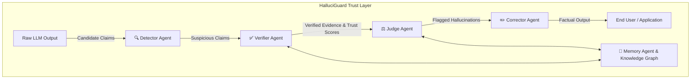
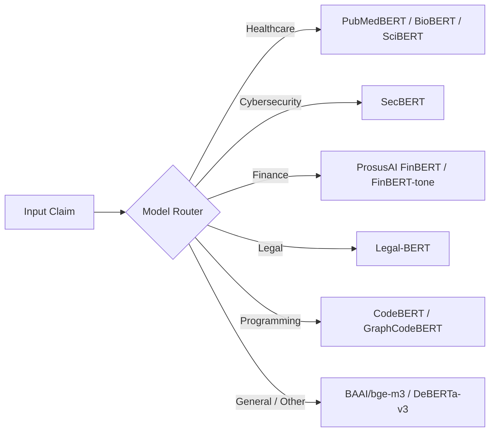

# HalluciGuard 🛡️

### Enterprise AI-Powered Multi-Agent Trust Layer for LLM Output Verification

[](https://www.python.org/)
[](https://fastapi.tiangolo.com/)
[](https://docs.pytest.org/)
[](https://opensource.org/licenses/MIT)

---

## 🎯 What is HalluciGuard?

**HalluciGuard** is an enterprise-grade, multi-agent platform designed to detect, verify, judge, and correct factual hallucinations in Large Language Model (LLM) outputs. Operating as an autonomous **trust layer** between raw LLM generation and end-user applications, HalluciGuard guarantees factual precision across 30+ domain categories using official APIs and specialized domain ML models.

> *"Don't trust. Verify."*

---

## 🏗️ Multi-Agent System Architecture



---

## 🤖 Multi-Agent Ecosystem Status

| Agent | Port | Status | Primary Function |
| :--- | :--- | :--- | :--- |
| 🔍 **Detector Agent** | `8001` | 🟡 In Development | Identifies factual assertions and candidate hallucinations |
| ✅ **Verifier Agent** | `8002` | 🟢 **Production Ready** | Entity-aware multi-source retrieval & DeBERTa NLI verification |
| ⚖️ **Judge Agent** | `8003` | 🟢 **Operational** | Risk-calibrated decision engine & conflict arbitration |
| ✏️ **Corrector Agent** | `8004` | 🟡 Planned | Re-synthesizes hallucinated content with verified evidence |
| 🧠 **Memory Agent** | `8005` | 🟡 Planned | Persistent domain knowledge graph & evaluation history |

---

## 🔬 Verifier Agent Deep Dive (`agents/verifier_agent/`)

The **Verifier Agent** executes a 9-stage verification pipeline utilizing entity resolution and domain-specific ML models:

```text
[Stage 1] DOMAIN VALIDATION & ROUTING  ──► Validates request domain & routes to specialized models
[Stage 2] CLAIM DECOMPOSITION         ──► Decomposes compound claims into atomic assertions
[Stage 3] ENTITY RESOLUTION & EXPANSION──► Canonicalizes CVEs, SEC CIKs, Drug MeSH terms & tickers
[Stage 4] MULTI-SOURCE RETRIEVAL       ──► Executes parallel search across official APIs (NVD, SEC, PubMed, OpenFDA)
[Stage 5] HYBRID RRF RETRIEVAL         ──► Combines BM25 + FAISS Dense vector search via Reciprocal Rank Fusion
[Stage 6] CROSS-ENCODER RERANKING      ──► Reranks evidence using cross-encoders (bge-reranker-large)
[Stage 7] DEBERTA NLI ENTAILMENT       ──► Computes batched NLI entailment probabilities
[Stage 8] EVIDENCE SCORING & CITATIONS ──► Applies dynamic credibility weighting & recency decay
[Stage 9] CONFLICT RESOLUTION          ──► 2:1 majority conflict logic, confidence calibration & explanations
```

### Specialized Domain ML Model Registry



---

## 🌐 Supported Domains & Official Integrations

| Domain | Official APIs & Sources | Specialized ML Model | Credibility |
| :--- | :--- | :--- | :--- |
| 🏥 **Healthcare** | PubMed Central, NCBI eUtils, openFDA, ClinicalTrials.gov | `BiomedNLP-PubMedBERT` | 0.97 - 0.98 |
| 🔒 **Cybersecurity** | NIST NVD API v2, MITRE ATT&CK STIX 2.1, CISA KEV | `SecBERT` | 0.96 |
| 💰 **Finance** | SEC EDGAR EFTS (10-K/10-Q), World Bank, Alpha Vantage | `ProsusAI/finbert` | 0.95 - 0.98 |
| ⚖️ **Legal** | CourtListener, Wikipedia Legal, Curated Statutory Acts | `Legal-BERT` | 0.85 - 0.90 |
| 🤖 **AI Research** | arXiv API, Semantic Scholar, Crossref | `BAAI/bge-m3` | 0.90 - 0.93 |
| 🌍 **General** | Wikipedia REST API, Wikidata | `all-MiniLM-L6-v2` | 0.80 - 0.82 |
| 📚 **24+ Stubs** | Agriculture, Astronomy, Physics, Chemistry, Economics, etc. | Domain Intelligence Registry | Dynamic |

---

## 🚀 Quick Start (Verifier Agent)

### 1. Installation & Environment Setup
```bash
# Clone the repository
git clone https://github.com/Manju10092006/HalluciGuard.git
cd HalluciGuard/agents/verifier_agent

# Install dependencies
pip install -r requirements.txt

# Configure environment
cp .env.example .env
```

### 2. Launch the Verifier Service
```bash
python -m uvicorn api.main:app --host 127.0.0.1 --port 8002
```

### 3. Send a Live Verification Request
```bash
curl -X POST "http://127.0.0.1:8002/verify" \
     -H "Content-Type: application/json" \
     -d '{
       "query_id": "demo-01",
       "domain": "cybersecurity",
       "suspicious_claims": [
         {
           "claim_id": "c1",
           "text": "Log4Shell CVE-2021-44228 allows remote code execution without authentication."
         }
       ]
     }'
```

---

## 🧪 Testing & Empirical Validation

Run the PyTest suite across all 45 test cases:
```bash
cd agents/verifier_agent
python -m pytest tests/ -v
```

```text
================ 45 passed, 3 warnings in 22.57s ==================
```

---

## 📁 Repository Layout

```text
HalluciGuard/
├── README.md                          # Root system overview
├── CONTRIBUTING.md
├── LICENSE
├── agents/
│   ├── verifier_agent/                # ✅ Verifier Agent Service (Production Ready)
│   │   ├── README.md                  # Comprehensive Verifier Agent Architecture Specs
│   │   ├── api/                       # FastAPI App & 9-Stage VerificationPipeline
│   │   ├── adapters/                  # Multi-Source Domain Adapters (NVD, SEC, PubMed, etc.)
│   │   ├── claims/                    # EntityResolver & ClaimDecomposer
│   │   ├── models/                    # ModelManager Singleton & Domain Wrappers
│   │   ├── retrievers/                # BM25 + FAISS Dense + Reciprocal Rank Fusion
│   │   ├── rerankers/                 # Cross-Encoder Rerankers
│   │   ├── nli/                       # Batched DeBERTa NLI Inference Engine
│   │   ├── scorers/                   # EvidenceScorer & SourceReliabilityManager
│   │   ├── explanations/              # Faithful Natural Language Explanation Generator
│   │   ├── formatters/                # Citation & Response Formatters
│   │   └── tests/                     # PyTest Validation Suite
│   ├── judge_agent/                   # ⚖️ Judge Agent Decision Engine
│   ├── detector_agent/                # 🔍 Detector Agent (Awaiting)
│   ├── corrector_agent/               # ✏️ Corrector Agent (Awaiting)
│   └── memory_agent/                  # 🧠 Memory Agent (Awaiting)
└── halluciguard_judge/                # Standalone Judge Agent Service
```

---

## 📄 License
Distributed under the **MIT License**. See [LICENSE](LICENSE) for details.
