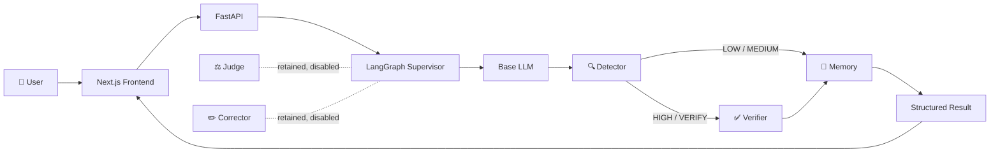
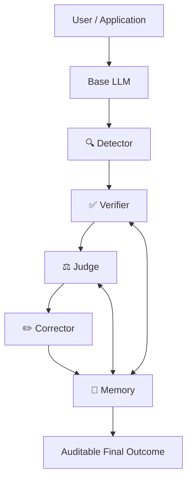
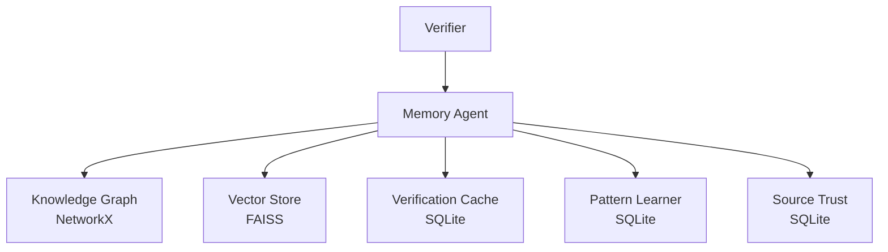

<!-- HERO / MOTION -->
<p align="center">
  <a href="https://github.com/Manju10092006/HalluciGuard">
    
  </a>
</p>

<p align="center">
  
</p>

<p align="center">
  <a href="https://github.com/Manju10092006/HalluciGuard/stargazers"></a>
  <a href="https://github.com/Manju10092006/HalluciGuard/network/members"></a>
  
  
  
  
</p>

<p align="center">
  <a href="https://github.com/Manju10092006/HalluciGuard-Frontend">Frontend</a> •
  <a href="#why-halluciguard">Why</a> •
  <a href="#architecture">Architecture</a> •
  <a href="#agents">Agents</a> •
  <a href="#verification-engine">Verifier</a> •
  <a href="#orchestration">LangGraph</a> •
  <a href="#validation-status">Status</a> •
  <a href="#roadmap">Roadmap</a>
</p>

---

# 🛡️ HalluciGuard

> **An independent reliability layer around AI generation — built to detect suspicious outputs, verify claims against evidence, govern decisions, repair unsupported content, and retain trustworthy knowledge.**

**The LLM generates. HalluciGuard asks whether the answer deserves to be trusted.**

---

## 🎯 Why HalluciGuard?

Large Language Models are exceptionally good at producing fluent, useful answers. The problem is that **fluency is not evidence of truth**.

An answer can be:

```text
confident
   ↓
well written
   ↓
persuasive
   ↓
WRONG
```

That becomes dangerous when the answer is used for research, healthcare, finance, cybersecurity, law, enterprise decisions, or any workflow where a confident mistake can create real cost.

HalluciGuard is designed to sit **between generation and consumption**:

```text
┌──────────────────┐
│     BASE LLM     │
│  generates text  │
└────────┬─────────┘
         │ draft
         ▼
┌─────────────────────────────┐
│       HALLUCIGUARD          │
│        TRUST LAYER          │
├─────────────────────────────┤
│ Risk detection              │
│ Evidence retrieval          │
│ NLI / semantic verification │
│ Evidence scoring             │
│ Governance                  │
│ Correction                  │
│ Memory & audit              │
└────────────┬────────────────┘
             │
             ▼
      auditable outcome
```

### The core idea

HalluciGuard does **not** try to replace ChatGPT, Gemini, Claude, Qwen, RAG systems, search engines, or foundation models.

It adds an **independent trust boundary around them**.

---

# 🌐 Why Use HalluciGuard When RAG, Search and LLM Guardrails Already Exist?

Because the question is not only:

> **“Can the system retrieve something relevant?”**

The harder questions are:

> **“Does the evidence actually support this claim?”**
>
> **“Does the evidence contradict it?”**
>
> **“How reliable is the source?”**
>
> **“How much of the response is actually grounded?”**
>
> **“What should happen when evidence is incomplete?”**
>
> **“Can another engineer audit what happened?”**

HalluciGuard combines those concerns into one observable workflow.

### What is different?

| Existing approach | Typical capability | HalluciGuard's role |
|---|---|---|
| Foundation model | Generate text | Treat generation as an untrusted draft |
| Search engine | Retrieve pages | Retrieve evidence for specific claims |
| RAG | Retrieve + augment generation | Independently validate the generated answer |
| Confidence score | Estimate uncertainty | Combine risk + evidence + NLI + provenance |
| Guardrail rule | Block known patterns | Multi-stage evidence-aware trust workflow |
| Single NLI call | Semantic relation | NLI becomes one component inside evidence scoring |
| Vector memory | Recall context | Preserve trusted facts + source/pattern history |
| HalluciGuard | — | **Generation → Detection → Verification → Governance → Memory** |

---

# 🧬 Architecture

## Current active product path



## Target full five-agent loop



> **Important:** the target architecture and the current active graph are intentionally different. Judge and Corrector remain disabled until they are independently validated. Documentation does not convert “implemented” into “production verified.”

---

# 🤖 Agents

<a id="agents"></a>

| Component | What it does | Current state |
|---|---|---|
| 🧠 **Base LLM** | Generates the candidate response that HalluciGuard evaluates | 🟡 Integration / live validation |
| 🔍 **Detector** | Estimates hallucination risk and decides whether deeper verification is needed | 🟢 Implemented |
| ✅ **Verifier** | Retrieves, ranks and semantically validates evidence | 🟢 Strongest validated subsystem |
| ⚖️ **Judge** | Governs evidence quality, policy, risk and final workflow action | 🟡 Implemented / disabled |
| ✏️ **Corrector** | Repairs unsupported content using verified grounding | 🟡 Implemented / disabled |
| 🧠 **Memory** | Persists trusted facts, semantic history, patterns and source trust | 🟢 Implemented |
| 🕸️ **LangGraph Supervisor** | Controls lifecycle, routing, retries and failures | 🟢 Implemented in active integration |
| 🔄 **Inter-Agent Bus** | Structured messages between orchestration nodes | 🟢 Implemented |

---

# 🔍 Detector Agent

The Detector is **not the final fact checker**.

Its job is to answer:

> **“Does this response look suspicious enough to justify deeper verification?”**

The current Detector uses the HaluEval-trained classifier and exposes the established interface:

```python
DetectorAgent.detect(user_query, llm_response)
```

Key outputs include:

```text
hallucination_probability
confidence_score
risk_level
next_action
```

Conceptually:

```text
                 Draft Response
                       │
                       ▼
               ┌──────────────┐
               │   Detector   │
               └──────┬───────┘
                      │
          ┌───────────┴───────────┐
          │                       │
     LOW / MEDIUM              HIGH
          │                       │
          ▼                       ▼
      Fast Path               Verifier
```

The Detector is therefore a **risk gate**, allowing expensive verification to focus on suspicious responses.

📁 `agents/detector_agent/`

---

# ✅ Verification Engine

<a id="verification-engine"></a>

The Verifier is currently the **most deeply validated subsystem** in HalluciGuard.

It is not simply “search + LLM.” It is a multi-stage evidence pipeline.

## 🔬 Nine-stage verification flow

```text
01  Domain Validation & Routing
        ↓
02  Claim Decomposition
        ↓
03  Entity Resolution / Query Expansion
        ↓
04  Multi-Source Retrieval
        ↓
05  Hybrid BM25 + Dense Retrieval + RRF
        ↓
06  Cross-Encoder Reranking
        ↓
07  DeBERTa NLI
        ↓
08  Evidence Scoring & Citation Data
        ↓
09  Conflict Resolution / Verification Result
```

### Retrieval

**Sparse retrieval / BM25** catches exact lexical matches.

**Dense retrieval / embeddings** catches semantic matches.

**Reciprocal Rank Fusion (RRF)** combines candidate rankings.

**Cross-encoder reranking** performs a deeper claim ↔ evidence relevance check.

### NLI

The local DeBERTa NLI model distinguishes:

| NLI outcome | Meaning |
|---|---|
| 🟢 `ENTAILMENT` | Evidence supports the claim |
| 🔴 `CONTRADICTION` | Evidence conflicts with the claim |
| 🟡 `NEUTRAL` | Evidence does not establish the claim |

The NLI integration has been hardened so unavailable/failed inference is represented as **degraded** rather than as convincing-looking constant fallback probabilities.

📁 `agents/verifier_agent/`

---

# ⚖️ Judge Agent

The Judge is intended to become HalluciGuard's **governance layer**.

It is not supposed to duplicate Detector or Verifier work.

Its intended responsibilities include:

- domain policy;
- evidence authority and quality;
- claim coverage;
- source consensus;
- contradiction analysis;
- safety / criticality assessment;
- risk governance;
- workflow action;
- explainability;
- audit records.

Its intended decisions include:

```text
ACCEPT
CORRECT
VERIFY_AGAIN
REJECT
ESCALATE_HUMAN
ABSTAIN
```

### Current status

The Judge implementation exists, but it is **not active in the current LangGraph**. Its independent runtime and NLI behavior must be validated before it becomes a trusted decision authority.

📁 `agents/judge_agent/`

---

# ✏️ Corrector Agent

The Corrector is intended to repair unsupported or contradictory content using verified evidence while preserving the user's original intent.

```text
Judge Decision
      ↓
Correction Plan
      ↓
Evidence-Grounded Generation
      ↓
Response Merge
      ↓
Structural / Consistency Validation
      ↓
Re-Verification
      ↓
Bounded Retry
      ↓
Corrected Response
```

The repository contains a multi-stage Corrector implementation and a LoRA-based correction model path.

### Current status

Corrector remains **retained but disabled** in the active graph. It requires independent validation of its model loading, portable artifact path, correction quality and evaluation methodology before activation.

📁 `agents/corrector_agent/`

---

# 🧠 Memory Agent

Memory is the long-term intelligence layer.



### Core modules

| Module | Technology | Role |
|---|---|---|
| Knowledge Graph | NetworkX | Entity + relationship memory |
| Vector Store | FAISS + embeddings | Semantic recall |
| Verification Cache | SQLite / aiosqlite | Repeated-check acceleration |
| Pattern Learner | SQLite | Recurring hallucination-pattern history |
| Source Trust | SQLite | Evidence-source reliability evolution |

A key safety rule is enforced by the orchestration policy: **unverified content must not silently become verified factual memory.**

📁 `agents/memory_agent/`

---

# 🕸️ LangGraph Orchestration

LangGraph is the **workflow runtime**, not another factual-reasoning agent.

<a id="orchestration"></a>

### Supervisor

The Supervisor asks:

> **“Which component should execute next?”**

It does **not** answer:

> “Is the claim true?”

That responsibility belongs to the future governance stage.

### Shared state

The orchestration layer carries structured state such as:

```text
execution_id
request_id
user_query
draft_response
generation metadata
detector output
claims
evidence
retrieved_evidence
ranked_evidence
NLI results
memory result
retry state
errors
trace
terminal status
```

### Inter-Agent Communication Bus

The current bus is deliberately lightweight and in-process.

```json
{
  "source_agent": "detector",
  "target_agent": "verifier",
  "message_type": "SUSPICIOUS_CLAIMS",
  "payload": {
    "risk_level": "HIGH",
    "hallucination_probability": 0.91
  }
}
```

Messages carry identifiers, source/target, payload, timestamp and execution context so the workflow is auditable without immediately introducing Kafka/RabbitMQ/Redis.

📁 `orchestration/`

---

# 🧬 Base LLM Layer

HalluciGuard needs a **real candidate answer** before a trust layer can inspect it.

The intended product flow is:

```text
User Query
    ↓
Base LLM
    ↓
Draft Response
    ↓
Detector
    ↓
Verifier (when required)
    ↓
Memory / Governance
```

The backend contains a configurable Base LLM service designed for server-side provider integration. The current target deployment uses an external provider-backed Qwen model rather than making the trust layer dependent on a single foundation model.

This is important because HalluciGuard should be able to sit around different generators:

```text
Qwen   ─┐
Gemini ─┤
Claude ─┤──→ HalluciGuard Trust Layer
GPT    ─┤
Other  ─┘
```

---

# 🌐 Evidence & Domain Strategy

The Verifier architecture supports domain-aware source selection. Representative source families already represented in the repository include:

| Domain | Example sources |
|---|---|
| 🏥 Healthcare | PubMed / NCBI / openFDA / ClinicalTrials.gov |
| 🔒 Cybersecurity | NIST NVD / MITRE ATT&CK / CISA |
| 💰 Finance | SEC / World Bank / market-data sources |
| ⚖️ Legal | CourtListener / statutory sources |
| 🤖 AI & Research | arXiv / Semantic Scholar / Crossref |
| 🌍 General | Wikipedia / Wikidata |

Exact source availability depends on adapter configuration and deployment environment.

---

# 🧪 Validation Philosophy

HalluciGuard deliberately separates engineering proof from presentation claims:

```text
Unit Test
   ≠
Model Load Test
   ≠
Agent Integration Test
   ≠
Backend E2E
   ≠
Browser E2E
   ≠
Production Deployment
```

A mocked LangGraph route can prove routing logic.

A real model smoke test can prove model loading.

A real backend E2E proves the live components cooperate.

A browser E2E proves the product is actually usable from the frontend.

**We only call a layer validated when the corresponding evidence exists.**

---

# 📊 Current Status

| Layer | Status |
|---|---|
| Detector | 🟢 Implemented |
| Verifier retrieval + ranking + NLI | 🟢 Strongly validated |
| Local DeBERTa NLI | 🟢 Validated |
| Memory | 🟢 Implemented |
| LangGraph state + supervisor | 🟢 Implemented / integration validation |
| Inter-Agent Bus | 🟢 Implemented |
| Base LLM provider | 🟡 Integration / live validation |
| Judge | 🟡 Implemented, disabled |
| Corrector | 🟡 Implemented, disabled |
| Frontend adapter | 🟡 Integration pending |
| Docker backend | 🔜 Planned |
| Render backend | 🔜 Planned |
| Vercel frontend | 🔜 Planned |
| Browser E2E | 🔜 Planned |

---

# 🗺️ Roadmap

## Phase 1 — Agent Foundation ✅

- [x] Detector
- [x] Verifier
- [x] Judge implementation
- [x] Corrector implementation
- [x] Memory implementation

## Phase 2 — Evidence Engine ✅

- [x] Multi-source retrieval
- [x] Hybrid sparse + dense retrieval
- [x] Reciprocal Rank Fusion
- [x] Cross-encoder reranking
- [x] DeBERTa NLI
- [x] Evidence scoring
- [x] Degraded-NLI safety hardening

## Phase 3 — Orchestration 🟡

- [x] Typed LangGraph state
- [x] Supervisor
- [x] Structured inter-agent communication
- [x] Bounded retries
- [x] Execution trace
- [x] Failure routing
- [ ] Final real production-model E2E

## Phase 4 — Product Integration 🟡

- [x] Base LLM service abstraction
- [ ] Live provider validation
- [ ] Frontend adapter integration
- [ ] Real chat → backend → graph flow
- [ ] Debug / execution console

## Phase 5 — Deployment 🔜

- [ ] Dockerize Python backend
- [ ] Render deployment
- [ ] Vercel deployment
- [ ] CORS hardening
- [ ] Production health checks
- [ ] Model artifact strategy
- [ ] Browser E2E

## Phase 6 — Full Trust Loop 🔜

```text
Base LLM
   ↓
Detector
   ↓
Verifier
   ↓
Judge
   ↓
Corrector
   ↓
Memory
   ↓
Auditable Response
```

Judge and Corrector become active only after independent runtime validation.

---

# 🛠️ Technology Stack

| Layer | Technology |
|---|---|
| Frontend | Next.js + TypeScript + Tailwind |
| API | FastAPI + Uvicorn |
| Orchestration | LangGraph |
| Base LLM | Configurable provider-backed model |
| Detector | HaluEval-trained classifier |
| Retrieval | BM25 + dense embeddings + RRF |
| Reranking | Cross-encoder |
| NLI | DeBERTa-v3 NLI |
| Memory graph | NetworkX |
| Vector memory | FAISS |
| Cache / history | SQLite / aiosqlite |
| Validation | PyTest |
| Deployment target | Vercel + Docker/Render |

---

# 📁 Repository Map

```text
HalluciGuard/
│
├── agents/
│   ├── detector_agent/       # Hallucination risk detection
│   ├── verifier_agent/       # Retrieval + ranking + NLI + evidence
│   ├── judge_agent/          # Governance / decision layer
│   ├── corrector_agent/      # Evidence-grounded correction
│   └── memory_agent/         # Knowledge + vector + trust memory
│
├── orchestration/            # LangGraph Supervisor + shared state + bus
├── services/                 # Provider/base-model service layer
├── docs/                     # Data flow, architecture, deployment docs
├── tests/                    # Cross-layer validation
└── README.md                 # System overview
```

---

# 🚀 Quick Start — Development

```bash
git clone https://github.com/Manju10092006/HalluciGuard.git
cd HalluciGuard

python -m venv .venv

# Windows
.venv\Scripts\activate

# Linux / macOS
source .venv/bin/activate

pip install -r requirements.txt
```

Then configure the relevant `.env` files / environment variables for the selected local components.

### Run the orchestration API

```bash
uvicorn orchestration.api:app --host 127.0.0.1 --port 8000
```

### Health

```bash
curl http://127.0.0.1:8000/health
```

### Verification request

```bash
curl -X POST http://127.0.0.1:8000/verify \
  -H "Content-Type: application/json" \
  -d '{"user_query":"What is the capital of France?","generation_mode":"normal"}'
```

> **Note:** production model artifacts, provider credentials and deployment-specific settings are intentionally not committed to this repository.

---

# 🔐 Security Principles

HalluciGuard is designed with a clear separation between code, models and secrets.

Never commit:

```text
.env
API keys
HF tokens
provider authorization headers
model binaries
local caches
node_modules
```

Secrets belong in the deployment environment, not in the frontend repository or Git history.

---

# 📚 Technical Documentation

- `docs/END_TO_END_DATA_FLOW.md` — transition-by-transition request/data flow
- `orchestration/README.md` — LangGraph workflow and state model
- `agents/detector_agent/README.md` — Detector subsystem
- `agents/verifier_agent/README.md` — verification engine
- `agents/judge_agent/README.md` — governance engine
- `agents/corrector_agent/README.md` — correction engine
- `agents/memory_agent/README.md` — memory subsystem

Frontend:

👉 [HalluciGuard Frontend](https://github.com/Manju10092006/HalluciGuard-Frontend)

---

# 🤝 Development Philosophy

HalluciGuard follows one rule above everything else:

> **Do not manufacture confidence. Make uncertainty observable.**

That means:

- no fake model outputs;
- no hidden fallback presented as success;
- no fabricated evidence;
- no “green” E2E claims without real execution;
- no enabling an unvalidated agent just to complete a diagram.

The project is intentionally being developed layer by layer so the system can be explained, tested and defended by an engineer — not merely demoed by a repository.

---

# 🧭 What HalluciGuard Ultimately Aims to Become

A model-agnostic **AI reliability control plane** where an organization can send an AI-generated response through a transparent trust workflow and obtain:

```text
Candidate Response
       ↓
Risk Assessment
       ↓
Claim-Level Evidence
       ↓
Semantic Verification
       ↓
Governance Decision
       ↓
Evidence-Grounded Correction
       ↓
Persistent Trusted Memory
       ↓
Audit Trail
```

The long-term vision is not simply to produce another answer.

It is to make AI systems **more accountable for the answers they already produce.**

---

<p align="center">
  
</p>

<p align="center">
  <strong>HalluciGuard — Building Trust in AI, One Verified Response at a Time.</strong>
</p>

<p align="center">
  <a href="https://github.com/Manju10092006/HalluciGuard">Backend</a> •
  <a href="https://github.com/Manju10092006/HalluciGuard-Frontend">Frontend</a> •
  <a href="https://github.com/Manju10092006/HalluciGuard/issues">Issues</a>
</p>

<p align="center">
  <sub>MIT License • Research / Engineering Project</sub>
</p>
