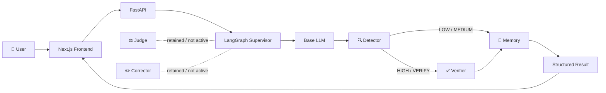
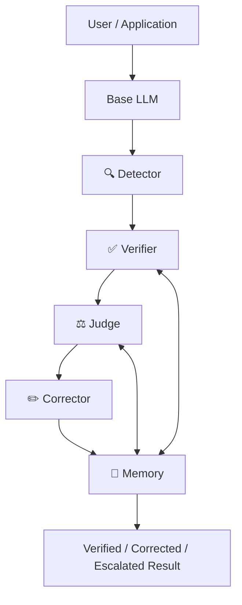
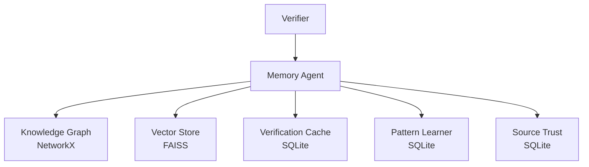

# 🛡️ HalluciGuard

<p align="center">
  
  
  
  
  
</p>

<p align="center">
  <strong>A trust layer for AI-generated answers.</strong><br/>
  <sub>Generate → Detect → Verify → Govern → Correct → Remember</sub>
</p>

<p align="center">
  <a href="#why-halluciguard">Why HalluciGuard</a> •
  <a href="#architecture">Architecture</a> •
  <a href="#verifier-agent">Verifier</a> •
  <a href="#orchestration">LangGraph</a> •
  <a href="#status">Status</a> •
  <a href="#roadmap">Roadmap</a>
</p>

---

## 🎯 Why HalluciGuard?

Large Language Models are excellent at producing fluent answers. Fluency, however, is not proof of truth.

**HalluciGuard is designed as a trust layer between AI generation and the application that consumes the answer.** Instead of treating every model response as trustworthy, the platform can inspect risk, retrieve evidence, compare claims against evidence with Natural Language Inference (NLI), score evidence quality, and preserve an auditable execution trace.

> **The LLM generates. HalluciGuard asks whether the answer deserves to be trusted.**

### The problem is not only “AI can be wrong.”

The harder problem is that an LLM can be **wrong while sounding certain**.

A normal search engine can find documents. A RAG system can retrieve passages. A model can generate an answer. A confidence score can estimate uncertainty.

But none of those, by themselves, provide a complete **generation → evidence → decision → audit** workflow.

HalluciGuard is built around that workflow.

---

# 🧭 Why Build This When RAG, Search, ChatGPT, Gemini and Claude Already Exist?

HalluciGuard is **not** trying to replace foundation models or search engines.

The goal is to provide an independent reliability layer that can sit around them.

```text
              Base LLM
                 │
                 │ draft answer
                 ▼
        ┌───────────────────┐
        │   HalluciGuard    │
        │    Trust Layer    │
        └─────────┬─────────┘
                  │
       ┌──────────┼──────────┐
       ▼          ▼          ▼
    Risk Gate   Evidence   Memory
       │          │          │
       └──────────┼──────────┘
                  ▼
          Auditable Outcome
```

### The engineering idea

- **Generation** produces a candidate answer.
- **Detection** decides whether the response deserves deeper checking.
- **Verification** finds and ranks evidence and checks semantic support.
- **Governance** can later decide what to do with the evidence.
- **Correction** can later repair unsupported content.
- **Memory** preserves trusted knowledge and execution history.
- **Orchestration** coordinates the lifecycle and state.

This separation makes failures easier to isolate, reasoning easier to inspect, and future agents easier to add.

---

# 🏗️ Architecture

## Current active development path



## Target five-agent trust loop



> **Important:** the target architecture contains five specialized agents. The active graph is intentionally narrower while Judge and Corrector are independently validated. Documentation does not equate “code exists” with “production verified.”

---

# 🤖 Agent Map

| Component | Core responsibility | Current status |
|---|---|---|
| 🧠 Base LLM | Generate the candidate response that will be inspected | 🟡 Under integration / live validation |
| 🔍 Detector | Estimate hallucination risk and choose the verification path | ✅ Implemented |
| ✅ Verifier | Retrieve evidence, rerank it, run NLI and score evidence | ✅ Strongest validated subsystem |
| ⚖️ Judge | Govern evidence, risk, policy and workflow decisions | 🟡 Implemented / not active |
| ✏️ Corrector | Repair unsupported content using verified evidence | 🟡 Implemented / not active |
| 🧠 Memory | Persist trusted facts, semantic history, source trust and patterns | ✅ Implemented |
| 🕸️ LangGraph Supervisor | Control execution, state, retries and failure paths | ✅ Implemented in active development |
| 🔄 Inter-Agent Bus | Structured messages/events between workflow nodes | ✅ Implemented in orchestration layer |

---

# 🔍 Detector Agent

The Detector is the **risk gate**, not the final fact checker.

Its core question is:

> **“Does this response look suspicious enough to justify deeper verification?”**

The current implementation uses a HaluEval-trained classifier and exposes the established contract:

```python
DetectorAgent.detect(user_query, llm_response)
```

The result contains information such as:

```text
hallucination_probability
confidence_score
risk_level
next_action
```

The intended routing policy is:

```text
LOW / MEDIUM → fast path
HIGH         → Verifier
```

The separation matters: a classifier can estimate risk, but it does not independently prove a claim true or false.

📁 `agents/detector_agent/`

---

# ✅ Verifier Agent

The Verifier is currently the **most deeply validated subsystem** in HalluciGuard.

It is a full evidence pipeline rather than a simple search wrapper.

## 9-stage pipeline

```text
01  Domain Validation & Routing
        ↓
02  Claim Decomposition
        ↓
03  Entity Resolution / Query Expansion
        ↓
04  Multi-Source Retrieval
        ↓
05  Hybrid BM25 + Dense + RRF
        ↓
06  Cross-Encoder Reranking
        ↓
07  DeBERTa NLI
        ↓
08  Evidence Scoring & Citation Data
        ↓
09  Conflict Resolution / Verification Result
```

### Retrieval stack

**BM25** gives strong lexical matching.

**Dense retrieval** finds semantically related evidence.

**Reciprocal Rank Fusion (RRF)** combines candidate rankings.

**Cross-encoder reranking** performs a deeper claim ↔ evidence relevance check before NLI.

### NLI layer

The verified local NLI model produces three semantic relationships:

```text
ENTAILMENT     → evidence supports the claim
CONTRADICTION  → evidence conflicts with the claim
NEUTRAL        → evidence does not establish the claim
```

The production path was hardened so failed/degraded NLI is explicitly marked as degraded rather than silently becoming successful verification evidence.

📁 `agents/verifier_agent/`

---

# ⚖️ Judge Agent

The Judge is intended to be the **governance layer** of HalluciGuard, not another copy of Detector or Verifier.

Its documented responsibilities include:

- domain policy;
- evidence quality and authority;
- claim coverage;
- conflicts;
- source consensus;
- runtime health;
- risk;
- workflow action;
- explainability;
- audit records.

The intended decision set includes:

```text
ACCEPT
CORRECT
VERIFY_AGAIN
REJECT
ESCALATE_HUMAN
ABSTAIN
```

### Current status

The Judge implementation exists and has a substantial governance architecture, but **it is deliberately not active in the current graph**. Its independent NLI/runtime path still requires validation against the trusted Verifier NLI path.

📁 `agents/judge_agent/`

---

# ✏️ Corrector Agent

The Corrector is intended to repair a response using verified grounding evidence rather than creating an unrelated replacement answer.

```text
Judge decision
      ↓
Correction plan
      ↓
Evidence-grounded generation
      ↓
Response merge
      ↓
Validation
      ↓
Re-verification
      ↓
Bounded retry
      ↓
Corrected response
```

The repository contains a multi-stage Corrector implementation and a LoRA fine-tuning/benchmark path.

### Current status

Corrector is **retained but disabled** in the active graph. It needs independent runtime validation, especially around portable model-path resolution and the validity of reported evaluation metrics, before being enabled.

📁 `agents/corrector_agent/`

---

# 🧠 Memory Agent

Memory is the persistence and historical-intelligence layer.



### What the modules do

| Module | Technology | Purpose |
|---|---|---|
| Knowledge Graph | NetworkX | Entity and relationship storage |
| Vector Store | FAISS + embeddings | Semantic recall |
| Verification Cache | SQLite / aiosqlite | Repeated-check acceleration |
| Pattern Learner | SQLite | Recurring claim-pattern history |
| Source Trust | SQLite | Source reliability evolution |

The active orchestration layer also follows a safety rule: **unverified content must not silently become verified factual memory.**

📁 `agents/memory_agent/`

---

# 🕸️ LangGraph Orchestration

LangGraph is the workflow runtime, not another factual-reasoning agent.

### Supervisor responsibilities

The Supervisor decides:

> **“Which node should execute next?”**

It does not answer:

> **“Is this claim true?”**

That is a future Judge responsibility.

### Shared state

The orchestration layer uses a typed shared state to carry:

- request metadata;
- draft response and generation metadata;
- Detector output;
- claims/evidence/NLI summaries;
- Memory output;
- retry state;
- structured errors;
- execution trace;
- inter-agent bus messages;
- terminal status.

### Inter-Agent Communication Bus

The bus is intentionally lightweight and in-process. It is backed by LangGraph state instead of introducing Kafka/RabbitMQ/Redis for a project that does not currently require them.

Example:

```json
{
  "source_agent": "detector",
  "target_agent": "verifier",
  "message_type": "SUSPICIOUS_CLAIMS",
  "payload": {
    "risk_level": "HIGH",
    "hallucination_probability": 0.91
  }
}
```

📁 `orchestration/`

---

# 🧬 Base LLM Layer

HalluciGuard needs a genuine candidate response before a trust system can inspect it.

The intended product flow is:

```text
User question
    ↓
Base LLM
    ↓
Draft response
    ↓
Detector
    ↓
Verifier if required
```

The current backend contains a configurable Base LLM service and is being moved toward a server-side OpenRouter-backed generation path using a configurable Qwen model.

> **Important:** live provider validation and frontend deployment remain separate milestones; the repository documentation does not claim a browser-level production E2E until that path has actually been executed.

---

# 🌐 Evidence & Domain Strategy

The Verifier architecture is designed to route claims to appropriate sources. Examples represented in the repository include:

| Domain | Example authoritative / specialist sources |
|---|---|
| 🏥 Healthcare | PubMed / NCBI / openFDA / ClinicalTrials.gov |
| 🔒 Cybersecurity | NIST NVD / MITRE ATT&CK / CISA |
| 💰 Finance | SEC / World Bank / market-data sources |
| ⚖️ Legal | CourtListener / curated statutory sources |
| 🤖 AI & Research | arXiv / Semantic Scholar / Crossref |
| 🌍 General | Wikipedia / Wikidata |

Exact availability depends on adapter configuration, source access and deployment environment.

---

# 🧪 Validation Philosophy

HalluciGuard explicitly separates:

```text
Unit Tests
    ≠
Model Load Test
    ≠
Agent Integration Test
    ≠
Backend E2E
    ≠
Browser E2E
```

A system is not called production-ready merely because a mocked graph is green.

The strongest current evidence is the real Verifier/NLI validation. The remaining system-level validation is being done layer by layer.

---

# 📊 Status

| Layer | Status |
|---|---|
| Detector implementation | 🟢 Implemented |
| Verifier retrieval + ranking + NLI | 🟢 Strongly validated |
| Local DeBERTa NLI | 🟢 Validated |
| Memory implementation | 🟢 Implemented |
| LangGraph active orchestration | 🟡 In active integration/validation |
| Inter-agent bus | 🟡 Implemented in orchestration branch/workflow |
| Base LLM / OpenRouter | 🟡 Implementation underway / live provider validation pending |
| Judge | 🟡 Implemented, disabled from active graph |
| Corrector | 🟡 Implemented, disabled from active graph |
| Frontend real adapter | 🟡 Designed, integration pending |
| Docker backend | 🔜 Planned |
| Render backend | 🔜 Planned |
| Vercel frontend | 🔜 Planned |
| Full browser E2E | 🔜 Planned |

---

# 🚀 Roadmap

## Phase 1 — Agent Foundation ✅

- [x] Detector implementation
- [x] Verifier implementation
- [x] Judge implementation
- [x] Corrector implementation
- [x] Memory implementation

## Phase 2 — Evidence Verification ✅

- [x] Multi-source retrieval
- [x] Hybrid retrieval
- [x] Ranking
- [x] DeBERTa NLI
- [x] Evidence scoring
- [x] NLI degraded-state hardening

## Phase 3 — Orchestration 🟡

- [x] LangGraph state
- [x] Supervisor concept
- [x] Structured inter-agent communication
- [x] Bounded retries
- [x] Trace / audit state
- [ ] Final real E2E validation with production models

## Phase 4 — Product Integration 🔜

- [ ] Finish live Base LLM provider validation
- [ ] Connect frontend adapter to backend
- [ ] Live execution console
- [ ] Dockerize backend
- [ ] Render deployment
- [ ] Vercel deployment
- [ ] Browser E2E

## Phase 5 — Full Five-Agent Loop 🔜

```text
Base LLM
   ↓
Detector
   ↓
Verifier
   ↓
Judge
   ↓
Corrector
   ↓
Memory
   ↓
Auditable Final Response
```

Judge and Corrector will only be enabled after independent runtime validation.

---

# 🗂️ Repository Map

```text
HalluciGuard/
│
├── README.md
│
├── agents/
│   ├── detector_agent/
│   ├── verifier_agent/
│   ├── judge_agent/
│   ├── corrector_agent/
│   └── memory_agent/
│
├── orchestration/
│   ├── graph.py
│   ├── state.py
│   ├── supervisor.py
│   ├── interbus.py
│   ├── api.py
│   └── tests/
│
├── services/
│   └── base_llm_service.py
│
├── scripts/
│   └── test_openrouter_llm.py
│
└── docs/
    └── architecture / data-flow / deployment notes
```

---

# 🧰 Engineering Principles

1. **No fake success.** A failed model is reported as failed.
2. **No hidden fallback.** Degraded inference is explicit.
3. **Evidence before confidence.** A confidence value is not proof.
4. **One canonical architecture.** Avoid duplicate orchestration implementations.
5. **Typed contracts.** Agents communicate through structured state and messages.
6. **Observable execution.** Important transitions produce traceable state.
7. **Security by default.** Secrets stay outside source code and client-side bundles.
8. **Production claims require production evidence.** A README never substitutes for a real E2E run.

---

# 📚 Documentation

- [Detector Agent](agents/detector_agent/README.md)
- [Verifier Agent](agents/verifier_agent/README.md)
- [Judge Agent](agents/judge_agent/README.md)
- [Corrector Agent](agents/corrector_agent/README.md)
- [Memory Agent](agents/memory_agent/README.md)
- [LangGraph Orchestration](orchestration/README.md)
- [Repository / data-flow documentation](docs/)

---

# 👥 Team Ownership

| Agent | Owner |
|---|---|
| 🔍 Detector | Snehith |
| ✅ Verifier | Manjunath |
| ⚖️ Judge | Anil |
| ✏️ Corrector | Gaurav |
| 🧠 Memory | Kushal |

HalluciGuard is intentionally modular so each agent can be understood, tested and validated independently before full-system integration.

---

# 📄 License

Distributed under the **MIT License**. See [`LICENSE`](LICENSE).

---

<p align="center">
  <strong>HalluciGuard — Don't trust the answer. Verify the evidence.</strong>
</p>
