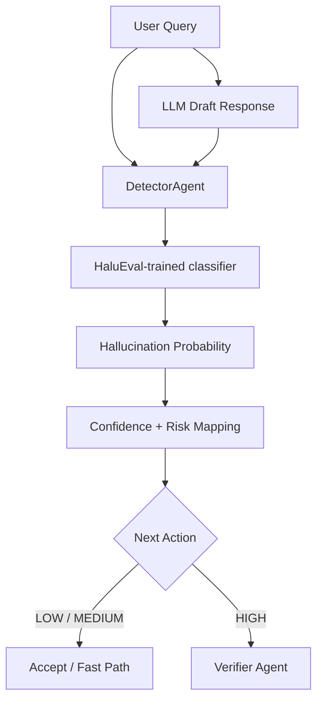

# 🔍 HalluciGuard Detector Agent

> **HaluEval-based hallucination risk gate for the HalluciGuard trust layer**

The Detector is the first intelligent gate in HalluciGuard. It receives the user query and the candidate response generated by the base LLM and estimates whether the response should be accepted quickly or sent to deeper evidence verification.

---

## 🎯 What Problem Does the Detector Solve?

A language model can produce a fluent answer without being certain that the answer is true. The Detector is therefore not the final fact checker. It is a **risk gate** designed to answer:

> **“Does this response look risky enough to justify expensive verification?”**

This lets HalluciGuard keep a fast path for low-risk responses while sending suspicious responses to the Verifier.

---

## 🧠 Current Detection Architecture



The current implementation uses a HaluEval-trained classifier. The older documentation described token probability, entropy, semantic similarity and self-consistency signals; those descriptions should not be treated as the current production implementation.

---

## 🔌 Public Contract

```python
from agents.detector_agent.detector import DetectorAgent

detector = DetectorAgent()
result = detector.detect(
    user_query="What is the capital of France?",
    llm_response="The capital of France is Paris."
)
```

The structured result includes:

```text
confidence_score
hallucination_probability
risk_level
next_action
```

The routing rule currently used by the implementation is:

```text
LOW / MEDIUM → ACCEPT / fast path
HIGH         → VERIFY
```

The Detector does not perform evidence retrieval, NLI verification, governance, or correction itself.

---

## 🧪 Why HaluEval?

HaluEval is used as the basis for the Detector classifier because the project needs an explicit hallucination-risk model rather than asking the same general-purpose LLM to judge itself.

The detector artifact is a deployable model dependency. Real execution requires the trained artifact to be available through the configured model path or an explicitly supported external model reference.

---

## 🔄 Role in the Full System

```text
Base LLM
   ↓
Draft Response
   ↓
Detector
   ├── LOW / MEDIUM → fast path
   │
   └── HIGH → Verifier
              ↓
          Evidence + NLI
```

This separation is intentional:

**Detector:** risk estimation.

**Verifier:** factual evidence verification.

They are complementary rather than duplicates.

---

## 📂 Project Structure

```text
agents/detector_agent/
├── detector.py                # DetectorAgent public orchestration
├── halueval_inference.py      # HaluEval model loading/inference
├── config.py                  # Runtime configuration
├── models.py                  # Detection result / risk enums
├── datasets/                  # Training/evaluation data
├── evaluation/                # Detector evaluation tooling
├── tests/                     # Detector tests
└── ...
```

---

## ⚙️ Configuration

Important runtime configuration includes:

- HaluEval model path
- maximum sequence length
- low-risk threshold
- high-risk threshold

Example concept:

```text
HALUEVAL_MODEL_PATH=<portable-model-path>
```

Do not hardcode a developer's Windows-only filesystem path in deployment.

---

## 🧪 Validation Expectations

The Detector should be evaluated at two levels:

### Contract tests

Validate:

- schema
- threshold routing
- invalid input handling
- model reference validation

### Real runtime tests

Validate:

- actual HaluEval model loading
- real inference
- non-constant probabilities
- correct LOW / MEDIUM / HIGH mapping
- correct Detector → Verifier routing

A green unit test without the actual model artifact is **not** a production runtime proof.

---

## 🔗 Downstream Integration

The Detector feeds structured output into the orchestration layer:

```text
DetectorAgent
     ↓
HalluciGuardState
     ↓
LangGraph Supervisor
     ↓
Verifier (when required)
```

The active orchestration layer may also retain the original draft response and structured Detector metadata for auditing.

---

## 📚 Related Documentation

- [Root HalluciGuard Architecture](../../README.md)
- [LangGraph Orchestration](../../orchestration/README.md)
- [Verifier Agent](../verifier_agent/README.md)

---

## 📄 License

Part of the HalluciGuard project. See the root [LICENSE](../../LICENSE).
