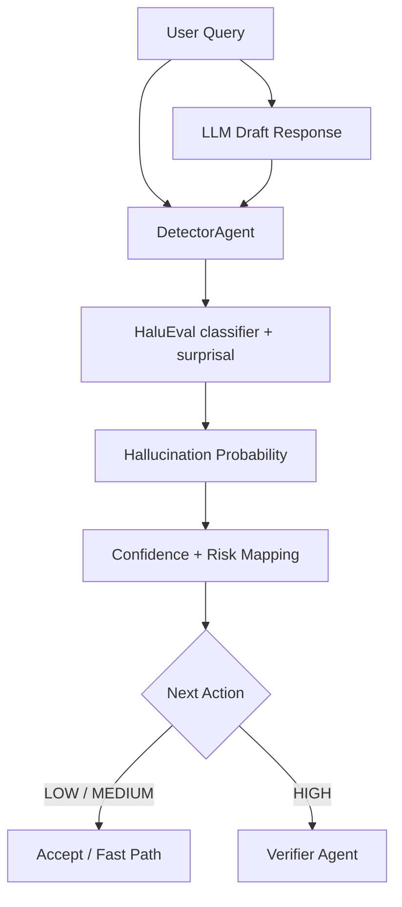
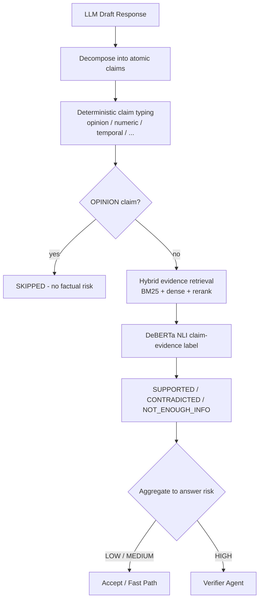

# 🔍 HalluciGuard Detector Agent

> **HaluEval-based hallucination risk gate for the HalluciGuard trust layer**

The Detector is the first intelligent gate in HalluciGuard. It receives the user query and the candidate response generated by the base LLM and estimates whether the response should be accepted quickly or sent to deeper evidence verification.

---

## 🎯 What Problem Does the Detector Solve?

A language model can produce a fluent answer without being certain that the answer is true. The Detector is therefore not the final fact checker. It is a **risk gate** designed to answer:

> **“Does this response look risky enough to justify expensive verification?”**

This lets HalluciGuard keep a fast path for low-risk responses while sending suspicious responses to the Verifier. When an evidence/provenance corpus is available, the Detector can additionally verify each atomic claim against retrieved evidence before deciding (see below).

---

## 🧠 Current Detection Architecture

### Two execution modes

**1. Legacy triage (default, no corpus):** HaluEval-trained DistilBERT classifier + HalluDetect token-surprisal signal, evaluating each atomic claim:


```mermaid
flowchart TD
    Q[User Query] --> R[LLM Draft Response]
    Q --> D[DetectorAgent]
    R --> D
    D --> M[HaluEval classifier + surprisal]
    M --> P[Hallucination Probability]
    P --> C[Confidence + Risk Mapping]
    C --> A{Next Action}
    A -->|LOW / MEDIUM| F[Accept / Fast Path]
    A -->|HIGH| V[Verifier Agent]
```

**2. Claim-level hybrid evidence verification (corpus provided):** when `documents` / `DetectionInput.context` is supplied, each atomic claim is answered independently:


```mermaid
flowchart TD
    R[LLM Draft Response] --> D[Decompose into atomic claims]
    D --> T[Deterministic claim typing<br/>opinion / numeric / temporal / ...]
    T --> NO{OPINION claim?}
    NO -->|yes| SKIP[SKIPPED - no factual risk]
    NO -->|no| E[Hybrid evidence retrieval<br/>BM25 + dense + rerank]
    E --> N[DeBERTa NLI claim-evidence label]
    N --> L[SUPPORTED / CONTRADICTED / NOT_ENOUGH_INFO]
    L --> A{Aggregate to answer risk}
    A -->|LOW / MEDIUM| F[Accept / Fast Path]
    A -->|HIGH| V[Verifier Agent]
```

Retrieval reuses the Verifier Agent's proven stack: BM25 + FAISS dense (`BAAI/bge-m3`) + cross-encoder rerank (`BAAI/bge-reranker-large`) + DeBERTa 3-way NLI (`cross-encoder/nli-deberta-v3-base`). When a numeric/date/quantity anchor is present, evidence must address that anchor — merely related evidence is NOT enough to mark a claim supported. When no relevant evidence exists the claim stays **UNVERIFIED** (`requires_verification=true`) and is never stamped supported or contradicted.

NLI and reranking degrade softly: without model weights the detector falls back to deterministic heuristics and marks `status="degraded"`, never authorizing a risk-free fast path on heuristic scores alone.

The older documentation described token probability, entropy, semantic similarity and self-consistency signals; those descriptions should not be treated as the current production implementation.

---

## 🔌 Public Contract

```python
from agents.detector_agent.detector import DetectorAgent

detector = DetectorAgent()
result = detector.detect(
    user_query="What is the capital of France?",
    llm_response="The capital of France is Paris.",
    # Optional: enable claim-level hybrid evidence verification.
    documents=["Paris is the capital city of France.", ...],
)
```

The `detect(user_query, llm_response)` signature is unchanged. `domain` (informational) and `documents` (evidence corpus) are optional keyword-only additions, so all existing callers keep working.

The structured result includes:

```text
confidence_score
hallucination_probability     # routing/verification-risk signal, NOT a truth verdict
risk_level
next_action
status                        # completed | degraded | failed
atomic_claims
per_claim_results             # per-claim: claim_type, verification_status,
                              #   supported/contradicted/unknown probabilities,
                              #   evidence_snippets, retrieval_method, nli_degraded
claim_count, supported_count, contradicted_count, unknown_count,
unverified_count, opinion_count
requires_verification
evidence_available
verification_risk
nli_engine_loaded, nli_inference_executed, nli_degraded
```

The routing rule currently used by the implementation is:

```text
LOW / MEDIUM → ACCEPT / fast path
HIGH         → VERIFY
```

Route semantics:

- **VERIFIED (SUPPORTED):** real DeBERTa NLI ran and the top evidence supports the claim → `requires_verification=false` fast path.
- **CONTRADICTED:** evidence contradicts the claim → routed to the Verifier to confirm the final verdict.
- **INSUFFICIENT / NOT_ENOUGH_INFO:** never treated as contradiction; routed to the Verifier.
- **UNVERIFIED:** no relevant evidence found for the claim; `requires_verification=true` (fail-closed, never a hands-free verdict).
- **SKIPPED (OPINION):** opinion claims (judgment words, bare superlatives) carry no factual hallucination risk.

The Detector still does not perform governance or correction itself; the Verifier owns the final factual verdict.

---

## 🧪 Why HaluEval?

HaluEval is used as the basis for the Detector classifier because the project needs an explicit hallucination-risk model rather than asking the same general-purpose LLM to judge itself.

The detector artifact is a deployable model dependency. Real execution requires the trained artifact to be available through the configured model path or an explicitly supported external model reference.

---

## 🔄 Role in the Full System

```text
Base LLM
   ↓
Draft Response
   ↓
Detector
   ├── LOW / MEDIUM → fast path
   │
   └── HIGH → Verifier
              ↓
          Evidence + NLI
```

This separation is intentional:

**Detector:** risk estimation.

**Verifier:** factual evidence verification.

They are complementary rather than duplicates.

---

## 📂 Project Structure

```text
agents/detector_agent/
├── detector.py                # DetectorAgent public orchestration
├── claims.py                  # Deterministic claim typing (opinion/numeric/...)
├── evidence.py                # Hybrid BM25+dense+rerank evidence retrieval
├── nli.py                     # Claim-evidence NLI (DeBERTa + deterministic guards)
├── halueval_inference.py      # HaluEval model loading/inference
├── config.py                  # Runtime configuration
├── models.py                  # Detection result / risk enums / evidence verdict schema
├── datasets/                  # Training/evaluation data
├── evaluation/                # Detector evaluation tooling
├── tests/                     # Detector tests (incl. test_claim_evidence.py)
└── ...
```

---

## ⚙️ Configuration

Important runtime configuration includes:

- HaluEval model path
- maximum sequence length
- low-risk threshold
- high-risk threshold

Example concept:

```text
HALUEVAL_MODEL_PATH=<portable-model-path>
```

Do not hardcode a developer's Windows-only filesystem path in deployment.

---

## 🧪 Validation Expectations

The Detector should be evaluated at two levels:

### Contract tests

Validate:

- schema
- threshold routing
- invalid input handling
- model reference validation

### Real runtime tests

Validate:

- actual HaluEval model loading
- real inference
- non-constant probabilities
- correct LOW / MEDIUM / HIGH mapping
- correct Detector → Verifier routing

A green unit test without the actual model artifact is **not** a production runtime proof.

---

## 🔗 Downstream Integration

The Detector feeds structured output into the orchestration layer:

```text
DetectorAgent
     ↓
HalluciGuardState
     ↓
LangGraph Supervisor
     ↓
Verifier (when required)
```

The active orchestration layer may also retain the original draft response and structured Detector metadata for auditing.

---

## 📚 Related Documentation

- [Root HalluciGuard Architecture](../../README.md)
- [LangGraph Orchestration](../../orchestration/README.md)
- [Verifier Agent](../verifier_agent/README.md)

---

## 📄 License

Part of the HalluciGuard project. See the root [LICENSE](../../LICENSE).
