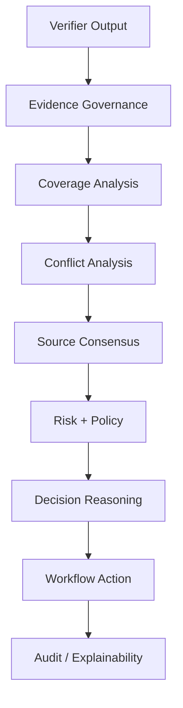

# ⚖️ HalluciGuard Judge Agent

> **Governance, risk and workflow decision layer for the HalluciGuard trust architecture**

The Judge Agent is designed to answer a different question from the Detector and Verifier:

> **“Given the evidence, system health, domain policy and risk, what should HalluciGuard do next?”**

It is intended to be the **governance layer**, not another search engine and not another hallucination detector.

---

## 🧭 Intended Role

```text
Detector
   ↓
Verifier
   ↓
Judge
   ├── ACCEPT
   ├── CORRECT
   ├── VERIFY_AGAIN
   ├── REJECT
   ├── ESCALATE_HUMAN
   └── ABSTAIN
```

The Judge can consider:

- evidence quality;
- claim coverage;
- source authority;
- conflicts;
- multi-source consensus;
- historical memory signals;
- domain policy;
- runtime health;
- claim criticality;
- risk;
- workflow state.

---

## 🏛 Architecture

The current implementation contains a substantial decision-intelligence subsystem with modules for evidence governance, coverage, consensus, conflict analysis, risk, runtime inspection, memory intelligence, workflow routing, explainability and audit trails.

The central decision engine is:

```text
agents/judge_agent/decision_intelligence.py
```

The intended governance flow is:



---

## 📌 Important Boundary

Judge is **not currently part of the active production graph**.

This is intentional.

The repository contains the Judge implementation, but its independent NLI/runtime path and integrated semantic behavior must be validated before it is allowed to govern the final system output.

The active orchestration layer should therefore report:

```text
Judge = NOT EXECUTED
```

rather than fabricate a Judge result.

---

## 🧪 What Must Be Validated Before Activation?

### Runtime consistency

The Judge must use a trustworthy, validated NLI path. Its NLI semantics must not disagree silently with the Verifier's validated NLI model.

### Decision semantics

Real scenarios should be tested for:

- strong supporting evidence → `ACCEPT`;
- fixable contradiction → `CORRECT`;
- insufficient evidence → `VERIFY_AGAIN` or `ABSTAIN`;
- unfixable/high-risk claim → `REJECT`;
- safety-critical conflict → `ESCALATE_HUMAN`;
- runtime failure → `ABSTAIN` / safe failure.

### Integration contracts

Validate the exact fields coming from Detector, Verifier and Memory. Do not rely only on dataclass construction or mocked values.

---

## 🔌 Intended Input / Output

The Judge receives a structured context containing information such as:

```text
user_query
draft_response
domain
detector_output
verifier_output
evidence
memory_context
runtime_status
retry_count
```

It returns a structured governance decision with fields such as:

```text
decision
severity
risk_assessment
claim_verdicts
evidence_governance
workflow_action
explanation
audit metadata
```

The exact schema is defined by the current code in `agents/judge_agent/`.

---

## 🧩 Why a Judge Exists When the Verifier Already Checks Evidence

The Verifier answers:

> **“What does the evidence say about the claim?”**

The Judge answers:

> **“Given everything the system now knows, what is the safest and most appropriate workflow decision?”**

That separation becomes especially important in healthcare, finance, security and other high-impact domains where evidence quality, risk and policy can matter even when a raw evidence score is high.

---

## 📂 Key Modules

```text
agents/judge_agent/
├── decision_intelligence.py   # central governance engine
├── decision_policies.py       # domain policy registry
├── domain_policies.py         # policy/source requirements
├── evidence_governance.py     # evidence authority/quality
├── coverage_analyzer.py       # claim coverage
├── conflict_resolver.py       # conflict categories
├── source_reliability.py      # authority tiers
├── source_consensus.py        # agreement / independence
├── risk_intelligence.py       # policy-driven risk
├── runtime_inspector.py       # system health
├── memory_intelligence.py     # historical signals
├── workflow_orchestrator.py   # next action
├── explainability.py          # human-readable reasons
├── audit_trail.py             # audit record
└── ...
```

---

## 🚧 Current Status

**Implemented:** ✅

**Integrated into active LangGraph:** ❌

**Independently runtime-validated against the final Verifier/NLI stack:** 🟡

**Production-ready claim:** ❌ not yet

This README intentionally avoids claiming full production readiness until the runtime and semantic integration are proven.

---

## 🔗 Related Documentation

- [Root HalluciGuard README](../../README.md)
- [Verifier Agent](../verifier_agent/README.md)
- [Corrector Agent](../corrector_agent/README.md)
- [LangGraph Orchestration](../../orchestration/README.md)
