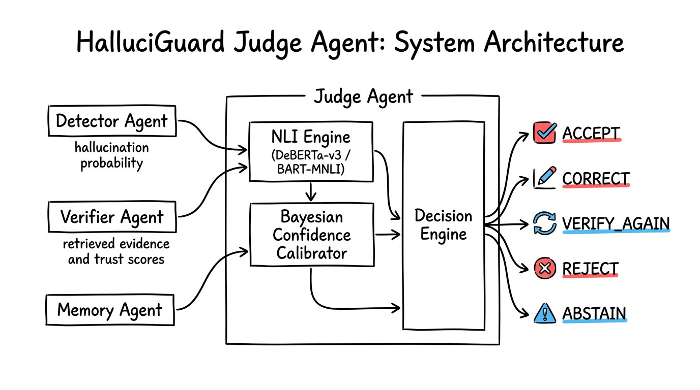
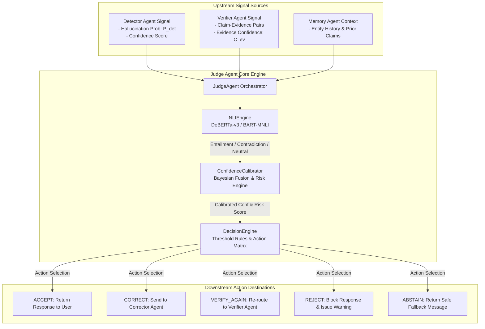

# ⚖️ HalluciGuard Judge Agent

> **Enterprise Factual Arbitration, Bayesian Risk Calibration & Multi-Signal Decision Engine**  
> *Production Version: 2.0.0-PROD | Status: 🟢 Operational & Fully Implemented | Microservice Port: 8003*

[](https://www.python.org/)
[](https://fastapi.tiangolo.com/)
[]()

---

## 📌 Architectural Overview

The **HalluciGuard Judge Agent** (`agents/judge_agent`) is the central arbitration engine of the HalluciGuard multi-agent trust layer. It sits between the upstream **Detector Agent** (which estimates raw hallucination probabilities) and **Verifier Agent** (which retrieves authoritative evidence). The Judge Agent evaluates claim-evidence entailment, calibrates Bayesian confidence scores, computes risk levels, and executes structured trust decisions (`ACCEPT`, `CORRECT`, `VERIFY_AGAIN`, `REJECT`, `ABSTAIN`).

### System Architecture Infographic
*(Style Inspiration: `helloianneo/ian-xiaohei-illustrations` — Hand-Drawn Editorial Engineering Illustration)*





---

## ⚡ Runtime Evaluation Pipeline

```text
[Stage 1] REQUEST PARSING & VALIDATION ──► Parses Detector hallucination probability P_det & Verifier evidence C_ev
[Stage 2] CLAIM-EVIDENCE NORMALIZATION  ──► Normalizes claim-evidence text pairs & extracts target entities
[Stage 3] CROSS-ENCODER NLI INFERENCE  ──► Computes entailment/contradiction scores via DeBERTa-v3 / BART-MNLI
[Stage 4] BAYESIAN MULTI-SIGNAL FUSION  ──► Fuses signals: C_final = α * P_det + β * S_NLI + γ * C_ev
[Stage 5] RISK LEVEL CALCULATION        ──► Categorizes risk (LOW, MEDIUM, HIGH, CRITICAL)
[Stage 6] ACTION MATRIX & PAYLOAD GEN  ──► Emits ACCEPT, CORRECT, VERIFY_AGAIN, REJECT, or ABSTAIN
```

---

## 🎯 Decision Matrix & Action Boundaries

| Action Verdict | Entailment Score ($S_{NLI}$) | Hallucination Prob ($P_{det}$) | Target Destination / Action |
| :--- | :--- | :--- | :--- |
| **`ACCEPT`** | $\ge 0.85$ (High Support) | $< 0.20$ (Low Hallucination) | Return response directly to user |
| **`CORRECT`** | $0.40 - 0.85$ (Contradiction) | Any | Route to Corrector Agent with evidence patch payload |
| **`VERIFY_AGAIN`** | $0.30 - 0.60$ (Neutral/Ambiguous) | $> 0.50$ | Re-query Verifier Agent with expanded entities |
| **`REJECT`** | Contradiction $\ge 0.85$ | $> 0.70$ (Critical Domain) | Block response immediately with security/medical warning |
| **`ABSTAIN`** | Insufficient Evidence | $> 0.60$ | Emits safe fallback message ("Evidence unavailable") |

---

## 🛠️ Technology Stack & Module Map

| Module File | Component Class | Tech / Model / Responsibilities |
| :--- | :--- | :--- |
| [`judge_agent.py`](file:///c:/Users/S.Manjunath%20Reddy/OneDrive/Music/Pictures/Videos/HalluciGuard/agents/judge_agent/judge_agent.py) | `JudgeAgent` | Primary pipeline orchestrator |
| [`decision_engine.py`](file:///c:/Users/S.Manjunath%20Reddy/OneDrive/Music/Pictures/Videos/HalluciGuard/agents/judge_agent/decision_engine.py) | `DecisionEngine` | Action selection matrix & Corrector payload builder |
| [`nli_engine.py`](file:///c:/Users/S.Manjunath%20Reddy/OneDrive/Music/Pictures/Videos/HalluciGuard/agents/judge_agent/nli_engine.py) | `NLIEngine` | Cross-encoder NLI (`cross-encoder/nli-deberta-v3-base`, `bart-large-mnli`) with fallback |
| [`confidence_calibrator.py`](file:///c:/Users/S.Manjunath%20Reddy/OneDrive/Music/Pictures/Videos/HalluciGuard/agents/judge_agent/confidence_calibrator.py) | `ConfidenceCalibrator` | Bayesian multi-signal fusion & risk calibrator |
| [`config.py`](file:///c:/Users/S.Manjunath%20Reddy/OneDrive/Music/Pictures/Videos/HalluciGuard/agents/judge_agent/config.py) | `JudgeConfig` | Configuration parameters & risk weights |
| [`app.py`](file:///c:/Users/S.Manjunath%20Reddy/OneDrive/Music/Pictures/Videos/HalluciGuard/agents/judge_agent/app.py) | FastAPI Service | REST API microservice (`/judge`, `/simulate`, `/health`) on port `8003` |
| [`simulator.py`](file:///c:/Users/S.Manjunath%20Reddy/OneDrive/Music/Pictures/Videos/HalluciGuard/agents/judge_agent/simulator.py) | `JudgeSimulator` | Synthetic benchmark evaluation suite |

---

## 📈 Engineering Evolution & Progress Roadmap

* **Phase 1: Rule-Based Heuristic Decision Logic** — Initial static thresholding and basic verdict mapping.
* **Phase 2: DeBERTa-v3 Cross-Encoder NLI Engine** — Integrated transformer-based entailment classification with zero-dependency heuristic fallback.
* **Phase 3: Bayesian Multi-Signal Confidence Calibrator** — Implemented mathematical signal fusion ($\alpha P_{det} + \beta S_{NLI} + \gamma C_{ev}$) and domain risk categorization.
* **Phase 4: Production Microservice Deployment** — Built FastAPI `/judge` and `/simulate` endpoints on port 8003 with full unit test validation.

---

## 🚀 Quick Start (Judge Agent Service)

```bash
# Navigate to judge agent directory
cd agents/judge_agent

# Launch the Judge Agent microservice
python -m uvicorn app:app --host 127.0.0.1 --port 8003
```

### Send a Test Judgment Request
```bash
curl -X POST "http://127.0.0.1:8003/judge" \
     -H "Content-Type: application/json" \
     -d '{
       "user_query": "What is Metformin used for?",
       "draft_response": "Metformin is a first-line medication for type 1 diabetes.",
       "detector_output": {"hallucination_probability": 0.75, "confidence_score": 0.88, "risk_level": "HIGH"},
       "verifier_output": {
         "claim_evidence_pairs": [
           {
             "claim": "Metformin is used to treat type 1 diabetes.",
             "evidence": "Metformin is indicated for type 2 diabetes mellitus.",
             "evidence_confidence": 0.95,
             "rank": 1,
             "source": "PubMed"
           }
         ]
       }
     }'
```
