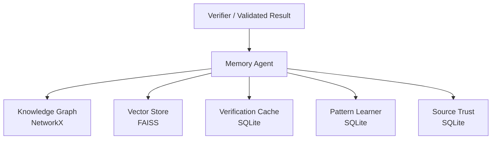

# 🧠 HalluciGuard Memory Agent

> **Knowledge persistence, semantic recall, source trust and historical intelligence**

The Memory Agent is the persistence layer of HalluciGuard. It is designed to remember information that has been verified, preserve source/reliability history, accelerate repeated checks and provide historical context to future reasoning.

---

## 🎯 Why Memory?

Without memory, every verification request starts from zero.

With memory, HalluciGuard can preserve useful signals from previous executions:

```text
Verified fact
   ↓
Memory
   ├── Knowledge Graph
   ├── Vector Store
   ├── Verification Cache
   ├── Pattern History
   └── Source Trust
```

Memory is therefore more than a database. It is a historical intelligence layer.

---

## 🏗️ Architecture



### Core modules

| Module | Technology | Responsibility |
|---|---|---|
| Knowledge Graph | NetworkX | Entity/relation storage and graph traversal |
| Vector Store | FAISS + embeddings | Semantic recall |
| Verification Cache | SQLite + aiosqlite | Repeated-check acceleration and TTL |
| Pattern Learner | SQLite | Recurring hallucination pattern history |
| Source Trust | SQLite | Source reliability evolution and audit history |

---

## 🔐 Memory Safety

The most important rule is:

> **Unverified information must not silently become trusted factual memory.**

The active orchestration integration therefore distinguishes between:

```text
VERIFIED FACT
   ↓
eligible for factual persistence

UNVERIFIED / DEGRADED / FAILED
   ↓
not a trusted fact
```

Audit history can be preserved separately when needed, but an unresolved claim must never be disguised as a confirmed fact.

---

## 📦 Main Modules

```text
agents/memory_agent/
├── knowledge_graph/          # NetworkX graph
├── vector_store/             # FAISS semantic memory
├── cache/                    # SQLite verification cache
├── patterns/                 # Pattern learner
├── trust/                    # Source trust evolution
├── memory/                   # MemoryAgent orchestrator
├── schemas/                  # Pydantic contracts
├── config/                   # Runtime configuration
├── api/                      # FastAPI interface
└── tests/                    # Memory tests
```

---

## 🔌 Main Interfaces

The repository exposes the Memory Agent through the orchestrator's store/recall abstractions and a FastAPI service.

Typical operations include:

```text
store verified fact
recall relevant historical knowledge
check verification cache
update/query source trust
query learned patterns
inspect graph/vector statistics
```

Exact contracts are defined by `schemas/models.py` and the corresponding implementation.

---

## 🚀 Integration with LangGraph

The active orchestration layer can invoke Memory after the relevant trust path completes:

```text
Base LLM
   ↓
Detector
   ↓
Verifier (when needed)
   ↓
Memory
   ↓
END
```

Judge and Corrector are intentionally disabled from the active graph at the current project milestone.

---

## 🧪 Validation

Memory should be validated at three levels:

1. **Module tests** — graph, vector, cache, trust and pattern operations.
2. **Integration tests** — store/recall behavior through the orchestrator.
3. **System tests** — confirm that only appropriately verified outputs can become trusted memory.

Never treat a successful HTTP response as proof that persistent knowledge was actually written correctly.

---

## 💾 Deployment Considerations

The current implementation includes local persistence mechanisms. Before production deployment, explicitly classify each storage path as:

- ephemeral and rebuildable;
- persistent on a mounted disk; or
- external persistent storage.

A container's local filesystem should not automatically be assumed to survive restarts or redeploys.

---

## 🔗 Related Documentation

- [Root HalluciGuard README](../../README.md)
- [Verifier Agent](../verifier_agent/README.md)
- [LangGraph Orchestration](../../orchestration/README.md)
