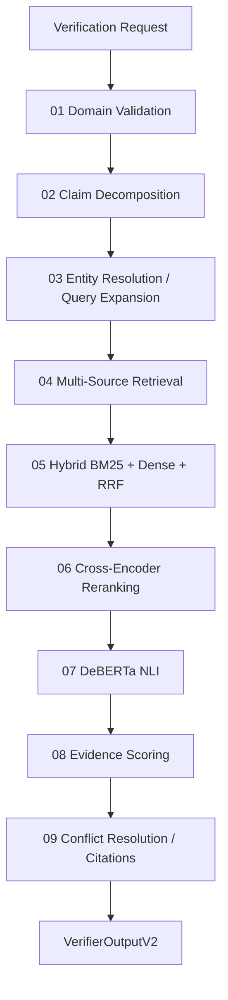

# ✅ HalluciGuard Verifier Agent

> **Evidence retrieval + reranking + Natural Language Inference + evidence scoring**
>
> The Verifier is the factual evidence engine of HalluciGuard. It is currently the most deeply validated agent in the project.

[](https://www.python.org/)
[](https://fastapi.tiangolo.com/)
[](https://huggingface.co/cross-encoder/nli-deberta-v3-base)

---

## 🎯 Mission

The Verifier answers a different question from the Detector.

**Detector:** “Does this response look suspicious?”

**Verifier:** “What evidence supports or contradicts these claims?”

The Verifier therefore performs evidence retrieval, ranking and semantic claim-evidence comparison instead of trusting the detector's probability alone.

---

## 🧭 Nine-Stage Runtime Pipeline



### Stage details

| Stage | Purpose |
|---|---|
| 1 | Validate domain and choose the applicable source/model profile. |
| 2 | Split compound responses into atomic claims. |
| 3 | Resolve important entities and expand search terms. |
| 4 | Query configured domain and general evidence sources. |
| 5 | Combine lexical and semantic retrieval with Reciprocal Rank Fusion. |
| 6 | Rerank candidate passages against the claim. |
| 7 | Compare claim ↔ evidence using NLI. |
| 8 | Combine evidence relevance, credibility, recency and NLI signals. |
| 9 | Resolve support/conflict and produce structured evidence-backed output. |

---

## 🔎 Retrieval & Ranking

The current architecture combines several search ideas because no single retrieval strategy is sufficient for every claim.

### BM25

Strong for exact names, identifiers, terminology and lexical overlap.

### Dense Retrieval

Useful when evidence uses different wording but similar meaning.

### Reciprocal Rank Fusion

Combines candidate rankings instead of trusting one retriever.

### Cross-Encoder Reranking

Performs a deeper claim-passage comparison on the strongest candidates before NLI.

---

## 🧠 NLI: The Semantic Verification Layer

The current NLI model is:

```text
cross-encoder/nli-deberta-v3-base
```

The validated local development artifact was tested from:

```text
C:\temp\test_nli
```

The verified label mapping is:

```text
0 → contradiction
1 → entailment
2 → neutral
```

The system has been tested with real examples representing all three relationships and produced non-constant probabilities.

### Important safety rule

A failed NLI model must **never** look like real inference.

The hardened runtime uses explicit degraded/error metadata rather than pretending that:

```text
0.33 / 0.33 / 0.34
```

is a legitimate prediction.

Degraded NLI is not decision-grade evidence.

---

## 🏆 Current Validation

The Verifier has been exercised through its complete internal pipeline and the real local NLI integration has been validated independently.

The project history reports a larger automated suite, while the latest hardening work also includes runtime/model-path, degraded-NLI and production-hardening regressions. Always treat the actual test command output from the current checkout as the authoritative pass/fail source.

The strongest validated path is:

```text
Retrieval
   ↓
Ranking
   ↓
Local DeBERTa NLI
   ↓
Evidence Scoring
   ↓
Verifier Result
```

---

## 🌐 Evidence Sources

The architecture supports domain-specific and general sources. Examples represented in the repository include:

- **Healthcare:** PubMed / NCBI / openFDA / ClinicalTrials.gov
- **Cybersecurity:** NIST NVD / MITRE ATT&CK / CISA
- **Finance:** SEC / World Bank / market-data sources
- **Legal:** CourtListener / curated legal sources
- **Research:** arXiv / Semantic Scholar / Crossref
- **General:** Wikipedia / Wikidata

Availability depends on the configured adapters and runtime credentials.

---

## 📦 Data Contract

The Verifier accepts structured claim requests and returns evidence-backed structured results.

Conceptually:

```json
{
  "query_id": "req-001",
  "domain": "general",
  "suspicious_claims": [
    {
      "claim_id": "c1",
      "text": "The capital of France is Paris."
    }
  ]
}
```

A result contains fields such as:

```text
claims
retrieved evidence
ranked evidence
NLI results
support / contradiction information
trust / confidence
verdict
citations
pipeline timing
```

Exact response fields are defined by the repository schemas rather than by this README.

---

## 🗂️ Package Structure

```text
agents/verifier_agent/
├── api/                   # FastAPI + VerificationPipeline
├── adapters/              # Source/domain retrieval adapters
├── claims/                # Decomposition + entity resolution
├── models/                # ModelManager + wrappers
├── retrievers/            # BM25 / dense / RRF retrieval
├── rerankers/             # Cross-encoder ranking
├── nli/                   # DeBERTa NLI engine
├── scorers/               # Evidence scoring / source trust
├── explanations/          # Explanation generation
├── formatters/            # Structured/citation output
├── cache/                 # Verification cache
├── config/                # Settings and domain intelligence
├── schemas/               # Pydantic contracts
└── tests/                 # Unit + integration + hardening tests
```

---

## 🔗 Integration with LangGraph

The Verifier is invoked by the active orchestration layer when Detector routes a request for deeper verification.

```text
Base LLM
   ↓
Detector
   ↓  (if verification required)
LangGraph Supervisor
   ↓
VerificationPipeline.verify(...)
   ↓
Claims + Evidence + NLI + Scores
   ↓
Memory / downstream governance
```

Judge and Corrector are currently retained outside the active graph while they are independently validated.

---

## 🚀 Local Development

```bash
git clone https://github.com/Manju10092006/HalluciGuard.git
cd HalluciGuard/agents/verifier_agent
pip install -r requirements.txt
cp .env.example .env
```

Run the existing Verifier API using the repository's configured entry point.

For the local NLI setup, configure a portable model path through environment settings rather than hardcoding a developer-specific absolute path.

---

## 🧪 Validation Philosophy

This agent distinguishes:

```text
Unit tests
≠
Model load
≠
Real NLI
≠
Real retrieval
≠
Full LangGraph E2E
```

A real model output and a genuine external evidence retrieval run are stronger proof than a green mock test.

---

## 📚 Related Documentation

- [Root HalluciGuard README](../../README.md)
- [LangGraph Orchestration](../../orchestration/README.md)
- [Verifier Technical Documentation](VERIFIER_AGENT_TECHNICAL_DOCUMENTATION.md)

---

## 📄 License

Part of HalluciGuard. See the root [LICENSE](../../LICENSE).
