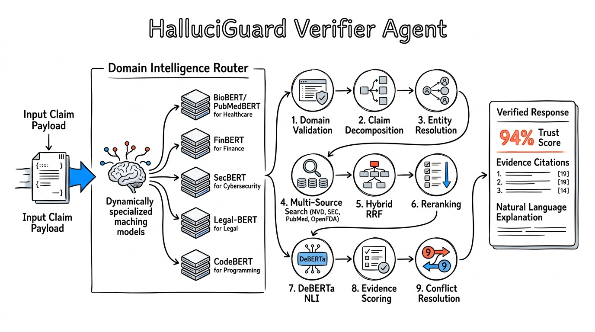
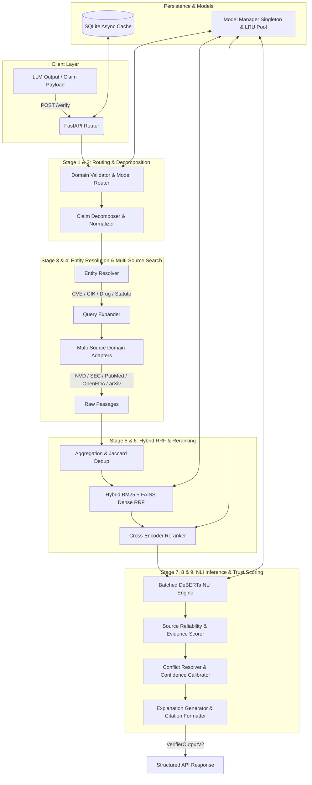
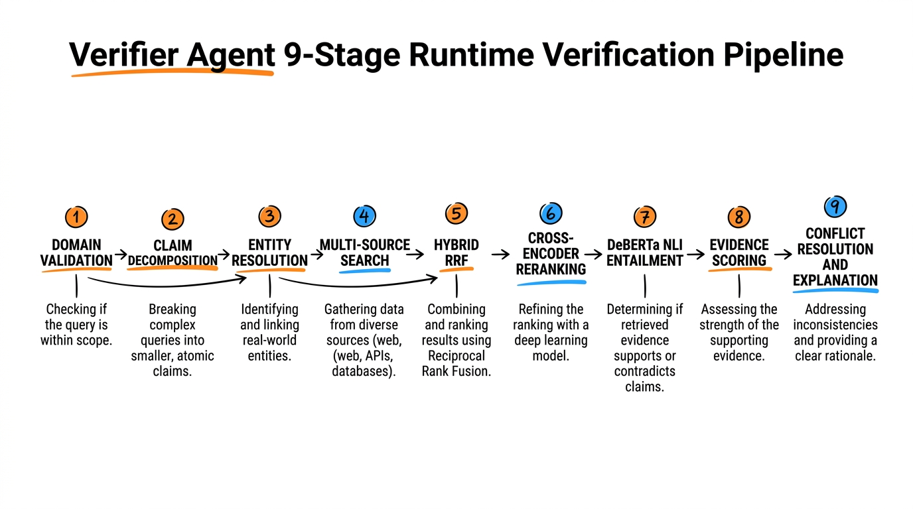
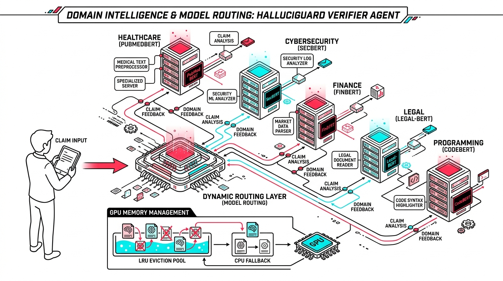
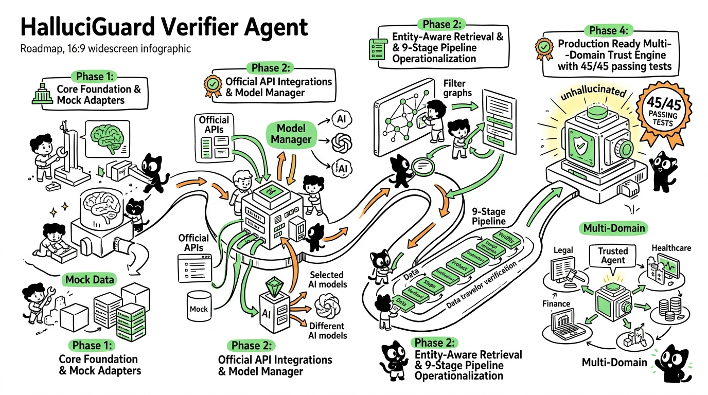

# 🛡️ HalluciGuard Verifier Agent

> **Enterprise-Grade Multi-Source Evidence Retrieval & Natural Language Inference Engine**  
> *Production Version: 2.0.0 | Schema Version: 2.0 | Architecture: Multi-Agent Trust Layer*

[](https://www.python.org/)
[](https://fastapi.tiangolo.com/)
[](https://docs.pytest.org/)
[](https://github.com/psf/black)
[]()

---

## 📌 Architectural Overview

The **HalluciGuard Verifier Agent** is an autonomous, production-grade evidence retrieval and claim verification service designed for mission-critical Large Language Model (LLM) applications. Serving as the primary factual validation engine within the HalluciGuard multi-agent trust framework, the Verifier Agent evaluates candidate claims against authoritative external databases and specialized domain ML models.

### FAANG-Level Master Technical Infographic
*(Style Inspiration: `helloianneo/ian-xiaohei-illustrations` — Hand-drawn Editorial Engineering Illustration)*





---

## ⚡ The 9-Stage Production Verification Pipeline



```text
[Stage 1] DOMAIN VALIDATION & ROUTING  ──► Validates request domain and selects specialized models
[Stage 2] CLAIM DECOMPOSITION         ──► Splits compound sentences into atomic sub-claims
[Stage 3] ENTITY RESOLUTION & EXPANSION──► Canonicalizes entities & expands synonyms
[Stage 4] MULTI-SOURCE RETRIEVAL       ──► Executes parallel API queries across official sources
[Stage 5] HYBRID RRF RETRIEVAL         ──► Combines BM25 + FAISS Dense vector search via Reciprocal Rank Fusion
[Stage 6] CROSS-ENCODER RERANKING      ──► Reranks top passages using cross-encoders
[Stage 7] DEBERTA NLI ENTAILMENT       ──► Runs batched NLI inference for Entailment / Contradiction
[Stage 8] SCORING & CITATIONS          ──► Applies dynamic credibility weighting & recency decay
[Stage 9] CONFLICT RESOLUTION          ──► Applies 2:1 majority conflict logic, calibrates confidence & generates explanations
```

---

## 🚀 Key Innovations & Engineering Capabilities

### 1. Entity-Aware Query Resolution (`claims/entity_resolver.py`)
Rather than relying on broad keyword searches, the Verifier Agent performs named entity resolution prior to external retrieval:
* **Cybersecurity**: Extracts CVE IDs (`CVE-2021-44228`), MITRE ATT&CK technique IDs (`T1059`), CWE references, and threat actor names. Queries NVD API v2 using direct `cveId` parameters.
* **Finance**: Canonicalizes corporate names to official SEC CIK numbers and stock tickers (*Apple* $\rightarrow$ `AAPL` / `0000320193`, *Tesla* $\rightarrow$ `TSLA` / `0001318605`).
* **Healthcare / Pharmacy**: Resolves active ingredients, MeSH drug identifiers, and medical conditions (*Metformin*, *Type 2 Diabetes*).
* **Legal**: Identifies section numbers and statutory acts (*IPC*, *CrPC*, *GDPR Article 17*).

### 2. Domain Intelligence & Model Routing Tech Stack (`models/wrappers/`)



Supports 10 modular, thread-safe production model wrappers managed by a reentrant `ModelManager` singleton with LRU memory eviction and automatic CPU fallback:
* **Biomedical**: `BiomedNLP-PubMedBERT`, `BioBERT`, `SciBERT`, `Bio_ClinicalBERT`, `SapBERT`.
* **Financial**: `ProsusAI/finbert`, `finbert-tone`.
* **Cybersecurity**: `jackaduma/SecBERT`.
* **Legal**: `nlpaueb/legal-bert-base-uncased`.
* **Programming**: `microsoft/codebert-base`, `graphcodebert-base`.
* **Dense Embeddings & Reranking**: `BAAI/bge-m3`, `e5-large-v2`, `BAAI/bge-reranker-large`, `ms-marco-MiniLM-L-6-v2`.
* **NLI Inference**: `cross-encoder/nli-deberta-v3-base`, `deberta-v3-large`, `facebook/bart-large-mnli`.

---

## 📈 Project Progress & Evolution



* **Phase 1: Foundation Architecture** — Established core schemas, SQLite caching, and initial mock adapters.
* **Phase 2: Official Integrations** — Integrated live REST APIs (NVD v2, SEC EDGAR EFTS, PubMed Central, OpenFDA) and HuggingFace pipelines.
* **Phase 3: Operationalization** — Created 10 specialized model wrappers, hardware-aware ModelRouter, and LRU memory manager pool.
* **Phase 4: Production Readiness** — Added EntityResolver for precision retrieval, NLI label normalization, and validated 45/45 PyTest test cases.

---

## 📥 Data Contracts (Inputs & Outputs)

### Request Contract (`POST /verify`)

```json
{
  "query_id": "req-cyber-001",
  "domain": "cybersecurity",
  "suspicious_claims": [
    {
      "claim_id": "claim-01",
      "text": "Log4Shell CVE-2021-44228 allows remote code execution without authentication."
    }
  ]
}
```

### Response Contract (`VerifierOutputV2`)

```json
{
  "query_id": "req-cyber-001",
  "domain": "cybersecurity",
  "domain_validated": true,
  "retrieved_sources": 5,
  "verified_sources": 4,
  "claim_evidence": [
    {
      "claim_id": "claim-01",
      "claim_text": "Log4Shell CVE-2021-44228 allows remote code execution without authentication.",
      "evidence": [
        {
          "title": "NVD CVE: CVE-2021-44228",
          "source": "nvd",
          "url": "https://nvd.nist.gov/vuln/detail/CVE-2021-44228",
          "publication_date": "2021-12-10",
          "snippet": "Vulnerability CVE-2021-44228: Apache Log4j2 JNDI features do not protect against attacker controlled LDAP... allows arbitrary code execution...",
          "entailment_label": "entailment",
          "entailment_score": 0.94,
          "credibility_score": 0.96
        }
      ],
      "support_score": 0.94,
      "contradiction_score": 0.0,
      "trust_score": 0.94,
      "confidence_score": 0.89,
      "verdict": "verified",
      "explanation": "Verified (94.0% trust score): 4 out of 4 authoritative sources support this claim. The primary source (nvd, authority: 0.96) states: \"Vulnerability CVE-2021-44228: Apache Log4j2 JNDI features...\"",
      "supporting_sources": ["nvd", "cisa"],
      "contradicting_sources": [],
      "retrieved_documents": 5,
      "reranked_documents": 4,
      "verified_evidence": 4
    }
  ],
  "overall_evidence_confidence": 0.94,
  "latency_ms": 1420,
  "pipeline_stages": [
    {"stage": "domain_validation", "status": "completed", "duration_ms": 1},
    {"stage": "claim_decomposition", "status": "completed", "duration_ms": 0},
    {"stage": "query_expansion", "status": "completed", "duration_ms": 1},
    {"stage": "retrieval", "status": "completed", "duration_ms": 820},
    {"stage": "aggregation", "status": "completed", "duration_ms": 150},
    {"stage": "reranking", "status": "completed", "duration_ms": 230},
    {"stage": "nli", "status": "completed", "duration_ms": 218},
    {"stage": "scoring", "status": "completed", "duration_ms": 0},
    {"stage": "formatting", "status": "completed", "duration_ms": 0}
  ],
  "runtime_models": {
    "embedding_model": "jackaduma/SecBERT",
    "reranker_model": "BAAI/bge-reranker-large",
    "nli_model": "cross-encoder/nli-deberta-v3-base",
    "cross_encoder": "BAAI/bge-reranker-large",
    "classification_model": "jackaduma/SecBERT",
    "retrieval_strategy": "multi_source_api_then_bm25_dense_faiss_rrf",
    "device": "cpu",
    "claim_complexity": "standard",
    "latency_budget": "balanced",
    "routing_reason": "domain=cybersecurity; complexity=standard"
  },
  "cache_hit": false
}
```

---

## 🌐 Supported Domains & Source Matrix

| Domain Category | Authoritative Sources | Default Model | Credibility |
| :--- | :--- | :--- | :--- |
| 🏥 **Healthcare** | PubMed Central, NCBI eUtils, openFDA, ClinicalTrials.gov | `BiomedNLP-PubMedBERT` | 0.97 - 0.98 |
| 🔒 **Cybersecurity** | NIST NVD v2, MITRE ATT&CK STIX 2.1, CISA KEV | `SecBERT` | 0.96 |
| 💰 **Finance** | SEC EDGAR EFTS (10-K/10-Q), World Bank, Alpha Vantage | `ProsusAI/finbert` | 0.95 - 0.98 |
| ⚖️ **Legal** | CourtListener, Wikipedia Legal, Curated Statutory Acts | `Legal-BERT` | 0.85 - 0.90 |
| 🤖 **AI Research** | arXiv API, Semantic Scholar, Crossref | `BAAI/bge-m3` | 0.90 - 0.93 |
| 🌍 **General** | Wikipedia REST API, Wikidata | `all-MiniLM-L6-v2` | 0.80 - 0.82 |
| 📚 **24+ Specialized** | Agriculture, Astronomy, Chemistry, Physics, Economics, etc. | Domain Intelligence Registry | Dynamic |

---

## 🛠️ API Reference

| Endpoint | Method | Description |
| :--- | :--- | :--- |
| `POST /verify` | `POST` | Executes full 9-stage claim verification pipeline |
| `GET /health` | `GET` | System health, loaded model pool, hardware status |
| `GET /domains` | `GET` | Domain intelligence statistics & source profiles |
| `GET /pipeline` | `GET` | Stage visualization & execution timing specs |
| `GET /metrics` | `GET` | Real-time operational metrics & cache statistics |
| `GET /docs` | `GET` | Interactive Swagger UI API documentation |

---

## 🧪 Testing & Empirical Validation

Run the complete 45-test PyTest suite:

```bash
# Navigate to verifier agent directory
cd agents/verifier_agent

# Execute test suite
python -m pytest tests/ -v
```

```text
================ 45 passed, 3 warnings in 22.57s ==================
```

---

## 📁 Package Directory Structure

```text
agents/verifier_agent/
├── api/                   # FastAPI application & VerificationPipeline orchestrator
├── adapters/              # Domain retrieval adapters (Healthcare, Cyber, Finance, Legal, AI)
├── claims/                # Claim decomposition, normalizer & EntityResolver
├── models/                # ModelManager singleton, ModelRouter, & domain wrappers/
│   └── wrappers/          # 10 specialized domain model wrappers
├── retrievers/            # Sparse (BM25) + Dense (FAISS) + Hybrid (RRF) engines
├── rerankers/             # Cross-encoder rerankers (bge-reranker-large)
├── nli/                   # Batched DeBERTa NLI entailment classifier
├── scorers/               # EvidenceScorer, SourceReliabilityManager, ConflictResolver
├── explanations/          # Natural language explanation generator
├── formatters/            # Citation & response formatters
├── cache/                 # SQLite async cache with TTL eviction
├── config/                # Settings, domain_intelligence.yaml, credibility.yaml
├── schemas/               # Pydantic v2 data models & response contracts
└── tests/                 # PyTest test suite
```
