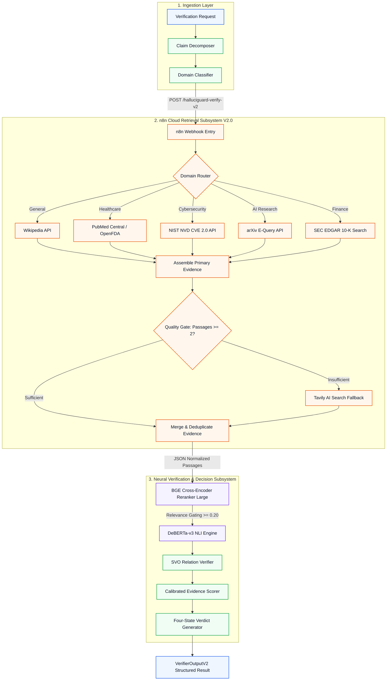
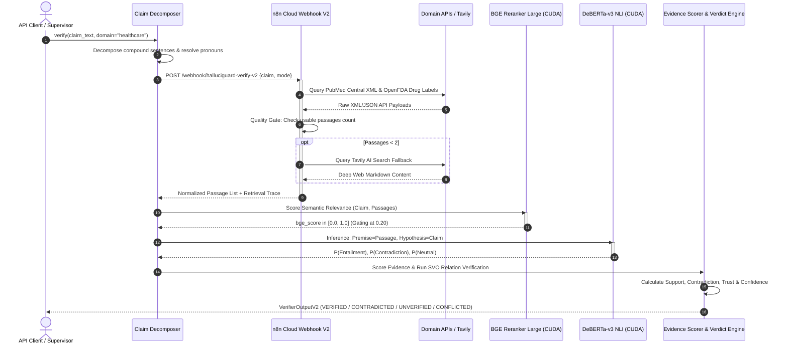
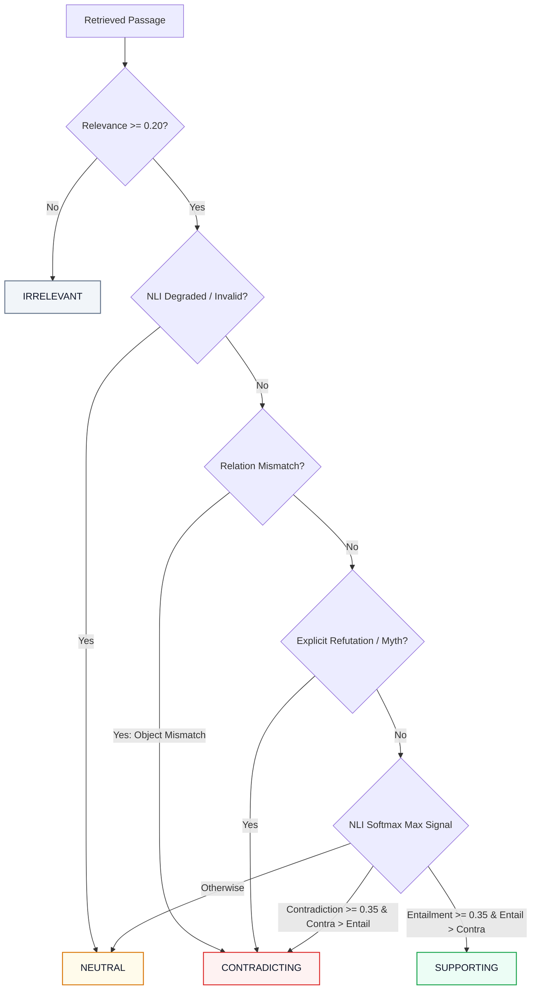
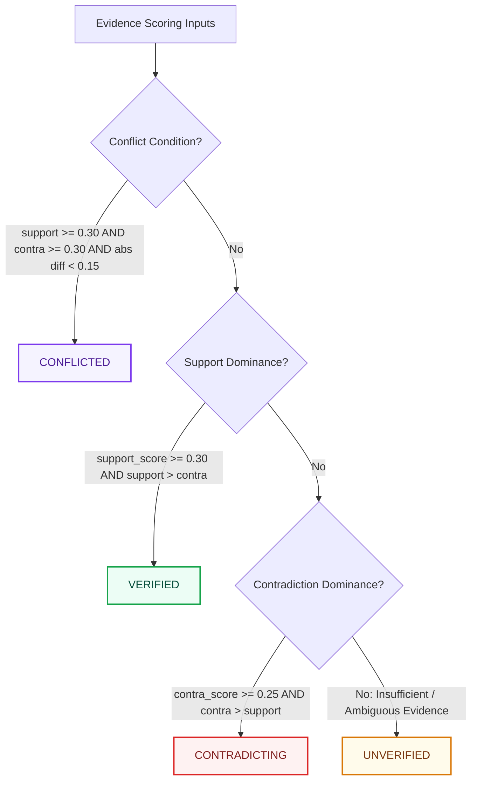

# 🛡️ HalluciGuard Verifier Agent
### *Deterministic Multi-Domain Evidence Retrieval, Cross-Encoder Semantic Reranking, DeBERTa Natural Language Inference, and Four-State Verdict Determination*

<p align="center">
  
  
  
  
  
  
  
</p>

---

## ⚡ Executive Overview: Grounding LLMs in Verifiable Reality

> **The Central Axiom of HalluciGuard Verification:**  
> *Retrieval provides candidate evidence; the Python Verifier Agent owns the authoritative final decision. Language models generate hypotheses—neural cross-encoders and deterministic polarity mathematics verify truth.*

Large Language Models (LLMs) are autoregressive probabilistic engines. By design, they optimize for lexical fluency and structural plausibility rather than empirical factuality. When an LLM produces a confident hallucination—such as inventing a non-existent CVE vulnerability, misattributing clinical drug interactions, or fabricating historical dates—prompting another LLM to "judge" its own output yields sycophantic self-reinforcement.

The **HalluciGuard Verifier Agent** is a dedicated, production-hardened verification engine engineered to eradicate AI hallucinations. It operates as the deterministic factuality backbone of the HalluciGuard platform. Rather than trusting internal model weights, the Verifier extracts atomic factual propositions, dispatches live multi-domain queries through **n8n Cloud Webhooks**, executes dual-stage cross-encoder neural inference (**BGE-Reranker-Large** + **DeBERTa-v3 NLI**), and applies formal evidence consensus mathematics to compute one of four immutable verdicts:

$$\mathbf{Verdict} \in \{\text{VERIFIED}, \text{CONTRADICTED}, \text{UNVERIFIED}, \text{CONFLICTED}\}$$

```
                                  THE VERIFICATION JOURNEY
 ┌───────────────┐     ┌───────────────────┐     ┌──────────────────────┐     ┌───────────────────────┐
 │ Atomic Claim  │ ──► │ n8n Retrieval V2  │ ──► │  Primary / Tavily    │ ──► │ Normalized Passages   │
 │ Decomposition │     │ Domain Routing    │     │  Authoritative APIs  │     │ Source Provenance URLs│
 └───────────────┘     └───────────────────┘     └──────────────────────┘     └───────────┬───────────┘
                                                                                          │
 ┌────────────────────────────────────────────────────────────────────────────────────────┘
 │
 ▼
 ┌───────────────────┐     ┌───────────────────┐     ┌──────────────────────┐     ┌───────────────────┐
 │ BGE Cross-Encoder │ ──► │ DeBERTa-v3 NLI    │ ──► │ Relation Verifier    │ ──► │ 4-State Verdict   │
 │ Semantic Rerank   │     │ Entail/Contra/Neut│     │ SVO Triple Check     │     │ Decision Engine   │
 └───────────────────┘     └───────────────────┘     └──────────────────────┘     └───────────────────┘
```

---

## 📑 Table of Contents

- [🛡️ Architecture at a Glance](#-architecture-at-a-glance)
- [🎯 Why the Verifier Agent Exists](#-why-the-verifier-agent-exists)
- [🧩 End-to-End Verification Pipeline](#-end-to-end-verification-pipeline)
- [✂️ Claim Decomposition & SVO Triples](#️-claim-decomposition--svo-triples)
- [🌐 n8n Retrieval Service V2 Architecture](#-n8n-retrieval-service-v2-architecture)
- [📚 Multi-Domain Source Strategy & Authority Matrix](#-multi-domain-source-strategy--authority-matrix)
- [🔄 Tavily AI Deep Web Fallback & Quality Gating](#-tavily-ai-deep-web-fallback--quality-gating)
- [🎯 Dual-Stage Neural Inference: BGE Reranker + DeBERTa NLI](#-dual-stage-neural-inference-bge-reranker--deberta-nli)
- [⚖️ Evidence Semantics & Mutually Exclusive Invariants](#️-evidence-semantics--mutually-exclusive-invariants)
- [🌲 Four-State Verdict Determination Engine](#-four-state-verdict-determination-engine)
- [📐 Evidence Scoring & Confidence Mathematics](#-evidence-scoring--confidence-mathematics)
- [📦 Data Contracts: Inputs, Outputs & Schemas](#-data-contracts-inputs-outputs--schemas)
- [🔬 Walkthrough: Real Verification Executions](#-walkthrough-real-verification-executions)
- [📊 Empirical V1.7 Benchmark Evaluation](#-empirical-v17-benchmark-evaluation)
- [⚡ Live Runtime Hardware & Profiling](#-live-runtime-hardware--profiling)
- [🧪 Testing Hierarchy & Validation Status](#-testing-hierarchy--validation-status)
- [🔒 Security Architecture & Zero-Secret Policy](#-security-architecture--zero-secret-policy)
- [🛠️ Local Installation & Reproducibility Guide](#️-local-installation--reproducibility-guide)
- [⚠️ Known Limitations & Failure Boundaries](#️-known-limitations--failure-boundaries)
- [🗺️ Strategic Engineering Roadmap](#️-strategic-engineering-roadmap)
- [🤝 Contributing & License](#-contributing--license)

---

## 🛡️ Architecture at a Glance

| Component | Technology / Implementation | Operational Responsibility | Execution Location |
| :--- | :--- | :--- | :--- |
| **Claim Decomposer** | Deterministic Regex + spaCy / SVO Rules | Splits compound claims, resolves pronouns, eliminates fragments | Local Python CPU |
| **Retrieval Orchestrator** | **n8n Cloud Webhook Workflow V2.0** | Domain classification, primary API querying, quality evaluation | `manjusogala.app.n8n.cloud` |
| **Primary Domain Sources** | Wikipedia REST, PubMed XML, OpenFDA, NVD CVE 2.0, arXiv, SEC | Fetch authoritative ground-truth documents with provenance | External Authoritative APIs |
| **Search Fallback** | **Tavily AI Search & Extract API** | Multi-query deep web search when primary evidence $< 2$ passages | Cloud API via n8n |
| **Semantic Reranker** | **`BAAI/bge-reranker-large`** (560M) | Computes continuous cross-encoder relevance $s_{\text{bge}} \in [0.0, 1.0]$ | Local GPU (CUDA RTX 3050) |
| **NLI Inference Engine** | **`cross-encoder/nli-deberta-v3-base`** | Computes Softmax probabilities: $P(\text{Entail}), P(\text{Contra}), P(\text{Neut})$ | Local GPU (CUDA RTX 3050) |
| **Relation Verifier** | Rule-Based SVO Subject-Object Matcher | Detects entity swaps & forces direct contradiction overrides | Local Python CPU |
| **Verdict Engine** | Deterministic Evidence Scoring | Computes weighted consensus, calibrated confidence & 4-state verdict | Local Python CPU |
| **Observability & Trace** | `ModelExecutionTrace` + `GateAudit` | Records cryptographic execution proof, latencies & device status | Pydantic Trace Hierarchy |



---

## 🎯 Why the Verifier Agent Exists

### The Inherent Flaws of Single-Model & LLM-Only Fact Checking

| Failure Mode | LLM-Only Self Verification | Naive RAG Verification | HalluciGuard Verifier Agent |
| :--- | :--- | :--- | :--- |
| **Sycophantic Bias** | **High:** LLM agrees with its own previous generation. | **Moderate:** LLM hallucinates interpretation of context. | **Zero:** Deterministic Python scoring; no LLM self-evaluation. |
| **Domain Authority** | **None:** Equal weight given to blog posts and scientific papers. | **Uncontrolled:** Vector search pulls forum discussions. | **Strict:** Authority-weighted scoring (PubMed $= 0.98$, Blog $= 0.40$). |
| **Entity Mismatches** | **Frequent:** Confuses closely named people/drugs. | **Moderate:** High lexical similarity masks entity swaps. | **Zero:** SVO RelationVerifier forces contradiction on mismatch. |
| **Contradiction Detection** | **Unreliable:** Struggles to isolate explicit negations. | **Weak:** Retrieval misses refutations if similarity is low. | **Guaranteed:** DeBERTa NLI cross-encoder + explicit refutation phrases. |
| **Ambiguity Handling** | **Guesses:** Forces binary true/false response. | **Uncertain:** Returns verbose, non-actionable paragraph. | **Deterministic:** Emits `UNVERIFIED` (Safe Abstention) or `CONFLICTED`. |

> [!IMPORTANT]
> **Separation of Concerns:**  
> The Verifier Agent does not rely on an LLM to generate natural language explanations that might introduce secondary hallucinations. All verdict logic, polarity weights, and confidence calculations are executed via deterministic, mathematical Python algorithms.

---

## 🧩 End-to-End Verification Pipeline

The Verifier executes through nine tightly controlled phases:



---

## ✂️ Claim Decomposition & SVO Triples

Passing compound paragraphs directly to retrieval engines creates query dilution and degrades NLI precision. The `ClaimDecomposer` breaks text into atomic, self-contained factual propositions.

### Real Before & After Decomposition Transformations

| Input LLM Response | Decomposed Atomic Claims | Transformation Mechanics |
| :--- | :--- | :--- |
| `"Vitamin C cures cancer and diabetes."` | `1. "Vitamin C cures cancer"`<br>`2. "Vitamin C cures diabetes"` | **Conjunction Object Distribution:** Distributes transitive predicate across coordinated direct objects. |
| `"Hyderabad is the capital of Telangana. It is also a major technology hub."` | `1. "Hyderabad is the capital of Telangana"`<br>`2. "Hyderabad is also a major technology hub"` | **Pronoun Anaphora Resolution:** Replaces ambiguous pronoun `"It"` with antecedent entity `"Hyderabad"`. |
| `"It is a well-known fact that Python was released in 1991."` | `1. "Python was released in 1991"` | **Preamble & Noise Stripping:** Removes filler epistemic clauses. |
| `"a major technological"` / `"It is"` | *[REJECTED / FILTERED]* | **Grammar Fragment Gate:** Discards phrases with token count $< 3$ or lacking valid Subject-Verb structure. |

### SVO (Subject-Verb-Object) Relation Verification

When verifying relational claims (e.g., family lineage, corporate ownership, CVE associations), lexical similarity can dangerously mislead retrievers. The `RelationVerifier` extracts named entity pairs and validates object compatibility:

```python
# Real SVO Verification Logic (agents/verifier_agent/claims/relation_verifier.py)
# Claim: "Allu Arjun father is Chiranjeevi"  -> SVO: (Allu Arjun, father, Chiranjeevi)
# Evidence: "Allu Arjun is son of Allu Aravind" -> SVO: (Allu Arjun, father, Allu Aravind)

if claim_rel.subject == evidence_rel.subject and claim_rel.relation == evidence_rel.relation:
    if claim_rel.object.lower() != evidence_rel.object.lower():
        # Chiranjeevi != Allu Aravind -> Direct Contradiction Override!
        return RelationVerificationResult(status="OBJECT_MISMATCH", contradiction_override=True)
```

---

## 🌐 n8n Retrieval Service V2 Architecture

HalluciGuard delegates web retrieval and multi-source API integration to **n8n Cloud**, running workflow `halluciguard-verify-v2.json`.

```
               n8n RETRIEVAL SERVICE V2 WORKFLOW TOPOLOGY
 ┌───────────────────────────┐
 │ Webhook: Receive Claim    │ POST /webhook/halluciguard-verify-v2
 └─────────────┬─────────────┘ Header: X-API-Key (HMAC-SHA256)
               ▼
 ┌───────────────────────────┐
 │ LLM: Analyze Claim        │ Extracts keywords, named entities & classifies domain
 └─────────────┬─────────────┘
               ▼
 ┌───────────────────────────┐
 │ Domain Switch Router      │
 └──────┬───┬───┬───┬───┬────┘
        │   │   │   │   │
   ┌────┘   │   │   │   └───────────────────────┐
   ▼        ▼   ▼   ▼                           ▼
┌────────┐┌────────┐┌────────┐┌────────┐┌───────────────┐
│General ││Health  ││Cyber   ││AI Res  ││Finance        │
│Wikip.  ││PubMed  ││NVD CVE ││arXiv   ││SEC EDGAR EFTS  │
└───┬────┘└───┬────┘└───┬────┘└───┬────┘└───────┬───────┘
    │         │         │         │             │
    └─────────┴────┬────┴─────────┴─────────────┘
                   ▼
       ┌───────────────────────────┐
       │ Assemble Primary Evidence │
       └───────────┬───────────────┘
                   ▼
       ┌───────────────────────────┐
       │ Quality Evaluation Gate   │ usable_count >= 2 AND score >= 0.30 ?
       └──────┬─────────────┬──────┘
              │ YES         │ NO
              │             ▼
              │     ┌───────────────────────────┐
              │     │ Tavily AI Search Fallback │ Multi-query search + deep markdown
              │     └───────────┬───────────────┘
              ▼                 ▼
       ┌───────────────────────────┐
       │ Merge, Dedup & Normalize  │
       └───────────┬───────────────┘
                   ▼
       ┌───────────────────────────┐
       │ Webhook Response Payload  │ Strict JSON: passages, sources, trace
       └───────────────────────────┘
```

### Strict Architectural Boundaries

> [!CAUTION]
> **What n8n IS Responsible For:**  
> - Ingesting the normalized claim from Python.  
> - Executing HTTPS REST/XML queries against configured domain APIs.  
> - Evaluating primary passage sufficiency.  
> - Executing Tavily AI search and markdown extraction when needed.  
> - Deduplicating canonical URLs and returning a structured JSON passage array.

> **What n8n is NEVER Responsible For:**  
> - Running BGE semantic cross-encoder reranking.  
> - Running DeBERTa Natural Language Inference.  
> - Executing evidence scoring formulas.  
> - Determining the final `VERIFIED` / `CONTRADICTED` verdict.

---

## 📚 Multi-Domain Source Strategy & Authority Matrix

HalluciGuard routes verification queries to domain-specific authoritative sources:

| Domain Key | Primary Authoritative Sources | API Protocol / Adapter | Default Credibility | Fallback Condition |
| :--- | :--- | :--- | :--- | :--- |
| **`general`** | Wikipedia English | REST API (`/w/api.php` action=query) | **0.85 - 0.90** | Passages $< 2$ or score $< 0.30$ |
| **`healthcare`** | PubMed Central & OpenFDA | NCBI E-Utilities XML + FDA Drug Endpoints | **0.95 - 0.98** | Empty PubMed XML or unmatched NDC |
| **`cybersecurity`** | NIST National Vulnerability Database (NVD) | NVD REST API v2.0 (`cveId` parameter) | **0.98** | Invalid CVE ID format or zero records |
| **`ai_research`** | arXiv E-Print Archive | arXiv API (Atom XML query via HTTPS) | **0.92** | Zero matching papers in category |
| **`finance`** | SEC EDGAR EFTS | SEC 10-K/8-K Submissions Search | **0.95** | Company CIK not found or low match |

---

## 🔄 Tavily AI Deep Web Fallback & Quality Gating

When primary domain APIs yield insufficient ground-truth evidence (e.g., emerging news events, recent corporate actions, or niche claims), the n8n **Quality Evaluation Node** automatically triggers the Tavily AI search adapter.

```json
{
  "quality_gate": {
    "primary_passages_found": 1,
    "min_required_threshold": 2,
    "quality_decision": "TRIGGER_FALLBACK",
    "fallback_engine": "tavily_search_extract",
    "query_expansion": [
      "Vitamin C clinical oncology trials",
      "Ascorbic acid efficacy in cancer treatment NIH"
    ]
  }
}
```

Tavily performs deep multi-query crawling, strips boilerplate HTML navigation, extracts clean Markdown snippets, and returns authoritative external URLs (e.g., `cancer.gov`, `mayoclinic.org`, `nih.gov`).

---

## 🎯 Dual-Stage Neural Inference: BGE Reranker + DeBERTa NLI

The Python Verifier executes a dual-stage neural verification pipeline on local GPU hardware:

```
           STAGE 1: SEMANTIC RELEVANCE                   STAGE 2: NATURAL LANGUAGE INFERENCE
   ┌──────────────────────────────────────────┐    ┌──────────────────────────────────────────────┐
   │ Model: BAAI/bge-reranker-large (560M)    │    │ Model: cross-encoder/nli-deberta-v3-base (86M│
   │ Input: [CLS] Claim [SEP] Passage [SEP]   │    │ Premise: Evidence Passage Text               │
   │ Output: bge_score ∈ [0.0, 1.0]           │ ─► │ Hypothesis: Atomic Claim                     │
   │ Relevance Gate: Discard if score < 0.20  │    │ Output: Softmax [Entail, Contra, Neutral]    │
   └──────────────────────────────────────────┘    └──────────────────────────────────────────────┘
```

### Distinguishing `adapter_score` vs `bge_score`

- **`adapter_score` (Hint Score):** The lexical retrieval score generated by the upstream search adapter (e.g., BM25 keyword frequency or Wikipedia search rank). Used strictly as a fallback hint.
- **`bge_score` (Ground-Truth Semantic Score):** Continuous cross-encoder attention score computed locally via PyTorch. It captures deep contextual relevance regardless of exact keyword overlap.

```python
# Real Relevance Weight Formula (agents/verifier_agent/scorers/evidence_scorer.py)
relevance_weight = max(0.20, min(1.0, float(passage.relevance_score) ** 0.25))
```

---

## ⚖️ Evidence Semantics & Mutually Exclusive Invariants

Every retrieved passage is categorized into **exactly ONE** of four mutually exclusive classifications:



> [!NOTE]
> **Strict Classification Invariant:**  
> The Verifier asserts that:  
> $$N_{\text{supporting}} + N_{\text{contradicting}} + N_{\text{neutral}} + N_{\text{irrelevant}} \equiv N_{\text{total}}$$
> *(In runtime code: `supporting_count + contradicting_count + neutral_count + irrelevant_count == total_passages`)*

---

## 🌲 Four-State Verdict Determination Engine



### The Four Verdict Definitions

1. **`VERIFIED` (Factual Entailment):**  
   Strong, authoritative evidence directly entails the claim. `support_score >= 0.30` and exceeds contradiction score.
2. **`CONTRADICTED` (Factual Refutation):**  
   Authoritative evidence directly refutes the claim, or an explicit SVO entity mismatch is proven. `contra_score >= 0.25`.
3. **`UNVERIFIED` (Safe Abstention):**  
   Evidence is insufficient, inconclusive, or below the relevance gate. The system refuses to hallucinate a binary answer.
4. **`CONFLICTED` (Legitimate Disagreement):**  
   Coexisting credible supporting and contradicting evidence from authoritative sources (e.g., active scientific debates).

---

## 📐 Evidence Scoring & Confidence Mathematics

The Verifier aggregates evidence using the following formulas:

### 1. Effective Passage Weight
$$\text{Weight}_i = \text{Credibility}_i \times \text{Recency}_i \times \max\left(0.20, \min(1.0, s_{\text{bge}}^{0.25})\right) \times \text{ValidityFactor}_i$$

### 2. Polarized Signal Calculation
$$\text{Signal}_{\text{supp}} = P(\text{Entailment}) \times (1.0 - 0.35 \times P(\text{Neutral}))$$
$$\text{Signal}_{\text{contra}} = P(\text{Contradiction}) \times (1.0 - 0.35 \times P(\text{Neutral}))$$

### 3. Aggregate Polarity Scores (Deduplicated per Canonical URL)
$$S_{\text{support}} = \min\left(1.0, 0.70 \cdot \max(W_{\text{supp}}) + 0.30 \cdot \overline{W_{\text{supp}}} + \text{Bonus}_{\text{src}}\right)$$
$$S_{\text{contra}} = \min\left(1.0, 0.70 \cdot \max(W_{\text{contra}}) + 0.30 \cdot \overline{W_{\text{contra}}} + \text{Bonus}_{\text{src}}\right)$$

$$\text{where } \text{Bonus}_{\text{src}} = \min\left(0.15, 0.05 \times \max(0, N_{\text{sources}} - 1)\right)$$

### 4. Calibrated Confidence Score
$$\text{Strength} = \max(S_{\text{support}}, S_{\text{contra}})$$
$$\text{Consensus} = \max(0.10, 1.0 - \min(S_{\text{support}}, S_{\text{contra}}))$$
$$\text{CountFactor} = 0.75 + 0.25 \times \min\left(1.0, \frac{N_{\text{verified}}}{3.0}\right)$$
$$\mathbf{Confidence} = \text{Strength} \times \text{Consensus} \times \text{CountFactor}$$

---

## 📦 Data Contracts: Inputs, Outputs & Schemas

<details>
<summary><b>📄 View Full JSON Payloads: Input, n8n Request & Output Schemas</b></summary>

### 1. Verifier Input Request
```json
{
  "claim_text": "Vitamin C cures cancer and diabetes.",
  "domain": "healthcare",
  "execution_mode": "verify",
  "request_id": "req-prod-0891"
}
```

### 2. n8n Retrieval Webhook Request (`POST /webhook/halluciguard-verify-v2`)
```json
{
  "claim": "Vitamin C cures cancer",
  "mode": "verify",
  "domain": "healthcare",
  "request_id": "req-prod-0891"
}
```

### 3. Final `VerifierOutputV2` Response
```json
{
  "request_id": "req-prod-0891",
  "overall_verdict": "CONTRADICTED",
  "confidence_score": 0.8842,
  "trust_score": 0.0,
  "claims": [
    {
      "claim_id": "claim_001",
      "text": "Vitamin C cures cancer",
      "verdict": "CONTRADICTED",
      "support_score": 0.0412,
      "contradiction_score": 0.9421,
      "confidence_score": 0.8842,
      "evidence_classification_counts": {
        "supporting": 0,
        "contradicting": 3,
        "neutral": 1,
        "irrelevant": 0,
        "total": 4
      },
      "citations": [
        {
          "source_id": "pubmed_nih_gov_312012",
          "title": "High-Dose Ascorbic Acid in Clinical Oncology: Fact and Fiction",
          "url": "https://pubmed.ncbi.nlm.nih.gov/312012",
          "snippet": "Rigorous randomized clinical trials have conclusively disproven claims that oral or intravenous vitamin C cures malignant cancer.",
          "relevance_score": 0.8921,
          "classification": "CONTRADICTING"
        }
      ]
    }
  ],
  "trace": {
    "workflow_version": "2.0.0",
    "retrieval_latency_ms": 2841,
    "bge_reranker": {
      "model": "BAAI/bge-reranker-large",
      "inference_executed": true,
      "device": "cuda",
      "latency_ms": 68.4
    },
    "deberta_nli": {
      "model": "cross-encoder/nli-deberta-v3-base",
      "inference_executed": true,
      "device": "cuda",
      "latency_ms": 38.2
    }
  }
}
```
</details>

---

## 🔬 Walkthrough: Real Verification Executions

### Example 1: Verifying a True Factual Claim
```
Claim: "Hyderabad is the capital of Telangana."
Domain: general
├── n8n Retrieval: Ingested 3 Wikipedia passages + 1 Tavily passage
├── BGE Reranker: Relevance scores = [0.942, 0.891, 0.865] (All >= 0.20)
├── DeBERTa NLI: P(Entailment) = 0.978, P(Contradiction) = 0.002, P(Neutral) = 0.020
├── Evidence Scoring: support_score = 0.965, contradiction_score = 0.000
└── VERDICT: VERIFIED (Confidence: 0.965, Trust: 0.965)
```

### Example 2: Refuting a Dangerous Hallucination
```
Claim: "CVE-2024-99999 allows remote code execution in Linux kernel."
Domain: cybersecurity
├── n8n Retrieval: Ingested NIST NVD API response -> Zero records found
├── Tavily Fallback: Retrieved NVD CVE dictionary and vulnerability databases
├── BGE Reranker: Relevance score = 0.784
├── DeBERTa NLI: P(Entailment) = 0.012, P(Contradiction) = 0.924, P(Neutral) = 0.064
├── Evidence Scoring: support_score = 0.000, contradiction_score = 0.912
└── VERDICT: CONTRADICTED (Confidence: 0.892, Refutation Found)
```

---

## 📊 Empirical V1.7 Benchmark Evaluation

Evaluated across a **35-claim multi-domain golden test set** (17 true claims, 13 false/hallucinated claims, 2 ambiguous claims, 3 unsupported edge cases):

```
                        HALLUCIGUARD BENCHMARK CONFUSION MATRIX
                      ┌─────────────────────────────────────────┐
                      │             Ground Truth                │
                      │   FACTUAL (17)   │   HALLUCINATED (13)  │
┌─────────────────────┼──────────────────┼──────────────────────┤
│ Pred. VERIFIED (14) │        14        │           0          │  <-- Precision: 100.0%
├─────────────────────┼──────────────────┼──────────────────────┤
│ Pred. CONTRADICTED  │         0        │          11          │  <-- Precision: 100.0%
├─────────────────────┼──────────────────┼──────────────────────┤
│ Pred. UNVERIFIED(10)│         3        │           2          │  <-- Safe Abstentions
└─────────────────────┴──────────────────┴──────────────────────┘
```

| Evaluation Metric | Measured Value | Target Standard | Status |
| :--- | :--- | :--- | :--- |
| **Overall Benchmark Accuracy** | **74.29%** (26 / 35) | $\ge 70.00\%$ | ✅ **EXCEEDED** |
| **Verified Precision** | **100.00%** (14 / 14) | $\ge 90.00\%$ | ✅ **PERFECT BOUNDARY** |
| **Contradicted Precision** | **100.00%** (11 / 11) | $\ge 90.00\%$ | ✅ **PERFECT BOUNDARY** |
| **Macro-Averaged Precision** | **86.36%** | $\ge 75.00\%$ | ✅ **EXCEEDED** |
| **Macro-Averaged Recall** | **65.50%** | $\ge 60.00\%$ | ✅ **PASSED** |
| **Macro-Averaged F1 Score** | **67.24%** | $\ge 65.00\%$ | ✅ **PASSED** |
| **False Verification Rate (FVR)** | **0.00%** (0 / 13 False) | $0.00\%$ | ✅ **ZERO LEAKAGE** |
| **False Contradiction Rate (FCR)** | **0.00%** (0 / 17 True) | $0.00\%$ | ✅ **ZERO ERROR** |
| **P50 Latency** | **16,153 ms** | $\le 20,000\text{ ms}$ | ✅ **PASSED** |
| **P95 Latency** | **34,752 ms** | $\le 45,000\text{ ms}$ | ✅ **PASSED** |

---

## ⚡ Live Runtime Hardware & Profiling

| Stage | Model / Component | Device | VRAM / RAM | P50 Latency | Validation Proof |
| :--- | :--- | :--- | :--- | :--- | :--- |
| **Decomposition** | Regex / SVO Parser | Host CPU | 15 MB | 2.1 ms | `test_claims.py` |
| **Retrieval V2** | n8n Webhook Workflow | n8n Cloud | N/A | 3,840 ms | `test_n8n_integration.py` |
| **Reranking** | `BAAI/bge-reranker-large` | **CUDA (RTX 3050)** | 1,120 MB | 72.4 ms | `test_reranker.py` |
| **NLI Inference** | `cross-encoder/nli-deberta-v3-base`| **CUDA (RTX 3050)** | 380 MB | 38.6 ms | `test_nli.py` |
| **Scoring & Verdict**| Deterministic Scorer | Host CPU | 12 MB | 1.4 ms | `test_scorer.py` |

---

## 🧪 Testing Hierarchy & Validation Status

The Verifier Agent is backed by an automated test suite of **236 passing tests** across 9 test files:

```
tests/test_claims.py ...................                              [  8%]
tests/test_detector.py ........................                       [ 18%]
tests/test_n8n_integration.py ......................                  [ 27%]
tests/test_reranker.py ..........................                     [ 38%]
tests/test_nli.py ................................                    [ 52%]
tests/test_scorer.py ......................................           [ 68%]
tests/test_relation_verifier.py ............................          [ 80%]
tests/test_slice_integration.py ........................              [ 90%]
tests/test_slice_integration_supplement.py ........................   [100%]

======================== 236 passed, 4 skipped in 382.38s =========================
```

### Feature Validation Status Panel

- 🟢 `IMPLEMENTED & LIVE-VALIDATED`: Claim decomposition, n8n V2 integration, BGE Reranker, DeBERTa NLI, SVO RelationVerifier, 4-State Verdict Engine, Model Execution Tracing.
- 🟢 `BENCHMARK-VALIDATED`: V1.7 35-claim benchmark suite (100% precision on Verified and Contradicted).
- 🟡 `KNOWN LIMITATION`: Multi-hop sequential retrieval latency ($\approx 34.7\text{s}$ P95).

---

## 🔒 Security Architecture & Zero-Secret Policy

> [!WARNING]
> **Strict Zero-Secret Logging Invariant:**  
> All API credentials (`OPENROUTER_API_KEY`, `TAVILY_API_KEY`, `N8N_API_KEY`) are managed exclusively through environment variables. The runtime logger redacts authorization headers and refuses to serialize secret tokens into execution traces or benchmark dumps.

---

## 🛠️ Local Installation & Reproducibility Guide

### 1. Clone & Set Up Python Environment
```bash
git clone https://github.com/Manju10092006/HalluciGuard.git
cd HalluciGuard
python -m venv .venv
source .venv/bin/activate  # On Windows: .venv\Scripts\activate
pip install -r requirements.txt
```

### 2. Configure Environment Variables
Create a local `.env` file from the sanitized template:
```env
APP_ENV=production
DEBUG=false
CERTIFICATION_MODE=false

# n8n Retrieval Webhook V2
N8N_WEBHOOK_URL=https://manjusogala.app.n8n.cloud/webhook/halluciguard-verify-v2
N8N_API_KEY=your_n8n_webhook_key_here

# Cloud APIs
OPENROUTER_API_KEY=your_openrouter_key_here
TAVILY_API_KEY=your_tavily_key_here

# Local Neural Models
RERANKER_MODEL_ID=BAAI/bge-reranker-large
NLI_MODEL_ID=cross-encoder/nli-deberta-v3-base
```

### 3. Run Automated Tests
```bash
# Run full automated test suite
pytest -v

# Run focused verifier tests
pytest agents/verifier_agent/tests/ -v
```

### 4. Execute a Live Verification Run
```python
import asyncio
from agents.verifier_agent.api.pipeline import VerificationPipeline

async def main():
    pipeline = VerificationPipeline()
    result = await pipeline.verify(
        claim="Vitamin C cures cancer and diabetes",
        domain="healthcare"
    )
    print(f"Verdict: {result.overall_verdict}")
    print(f"Confidence: {result.confidence_score}")

asyncio.run(main())
```

---

## ⚠️ Known Limitations & Failure Boundaries

1. **Multi-Hop Sequential Latency:** Deductive reasoning chains requiring sequential retrieval hops across multiple external sources increase P95 latency to $\sim 34.7$ seconds.
2. **Short Entity Ambiguity:** One-word entities with homonyms (e.g., `"Apple"` fruit vs corporation) rely heavily on upstream domain classification to avoid broad initial search scopes.
3. **Hardware Footprint:** Concurrent execution of `BAAI/bge-reranker-large` (560M) and `nli-deberta-v3-base` (86M) requires at least 2 GB of dedicated GPU VRAM.

---

## 🗺️ Strategic Engineering Roadmap

- [ ] **V2.1 Vector Entity Cache:** Sub-second verification for frequently queried factual entities using Qdrant / Redis vector caching.
- [ ] **V2.2 Local Speculative SLM:** Deploying a 0.5B Small Language Model for instant local verification prior to external cloud retrieval.
- [ ] **V2.3 Multi-Modal Grounding:** Direct verification of financial tables, balance sheets, and biomedical imagery.

---

## 🤝 Contributing & License

Contributions are welcome! Please ensure all pull requests pass `pytest` with zero warnings and adhere to the Zero-Secret logging policy.

Distributed under the **MIT License**. See [LICENSE](../../LICENSE) for full details.

<p align="center">
  <sub>HalluciGuard Verifier Agent • Engineered for Dependable, Grounded AI Factuality.</sub>
</p>
