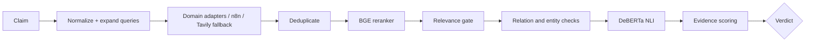

# Verifier Agent

The Verifier is the factual evidence engine in `agents/verifier_agent/`. It accepts atomic claims, retrieves candidate passages, ranks them, evaluates claim–evidence relations, and emits one of four claim verdicts.

## Models and evidence

- Reranker: `BAAI/bge-reranker-large`.
- NLI: `cross-encoder/nli-deberta-v3-base`.
- General retrieval includes Wikipedia and Tavily when configured.
- Domain adapters and `domain_intelligence.yaml` define additional source strategies.
- n8n can broker retrieval, but Python performs the decision-grade relevance and factual evaluation.

## Verdicts

- `VERIFIED`: decision-grade evidence supports the claim without material contradiction.
- `CONTRADICTED`: decision-grade evidence refutes the claim without material support.
- `CONFLICTED`: meaningful support and contradiction coexist.
- `UNVERIFIED`: available evidence is absent, irrelevant, neutral, or insufficient.

Retrieval success is not verification. A returned page can be irrelevant, and a high-authority source can still fail to address the specific relationship. Relation checks, named-entity guards, reranking and NLI reduce these failure modes but do not eliminate them.

Native reports include retrieved/reranked document counts, evidence metadata, scores and explanations. The canonical contract exposes the stable subset consumed by Judge.
