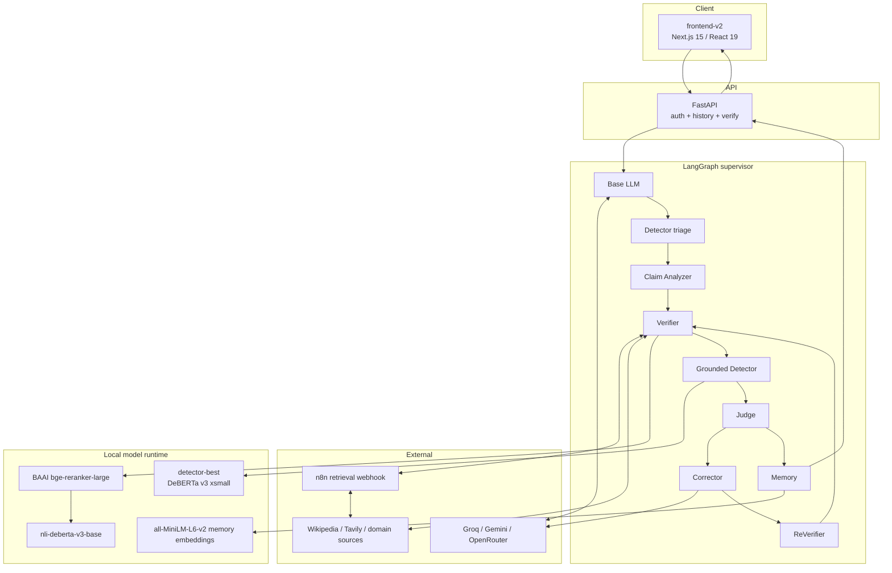

# HalluciGuard architecture

## System boundary

HalluciGuard is an evidence-grounded control plane around hosted generation and local verification models. The Next.js client calls the FastAPI orchestration API; LangGraph coordinates generation and trust stages; external providers supply generation and retrieval; local models rerank, classify evidence relations, and estimate grounded risk.

## Control flow

The production default verifies every generated response. An evidence-free Detector pass performs only triage. Claim Analyzer then removes non-factual text. Verifier retrieves and scores evidence. A second Detector pass uses those evidence snippets to execute the trained checkpoint. Judge consumes both grounded Detector diagnostics and Verifier verdicts.

`ACCEPT` proceeds to Memory. `VERIFY_AGAIN` repeats retrieval within a fixed budget. `CORRECT` authorizes a minimal evidence-bound edit, followed by independent ReVerifier execution. `REJECT` and `ABSTAIN` withhold release. Every terminal path crosses Memory for audit, but only accepted verified facts are written.

## Trust boundaries

| Boundary | Trusted for | Not trusted for |
|---|---|---|
| Hosted LLM | Candidate text | Factual certification |
| n8n | Transport, search brokering, extraction, normalization metadata | Final relevance, entailment or verdict |
| Reranker | Claim–passage relevance signal | Truth |
| NLI | Textual support/contradiction signal | Source authenticity or full world knowledge |
| Detector | Calibrated evidence-conditioned risk | Final release decision |
| Verifier | Claim-level evidence verdict | Product policy |
| Judge | Workflow/release policy | Retrieval or fact generation |
| Memory | Reuse of previously accepted facts | Permanent freshness |

## Data contracts

Canonical models are in `orchestration/schemas.py`. `HalluciGuardState` in `orchestration/state.py` carries both canonical outputs and compatibility views, plus request metadata, retry counters, trace, errors, and inter-agent messages.

The API returns enough structured state for the frontend to show what executed. Conditional stages are labeled `NOT_REQUIRED` or skipped; they are never represented as successful execution.

## Deployment surfaces

- `orchestration.api:app`: canonical FastAPI product API.
- `app.py`: Hugging Face/Gradio-compatible deployment entry point that mounts/uses the backend.
- `frontend-v2/`: active Vercel-oriented web client.
- Per-agent APIs: Detector, Verifier, Corrector and Memory expose optional standalone development surfaces.

See [project structure](project-structure.md), [API reference](api.md), and [orchestration guide](../orchestration/README.md).
