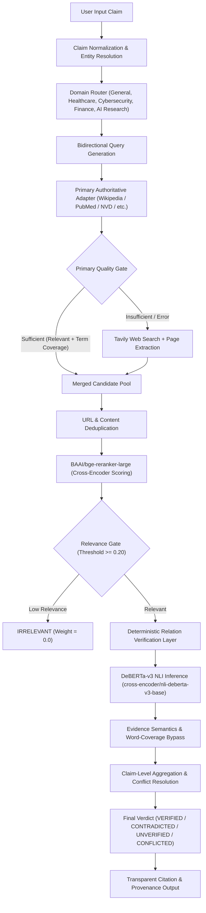

# HalluciGuard Verifier V2 — Architecture & Technical Design

## 1. System Architecture Overview

HalluciGuard Verifier V2 is an authoritative, multi-stage fact-verification system built to evaluate claims without fabricating evidence, scores, or certainty.



---

## 2. Pipeline Stages & Architectural Contracts

### Stage 1: Normalization & Bidirectional Query Generation
* **Component**: `claims/normalizer.py`, `routers/query_expander.py`
* **Function**: Normalizes casing, strips rhetorical prefixes, and generates bidirectional search queries:
  - *Active $\leftrightarrow$ Passive*: `Java was created by James Gosling` $\rightarrow$ `Java created by`, `who created Java`
  - *Entity-Relationship*: `Chiranjeevi is the father of Allu Arjun` $\rightarrow$ `Allu Arjun father`, `Allu Arjun family`
  - *Domain Canonicalization*: `CVE-2021-44228` $\rightarrow$ NVD API parameters.

### Stage 2: Quality-Gated Multi-Adapter Retrieval
* **Component**: `adapters/web_enhanced.py`, `adapters/general.py`, `adapters/healthcare.py`, etc.
* **Retrieval Modes**:
  - `hybrid` (Default): Primary adapter first; Tavily web search only if quality gate fails.
  - `primary_only`: Primary adapter only; no web fallback.
  - `tavily_only` / `--force-tavily`: Diagnostic mode skipping primary adapter.
* **Quality Gate Policy**:
  - Evaluates usable passage structure (snippet $\ge 20$ chars, valid URL, valid title).
  - Assesses pre-ranking relevance signal ($overlap\_ratio \times 0.7 + hint \times 0.3$).
  - Enforces minimum query-term lexical coverage ($\ge 50\%$).

### Stage 3: Merge, Deduplication & Cross-Encoder Reranking
* **Component**: `retrievers/hybrid.py`, `BAAI/bge-reranker-large`
* **Deduplication**: Normalizes URLs (stripping query parameters, tracking tags, trailing slashes, fragments) and detects text duplicate chunks.
* **BGE Reranking**: Measures query-passage cross-attention directly, producing continuous logit scores normalized to $[0.0, 1.0]$.
* **Relevance Gating**: Passages scoring $< 0.20$ are designated `IRRELEVANT` and assigned zero factual weight prior to NLI evaluation.

### Stage 4: Deterministic Relation Verification Layer
* **Component**: `scorers/relation_verifier.py`
* **Supported Relations**: `capital_of`, `location_of`, `father_of`/`mother_of`/`parent_of`, `created_by`, `associated_with`, `is_a`.
* **Bypass Invariant**:
  - When `status == OBJECT_MISMATCH` (e.g. claim asserts Hyderabad is capital of India, but evidence proves Telangana), the check directly triggers refutation.
  - Bypasses the legacy claim-word-coverage suppression check completely, avoiding the false-token containment bug.

### Stage 5: DeBERTa Cross-Encoder NLI & Evidence Semantics
* **Component**: `nli/robust_entailment.py`, `scorers/evidence_scorer.py`
* **Model**: `cross-encoder/nli-deberta-v3-base` (3-way: Entailment, Contradiction, Neutral).
* **Explicit Refutation Logic**: Detects explicit qualification phrases (*"scientifically disproven"*, *"debunked"*, *"untrue"*, *"hoax"*) and marks assertive affirmative claims as `CONTRADICTING`.

### Stage 6: Claim-Level Aggregation & Calibration
* **Component**: `scorers/evidence_scorer.py`, `scorers/conflict_resolver.py`
* **Public Verdict Contract**:
  - `VERIFIED`: Substantial supporting evidence ($\ge 0.35$), minimal contradiction ($< 0.15$).
  - `CONTRADICTED`: Substantial contradicting evidence ($\ge 0.35$), minimal support ($< 0.15$).
  - `CONFLICTED`: Competing strong support ($\ge 0.35$) and strong contradiction ($\ge 0.35$).
  - `UNVERIFIED`: Insufficient evidence passing decision-grade relevance threshold.
* **Public Evidence Classes**: `SUPPORTING`, `CONTRADICTING`, `NEUTRAL`, `IRRELEVANT`.
* **Honest Confidence Calibration**:
  $$\text{Confidence} = \max(\text{Support}, \text{Contradict}) \times \text{Decision Grade Weight} \times (1.0 - \text{Conflict Penalty})$$
  *(Confidence never uses hard-coded source credibility as a substitute for factual alignment).*

---

## 3. Schemas & Provenance Models

All pipeline transactions adhere to strict Pydantic models in `schemas/models.py` and `schemas/retrieval_trace.py`:

```python
class EvidenceItem(BaseModel):
    title: str
    source: str
    url: str
    publication_date: str
    snippet: str
    source_id: str
    entailment_score: float
    entailment_label: EntailmentLabel
    credibility_score: float
    relevance_score: float
    source_confidence_hint: float
    relation_check: Optional[RelationCheckResult]

class VerifierReportV2(BaseModel):
    claim_id: str
    claim_text: str
    verdict: VerdictLabel  # VERIFIED | CONTRADICTED | UNVERIFIED | CONFLICTED
    confidence_score: float
    support_score: float
    contradiction_score: float
    trust_score: float
    explanation: str
    evidence: List[EvidenceItem]
    retrieval_trace: Dict[str, Any]
```
