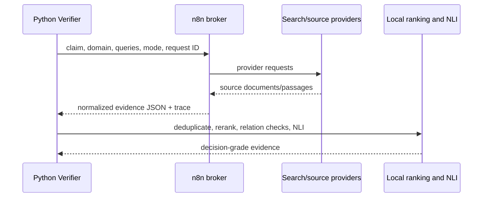

# Retrieval and n8n

Retrieval supplies candidate evidence. It is not itself verification.

`services/n8n_retrieval_client.py` supports single-claim and batched requests, header/bearer authentication, configurable timeout, health checks, multiple workflow response shapes and typed passage normalization. It preserves provider trace metadata but assigns `relevance_score=0` until the Python reranker executes.

When n8n is disabled, unavailable or insufficient, the Verifier's adapters and web fallback can retrieve evidence directly according to configuration. Tavily is an optional fallback and requires `TAVILY_API_KEY`.

The Verifier then performs URL/content deduplication, BGE relevance scoring, relation/entity guards, DeBERTa NLI, source weighting and claim aggregation. A successful webhook call cannot by itself produce `VERIFIED`.

See [`../n8n/README.md`](../n8n/README.md) and [`agents/verifier.md`](agents/verifier.md).
