# HalluciGuard Detector Agent

A reference-grounded, sentence-level hallucination detector. It accepts a draft LLM answer and evidence, labels each sentence as `SUPPORTED`, `CONTRADICTED`, or `NOT_ENOUGH_INFO`, and returns an answer-level hallucination risk.

This detector does **not** pretend that truth can be inferred from wording alone. Evidence is mandatory. `NOT_ENOUGH_INFO` means the supplied evidence is insufficient; it does not mean a claim is globally false.

## Design

- **Training data:** RAGTruth human span annotations, converted to sentence labels.
- **Model:** compact DeBERTa-v3 cross-encoder over `(evidence, sentence)`.
- **Leakage control:** train/dev partitioning is grouped by source document; the official RAGTruth test split is untouched.
- **Outputs:** per-sentence calibrated probabilities, exact character offsets, evidence snippets, aggregate risk, and a verifier-routing flag.
- **Calibration:** temperature scaling and the decision threshold are fitted only on dev predictions.

The implementation borrows the reference-conditioned checking formulation from MiniCheck and RefChecker, but contains original HalluciGuard code. RAGTruth is MIT licensed; MiniCheck is Apache-2.0 licensed. Their repositories are retained under `third_party/` for provenance.

The included `artifacts/detector-best` checkpoint is the completed one-epoch baseline described in [MODEL_CARD.md](MODEL_CARD.md). Its metrics are honest baseline results, not a claim of perfect open-world detection.

## Production integration

The production graph uses two calls through `orchestration/detector_bridge.py`:

1. **Pre-retrieval triage** receives the query and candidate answer. Because no evidence exists, it emits claim spans, `probability_available=false`, `inference_executed=false`, and routes to verification. It does not load the checkpoint or fabricate a truth score.
2. **Grounded inference** runs immediately after Verifier retrieval. It receives the same query/answer plus retrieved evidence, loads `artifacts/detector-best`, executes the trained model, applies calibration, and replaces the triage result before Judge.

```mermaid
flowchart LR
    Q[Query + candidate] --> S[Sentence spans]
    S --> T[Pre-retrieval triage]
    T --> R[Verifier retrieval]
    R --> X[Lexical evidence selection]
    X --> TOK[DeBERTa tokenizer<br/>evidence, sentence]
    TOK --> M[detector-best checkpoint]
    M --> L[Three-class logits]
    L --> C[Temperature scaling]
    C --> P[P contradicted + P not-enough-info]
    P --> K[Risk, routing and sentence contract]
```



## Input and output contract

Grounded input requires `user_query`, a non-empty candidate answer, and non-empty evidence. Runtime output includes probability, confidence, risk, action, model source/status, degradation reason, model load and inference proof, model/calibrator versions, calibration status, per-sentence spans/labels/probabilities, warnings and diagnostics. The canonical supervisor contract is smaller; the bridge retains these operational fields for audit.

## Training record

| Item | Recorded value |
|---|---|
| Dataset | RAGTruth human span annotations |
| Labels | `SUPPORTED`, `CONTRADICTED`, `NOT_ENOUGH_INFO` |
| Conversion | deterministic sentence spans and annotation overlap |
| Leakage control | source-grouped train/dev; official test untouched |
| Examples | train 29,832; dev 10,873; test 18,777 |
| Encoder | `microsoft/deberta-v3-xsmall` with a fresh three-class head |
| Artifact run | 1 epoch, batch size 16, maximum length 256, seed 42 |
| Optimizer | AdamW; implementation default LR `2e-5`, weight decay `0.01` |
| Schedule / clipping | linear, 6% warmup; gradient clipping 1.0 |
| Precision/device | AMP on CUDA; report records CUDA, not the exact GPU model |

The artifact report does not record every possible command-line override. Missing hardware or run values are not inferred.

## Calibration and held-out evaluation

Temperature scaling is fitted only on development logits. The persisted temperature is `0.7586129308` and the dev-selected hallucination threshold is `0.6216216216`. Hallucination probability is calibrated `P(CONTRADICTED) + P(NOT_ENOUGH_INFO)`, not a raw logit.

| Metric | Value |
|---|---:|
| Accuracy | 0.8655 |
| Precision | 0.3083 |
| Recall | 0.5332 |
| F1 | 0.3907 |
| ROC-AUC | 0.8212 |
| PR-AUC | 0.2886 |
| ECE | 0.1296 |
| False-positive rate | 0.1053 |
| False-negative rate | 0.4668 |

Confusion counts: TN 15,441; FP 1,817; FN 709; TP 810 over 18,777 sentences. The runtime entity-conflict guard is excluded from these figures.

## Failure behavior

- Missing evidence: honest triage result, no inference, force verification.
- Missing/corrupt artifact or inference exception: degraded, risk `HIGH`, action `Verify`, reason retained.
- Model/calibration failure never silently substitutes another Detector.
- `NOT_ENOUGH_INFO` means the supplied evidence is inadequate, not that the claim is globally false.
- Judge treats Detector output as triage and consumes independent Verifier verdicts.

## Install and reproduce

```powershell
python -m pip install -r requirements.txt
python -m halluciguard_detector.cli prepare-data
python -m halluciguard_detector.cli train-model --epochs 3 --batch-size 8
python -m halluciguard_detector.cli evaluate-model
python -m pytest -q halluciguard_detector/tests
```

Training starts a fresh fine-tuning run from the named pretrained language-model checkpoint. It does not reuse HalluciGuard detector weights. Training a useful language encoder from random tokens would require vastly more data and compute and is intentionally not claimed here.

## Run

Test your own LLM answer directly:

```powershell
python -m halluciguard_detector.cli predict-text `
  --query "Who created Java?" `
  --answer "Java was created by Snehith in 1995." `
  --evidence "Java was designed by James Gosling at Sun Microsystems and released in 1995."
```

Use `-e` more than once to supply multiple evidence passages. The detector
cannot establish truth from the query and answer alone; evidence is required.

Run the compatibility Base LLM → Detector → Verifier slice:

```powershell
python scripts/test_llm_detector_verifier_slice.py --query "Who created Java?" --force-verifier
```

```powershell
$env:HALLUCIGUARD_DETECTOR_MODEL = "artifacts/detector-best"
uvicorn halluciguard_detector.api:app --host 0.0.0.0 --port 8000
```

```json
POST /v1/detect
{
  "user_query": "Who created Java?",
  "draft_answer": "Java was created by Snehith in 1995. It was developed at Sun Microsystems.",
  "evidence": ["Java was designed by James Gosling at Sun Microsystems and released in 1995."]
}
```

## Operational boundary

This component is a triage detector, not the final Judge. Route `CONTRADICTED` and `NOT_ENOUGH_INFO` claims to HalluciGuard's evidence Verifier. Metrics are dataset-specific and must not be described as proof that the model "works perfectly" on open-world facts.

## Research basis

The reference-conditioned formulation is informed by RAGTruth, MiniCheck and RefChecker. HalluciGuard's preprocessing, trained checkpoint, calibration, entity guard, contracts and orchestration integration are implemented in this repository. See [`../docs/research.md`](../docs/research.md).
