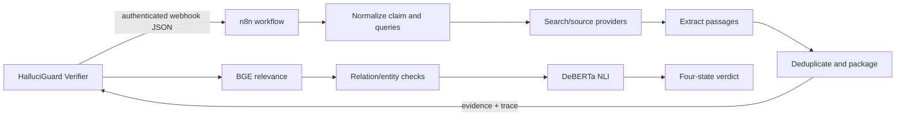

# n8n retrieval broker

n8n is an optional retrieval and integration layer. It is **not** the Verifier and does not have authority to declare a claim true.



## Versioned workflow exports

| File | Role |
|---|---|
| `halluciguard-verify-v2.json` | Version 2 workflow export used by the existing client contract |
| `halluciguard_n8n_v2_updated.json` | Updated V2 export/variant retained for provenance |
| `workflow_backup_v2.json` | Minimal V2 backup export |
| `halluciguard-verify-v3.json` | Local V3 workflow candidate; include only after credential-safe validation |

The Python client currently targets a configurable webhook rather than a hardcoded cloud account. It accepts evidence arrays, passage arrays, result arrays and batched claim shapes, then normalizes them into `Passage` objects.

## Configuration

```env
N8N_RETRIEVAL_ENABLED=false
N8N_RETRIEVAL_WEBHOOK_URL=
N8N_HEALTH_WEBHOOK_URL=
N8N_AUTH_MODE=header
N8N_HEADER_NAME=X-API-Key
N8N_WEBHOOK_SECRET=
N8N_TIMEOUT_SECONDS=60
```

The project has used temporary public tunnel URLs during local development. Tunnel hostnames are deployment details, not credentials or stable endpoints; set current values only in `.env`. Never embed n8n credentials, provider tokens or webhook secrets in an exported workflow.

## Import and operate

1. Import the selected JSON export into n8n.
2. Inspect every credential reference and replace it with n8n-managed credentials or environment expressions.
3. Configure the webhook path and authentication.
4. Activate the workflow.
5. Put its URL and secret in the backend `.env`.
6. Run the n8n retrieval tests or the full demo and inspect the returned trace.

If n8n is unavailable, the client returns a controlled failure and the Verifier may use its configured Python retrieval fallback. A webhook 200 response is not a factual verdict.
