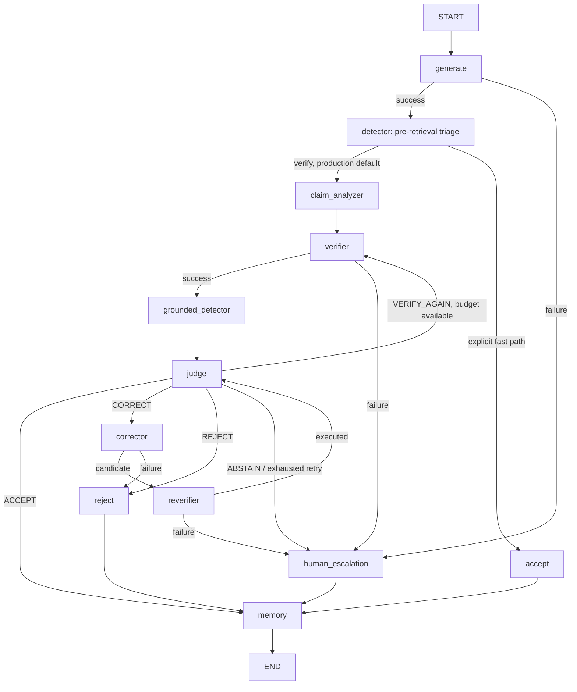

# LangGraph orchestration

`orchestration/` is HalluciGuard's control plane. It owns execution order, canonical state, bounded retries, terminal routing, errors, trace events, and the product FastAPI surface. It does not decide factual truth by itself.

## Actual production graph



The Detector executes twice. Before retrieval it performs sentence triage and routes factual content without inventing a truth probability. After Verifier evidence exists, `grounded_detector` loads `artifacts/detector-best`, executes calibrated inference, and replaces the triage result before Judge.

## Package map

| File | Responsibility |
|---|---|
| `graph.py` | Nodes, conditional edges, retries, correction/reverification loop, terminal state |
| `state.py` | `HalluciGuardState`, trace, error and inter-agent bus helpers |
| `schemas.py` | Canonical Detector, Verifier, Judge, Corrector, ReVerifier and Memory contracts |
| `detector_bridge.py` | Single adapter for triage and grounded trained-model execution |
| `api.py` | Authentication, history, health, `/verify`, and `/api/v1/verify` |
| `auth.py` | SQLite account/history support and JWT handling |
| `runtime_validation.py` | Configuration, detector artifact and verifier runtime checks |
| `intent.py` | Query intent/domain support |
| `scripts/verify_e2e.py` | Command-line E2E helper |
| `tests/` | Graph, contract, failure, retry and integration regressions |

## State and contracts

`HalluciGuardState` carries request IDs, query, candidate response, claim analysis, detector results, Verifier reports, Judge decision, correction/reverification state, memory result, retry counters, errors, bus messages and trace events.

Pydantic contracts in `schemas.py` are the authoritative inter-agent boundary. Legacy dictionaries remain for compatibility and human-readable display. Unknown verdicts and invalid states fail closed rather than being converted into success.

## Routing invariants

- `ALWAYS_VERIFY=true` is the production default.
- A Detector fast path requires `ALLOW_DETECTOR_FAST_PATH=true` and `ALWAYS_VERIFY=false`.
- `VERIFY_AGAIN` is bounded by `max_retries`.
- `CORRECT` is bounded by the correction attempt budget.
- Corrected content must pass ReVerifier before Judge may accept it.
- Every terminal route crosses Memory, but Memory writes only Judge-accepted verified facts.
- Model and retrieval failures end in rejection or human review, never a verified-looking result.

## API

```powershell
uvicorn orchestration.api:app --host 0.0.0.0 --port 8000
```

The product request accepts a `user_query`, `generation_mode`, and optional domain/history fields. Supplying an existing `llm_response` remains a compatibility/testing path; the query-only demo invokes the Base LLM normally.

See [`../docs/api.md`](../docs/api.md) and [`../docs/architecture.md`](../docs/architecture.md).
