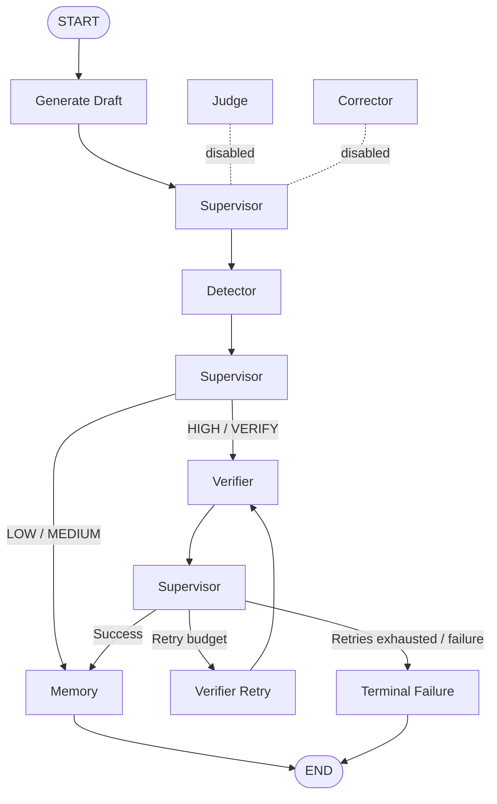

# 🕸️ HalluciGuard LangGraph Orchestration

> **FastAPI → Base LLM → LangGraph Supervisor → Agents → Structured Result**

The `orchestration/` package is the control plane of HalluciGuard. It coordinates agent execution, shared state, conditional routing, retries, failures, observability and inter-agent communication.

**LangGraph is the workflow runtime. It is not the Judge Agent.**

---

## 🎯 Current Active Path

The current active development path intentionally keeps the system smaller while Judge and Corrector are independently validated:



### Active components

- Base LLM / draft generation — under live provider validation.
- Detector Agent.
- Verifier Agent.
- Memory Agent.
- LangGraph Supervisor.
- Structured Inter-Agent Bus.

### Disabled components

- Judge Agent — retained but not executed.
- Corrector Agent — retained but not executed.

This is deliberate. The graph must never manufacture Judge/Corrector output merely to make a demo look complete.

---

## 🧠 What the Supervisor Does

The Supervisor answers:

> **“Which component should execute next?”**

It controls:

- lifecycle routing;
- conditional transitions;
- retry budget;
- failure handling;
- terminal state;
- execution trace.

It does **not** determine whether a factual claim is true.

That job belongs to the Verifier and, in the future five-agent graph, the Judge.

---

## 🔄 Shared State

`orchestration.state.HalluciGuardState` is the common contract between nodes.

It carries information such as:

```text
execution_id
request_id
user_query
draft_response
generation metadata
detector output
claims
evidence
retrieved / ranked evidence
NLI results
memory output
retry state
errors
trace
inter-agent bus
terminal status
```

The goal is to prevent agents from passing unstructured one-off dictionaries directly to one another.

---

## 🔄 Inter-Agent Communication Bus

`orchestration/interbus.py` provides a lightweight in-process event/message layer backed by the shared graph state.

Each message contains:

```text
message_id
execution_id
source_agent
target_agent
message_type
payload
timestamp
status
```

Example:

```json
{
  "source_agent": "detector",
  "target_agent": "verifier",
  "message_type": "SUSPICIOUS_CLAIMS",
  "payload": {
    "risk_level": "HIGH",
    "hallucination_probability": 0.91
  }
}
```

This provides a traceable communication contract without introducing distributed brokers that the current project does not need.

---

## 🧩 Current Graph Semantics

### Generation

The Base LLM produces the candidate draft.

A generation failure must stop the trust pipeline cleanly. Detector must never receive an empty/fake response.

### Detector

The existing `DetectorAgent.detect(user_query, draft_response)` contract is reused.

- LOW / MEDIUM → fast path.
- HIGH / VERIFY → Verifier.

### Verifier

The existing `VerificationPipeline.verify(...)` is reused. Its retrieval, ranking, NLI and evidence logic stay inside the Verifier.

### Memory

Memory can persist appropriate verified facts and preserve system history.

Unverified/degraded content must not silently become trusted factual knowledge.

---

## 🔁 Retry Logic

Retries are bounded by configuration.

Conceptually:

```text
Verifier failure
      ↓
retry_count < MAX_RETRIES ?
      ├── yes → Verifier again
      └── no  → terminal failure
```

There must never be an infinite verification loop.

---

## 🚨 Failure Semantics

A failed component must stay failed.

Examples:

```text
LLM unavailable       → generation_failed
Detector unavailable  → detector_failed
Verifier unavailable  → bounded retry / failure
NLI unavailable       → degraded NLI, never fake evidence
Memory write failure  → preserve error / partial state
```

Do not replace an exception with an artificial success result.

---

## 📊 Observability

Each important node should contribute trace information such as:

```text
node
status
timestamp
latency_ms
retry_count
details
```

The execution should also expose:

- `execution_id`;
- `request_id`;
- structured errors;
- bus messages;
- terminal status.

This trace is intended to become the backend source for the future frontend execution studio.

---

## 🔌 API

The orchestration layer is exposed through FastAPI.

Canonical endpoint:

```text
POST /verify
```

A compatibility `/api/v1/verify` route may call the same backend implementation when required by the frontend contract.

Example product request:

```json
{
  "user_query": "What is the capital of France?",
  "generation_mode": "normal"
}
```

Backward-compatible internal testing can supply an existing `llm_response` instead of invoking the Base LLM.

The response should include structured generation, Detector, Verifier and Memory information plus trace/error metadata.

---

## 🧪 Testing Strategy

Separate these categories:

```text
Unit Tests
Contract Tests
Model Runtime Tests
Agent Integration Tests
Real E2E Tests
Browser E2E Tests
```

A deterministic routing test is not a real production E2E test.

The strongest real E2E milestone for the current active graph is:

```text
Base LLM
  ↓
Detector
  ↓
Verifier (when required)
  ↓
Memory
  ↓
END
```

---

## 🗺️ Current vs Target Architecture

### Current

```text
Base LLM
   ↓
Supervisor
   ↓
Detector
   ├── fast path → Memory
   └── verify → Verifier → Memory
```

### Target

```text
Base LLM
   ↓
Detector
   ↓
Verifier
   ↓
Judge
   ├── ACCEPT
   ├── VERIFY_AGAIN
   ├── CORRECT
   ├── REJECT
   └── ESCALATE_HUMAN
          ↓
      Corrector / Human
          ↓
        Memory
```

Judge and Corrector will be returned to the active graph only after their separate runtime and semantic validation is complete.

---

## 📂 Package Map

```text
orchestration/
├── graph.py                 # StateGraph and active node wiring
├── state.py                 # Shared typed state / trace helpers
├── supervisor.py            # Control-plane routing
├── interbus.py              # Structured inter-agent messages
├── api.py                   # FastAPI endpoints
├── runtime_validation.py    # Startup/model checks
├── scripts/                 # E2E and utility scripts
└── tests/                   # Contract / execution / validation tests
```

---

## 🚦 Current Status

```text
Shared State             ✅
Supervisor               ✅
Inter-Agent Bus          ✅
Bounded Retry            ✅
Trace / Audit             ✅
Active Detector           ✅
Active Verifier           ✅
Active Memory             ✅
Base LLM integration      🟡 Live provider validation pending
Judge in graph            ❌ disabled
Corrector in graph        ❌ disabled
Browser E2E               🔜 pending
Production deployment     🔜 pending
```

---

## 🔗 Related Documentation

- [Root HalluciGuard README](../README.md)
- [Detector Agent](../agents/detector_agent/README.md)
- [Verifier Agent](../agents/verifier_agent/README.md)
- [Judge Agent](../agents/judge_agent/README.md)
- [Corrector Agent](../agents/corrector_agent/README.md)
- [Memory Agent](../agents/memory_agent/README.md)
