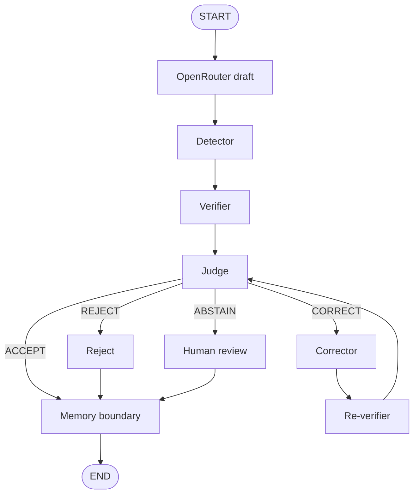

# 🕸️ HalluciGuard LangGraph Orchestration

> **FastAPI → Base LLM → LangGraph Supervisor → Agents → Structured Result**

The `orchestration/` package is the control plane of HalluciGuard. It coordinates agent execution, shared state, conditional routing, retries, failures, observability and inter-agent communication.

**LangGraph is the workflow runtime. It is not the Judge Agent.**

---

## 🎯 Current Active Path

The production-safe default runs every generated answer through the evidence pipeline:



### Active components

- OpenRouter Base LLM / draft generation.
- Detector Agent.
- Verifier Agent.
- Judge Agent.
- Corrector Agent (OpenRouter-backed by default).
- Re-verifier.
- Memory Agent.
- LangGraph Supervisor.
- Structured Inter-Agent Bus.

The n8n retrieval workflow is currently paused. Retrieval, reranking, NLI, and
scoring run through the Python Verifier path. A detector fast path exists only
as an explicit operator opt-in; production defaults to full verification.

---

## 🧠 What the Supervisor Does

The Supervisor answers:

> **“Which component should execute next?”**

It controls:

- lifecycle routing;
- conditional transitions;
- retry budget;
- failure handling;
- terminal state;
- execution trace.

It does **not** determine whether a factual claim is true.

That job belongs to the Verifier and Judge.

---

## 🔄 Shared State

`orchestration.state.HalluciGuardState` is the common contract between nodes.

It carries information such as:

```text
execution_id
request_id
user_query
draft_response
generation metadata
detector output
claims
evidence
retrieved / ranked evidence
NLI results
memory output
retry state
errors
trace
inter-agent bus
terminal status
```

The goal is to prevent agents from passing unstructured one-off dictionaries directly to one another.

---

## 🔄 Inter-Agent Communication Bus

`orchestration/interbus.py` provides a lightweight in-process event/message layer backed by the shared graph state.

Each message contains:

```text
message_id
execution_id
source_agent
target_agent
message_type
payload
timestamp
status
```

Example:

```json
{
  "source_agent": "detector",
  "target_agent": "verifier",
  "message_type": "SUSPICIOUS_CLAIMS",
  "payload": {
    "risk_level": "HIGH",
    "hallucination_probability": 0.91
  }
}
```

This provides a traceable communication contract without introducing distributed brokers that the current project does not need.

---

## 🧩 Current Graph Semantics

### Generation

The Base LLM produces the candidate draft.

A generation failure must stop the trust pipeline cleanly. Detector must never receive an empty/fake response.

### Detector

The existing `DetectorAgent.detect(user_query, draft_response)` contract is reused.

- All risk levels → Verifier by default.
- A LOW-risk fast path is available only when `ALLOW_DETECTOR_FAST_PATH=true`
  and `ALWAYS_VERIFY=false` are both set deliberately.

### Verifier

The existing `VerificationPipeline.verify(...)` is reused. Its retrieval, ranking, NLI and evidence logic stay inside the Verifier.

### Memory

Memory can persist appropriate verified facts and preserve system history.

Unverified/degraded content must not silently become trusted factual knowledge.

---

## 🔁 Retry Logic

Retries are bounded by configuration.

Conceptually:

```text
Judge requests another verification
      ↓
retry_count < MAX_RETRIES ?
      ├── yes → Verifier again
      └── no  → human review
```

There must never be an infinite verification loop.

---

## 🚨 Failure Semantics

A failed component must stay failed.

Examples:

```text
LLM unavailable       → generation_failed
Detector unavailable  → detector_failed
Verifier unavailable  → bounded retry / failure
NLI unavailable       → degraded NLI, never fake evidence
Memory write failure  → preserve error / partial state
```

Do not replace an exception with an artificial success result.

---

## 📊 Observability

Each important node should contribute trace information such as:

```text
node
status
timestamp
latency_ms
retry_count
details
```

The execution should also expose:

- `execution_id`;
- `request_id`;
- structured errors;
- bus messages;
- terminal status.

This trace is the backend source for the authenticated frontend verification view.

---

## 🔌 API

The orchestration layer is exposed through FastAPI.

Canonical endpoint:

```text
POST /verify
```

A compatibility `/api/v1/verify` route may call the same backend implementation when required by the frontend contract.

Example product request:

```json
{
  "user_query": "What is the capital of France?",
  "generation_mode": "normal"
}
```

Backward-compatible internal testing can supply an existing `llm_response` instead of invoking the Base LLM.

The response includes structured generation, Detector, Verifier, Judge,
Corrector, Re-verifier, and Memory information plus trace/error metadata.

---

## 🧪 Testing Strategy

Separate these categories:

```text
Unit Tests
Contract Tests
Model Runtime Tests
Agent Integration Tests
Real E2E Tests
Browser E2E Tests
```

A deterministic routing test is not a real production E2E test.

The strongest real E2E milestone for the current active graph is:

```text
Base LLM → Detector → Verifier → Judge
                              ├─ ACCEPT → Memory
                              └─ CORRECT → Corrector → Re-verifier → Judge
```

---

## 🗺️ Active Architecture

```text
Base LLM
   ↓
Detector
   ↓
Verifier
   ↓
Judge
   ├── ACCEPT
   ├── VERIFY_AGAIN
   ├── CORRECT
   ├── REJECT
   └── ESCALATE_HUMAN
          ↓
      Corrector / Human
          ↓
        Memory
```

Judge and Corrector are active. Their failures and exhausted retry budgets fail
closed to rejection or human review, and every terminal outcome crosses the
Memory boundary for audit without persisting unverified facts.

---

## 📂 Package Map

```text
orchestration/
├── graph.py                 # StateGraph and active node wiring
├── state.py                 # Shared typed state / trace helpers
├── supervisor.py            # Control-plane routing
├── interbus.py              # Structured inter-agent messages
├── api.py                   # FastAPI endpoints
├── runtime_validation.py    # Startup/model checks
├── scripts/                 # E2E and utility scripts
└── tests/                   # Contract / execution / validation tests
```

---

## 🚦 Current Status

```text
Shared State             ✅
Supervisor               ✅
Inter-Agent Bus          ✅
Bounded Retry            ✅
Trace / Audit             ✅
Active Detector           ✅
Active Verifier           ✅
Active Judge              ✅
Active Corrector          ✅ OpenRouter generator
Active Re-verifier        ✅
Active Memory             ✅
Base LLM integration      ✅ OpenRouter configuration required
Frontend integration      ✅ marketing + authenticated chat workspace
n8n retrieval             ⏸ paused
```

---

## 🔗 Related Documentation

- [Root HalluciGuard README](../README.md)
- [Detector Agent](../agents/detector_agent/README.md)
- [Verifier Agent](../agents/verifier_agent/README.md)
- [Judge Agent](../agents/judge_agent/README.md)
- [Corrector Agent](../agents/corrector_agent/README.md)
- [Memory Agent](../agents/memory_agent/README.md)
