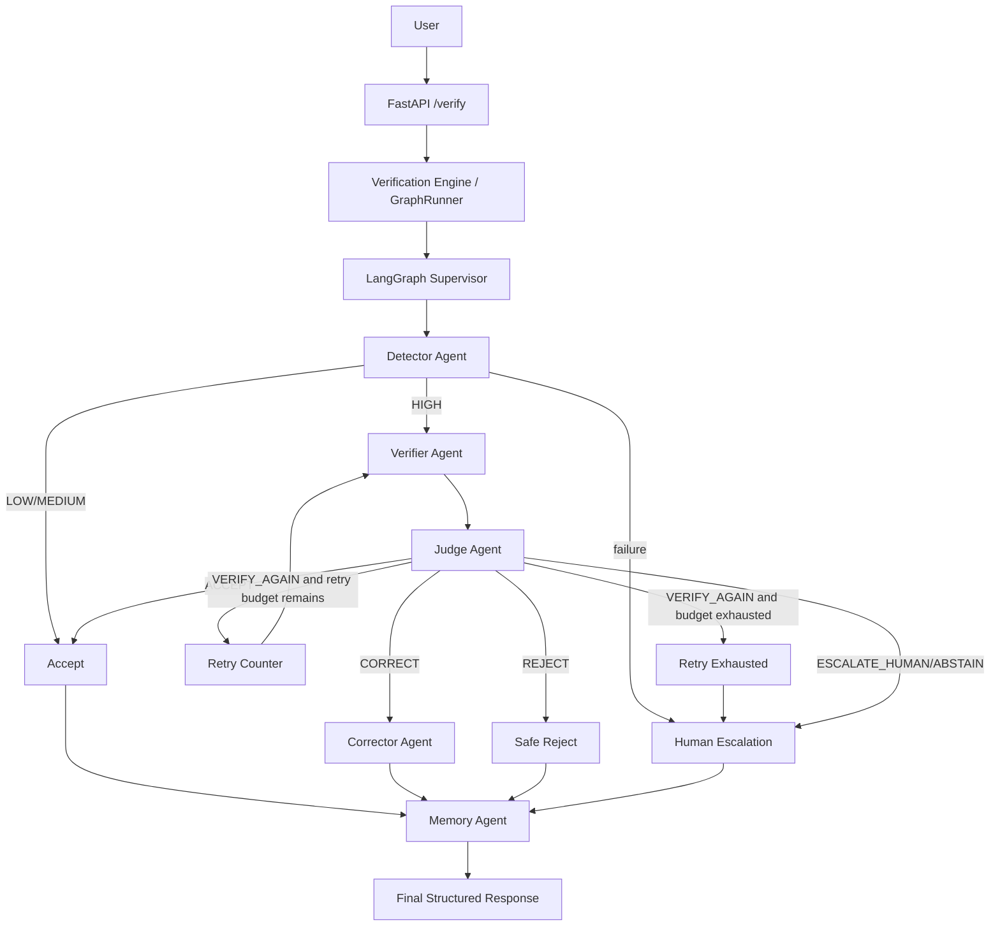

# HalluciGuard LangGraph Verification Engine

The `orchestration` package is the production-facing **FastAPI → Verification Engine / GraphRunner → LangGraph Supervisor** layer for HalluciGuard. It preserves the five separately built agents and only adapts their existing public contracts.

## Architecture



Supporting layers remain owned by the underlying agents: vector memory/FAISS, knowledge graph, cache, retrieval adapters, rerankers, NLI, evidence scoring, audit logs, and model clients.

## Shared state

`orchestration.state.HalluciGuardState` is the typed inter-agent communication contract. It carries:

- request and execution metadata: `execution_id`, `request_id`, timestamps, `user_query`, `llm_response`, `domain`;
- Detector output: `detector`, `hallucination_probability`, `confidence`, `route`;
- Verifier output: `claims`, `evidence`, `retrieved_evidence`, `ranked_evidence`, `nli_results`, `verifier`, `judge_pairs`;
- Judge output: `judge`, `judge_decision`;
- Corrector and Memory output: `corrector`, `memory`, `memory_context`, `knowledge_graph_context`;
- control fields: `retry_count`, `max_retries`, `terminal_status`, `verification_status`, `final_response`, structured `errors`;
- observability/audit: append-only `trace` events and `audit` metadata.

Every node returns partial state updates; agents do not pass random dictionaries directly to each other.

## Existing agents reused

- Detector: `agents.detector_agent.detector.DetectorAgent.detect(user_query, llm_response)`.
- Verifier: `agents/verifier_agent/api/pipeline.py::VerificationPipeline.verify(...)`; the full retrieval, ranking, NLI, evidence scoring, reliability, cache, and formatting pipeline remains inside the Verifier.
- Judge: `agents/judge_agent/decision_intelligence.py::DecisionIntelligenceEngine.evaluate(...)`.
- Corrector: `agents/corrector_agent/app/orchestrator.py::CorrectorOrchestrator.executeCorrectionPipeline(...)`.
- Memory: `agents/memory_agent/memory/memory_agent.py::MemoryAgent.store_fact(...)`, including the knowledge graph, verification cache, source trust, pattern learning, and FAISS vector store.

## Routing and retry behavior

- Detector `ACCEPT` fast-path skips expensive verification and proceeds to Memory/final response.
- Detector `VERIFY` enters the Verifier.
- Judge outcomes are explicit:
  - `ACCEPT` → Accept → Memory → final response.
  - `CORRECT` → Corrector → Memory → corrected response.
  - `VERIFY_AGAIN` → Retry node → Verifier while `retry_count < max_retries`.
  - retry limit exhausted → Retry Exhausted → Human Escalation → Memory.
  - `REJECT` → Safe Reject → Memory.
  - `ESCALATE_HUMAN`, `HUMAN_ESCALATE`, or `ABSTAIN` → Human Escalation → Memory.
- `HALLUCIGUARD_MAX_VERIFICATION_RETRIES` configures the bounded loop and defaults to `2`.

## Failure handling and observability

Each graph node records a trace event with node name, status, timestamp, retry count, latency where available, and sanitized details. Agent failures are captured in `errors` and routed to a graceful terminal path instead of crashing the graph. Memory persistence is skipped when there are no verifier facts to store, keeping temporary LangGraph state separate from persistent memory.

## API

Run:

```bash
uvicorn orchestration.api:app --host 127.0.0.1 --port 8010
```

Request:

```bash
curl -X POST http://127.0.0.1:8010/verify \
  -H "Content-Type: application/json" \
  -d '{"user_query":"What is the capital of France?","llm_response":"The capital of France is Paris.","domain":"general"}'
```

Response includes `execution_id`, `request_id`, `final_response`, `terminal_status`, `verification_status`, five-agent outputs where reached, `retry_count`, `errors`, `audit`, and `trace`.

## Tests

```bash
python -m pytest orchestration/tests -q
python -m orchestration.scripts.verify_e2e
```

The pytest suite validates graph construction, state/trace contracts, all conditional Judge routes, bounded retry behavior, graceful failure routing, and complete graph execution with deterministic node overrides. The E2E script invokes the real graph nodes and reports which real agents were reached. If required model artifacts or external services are missing, the graph returns structured failure/human-review state and records the exact error.

## Current local E2E note

In this checkout, the real Detector cannot load because `artifacts/halueval-detector-final` is absent and `HALUEVAL_MODEL_PATH` is not set. The real E2E therefore exercises the Detector failure path and reaches `detector -> human_escalation -> memory` rather than the full Detector → Verifier → Judge chain. Install/provide the Detector artifact to run the complete real-agent path.
