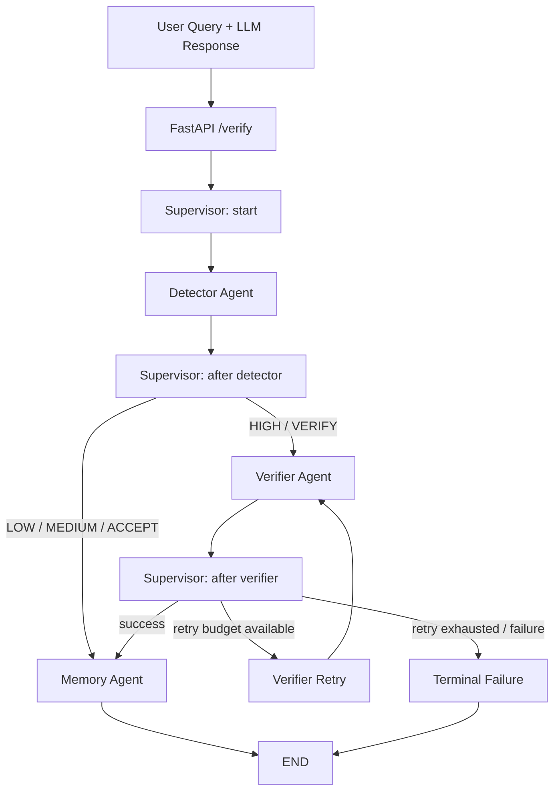

# HalluciGuard LangGraph Orchestration

The `orchestration` package is the production-facing FastAPI → LangGraph Supervisor layer for the currently validated HalluciGuard trust path.

## Current active architecture



### Active agents

1. Detector Agent — real HaluEval classifier.
2. Verifier Agent — existing nine-stage verification pipeline, including the validated local NLI model.
3. Memory Agent — existing persistent memory/knowledge-graph/vector-memory implementation.

### Disabled agents

Judge and Corrector remain in the repository because they are part of the intended five-agent architecture, but they are **not active graph nodes** in this orchestration revision. They are never invoked, their outputs are never fabricated, and the API explicitly reports them as `not_executed`.

This is intentional until those agents are independently validated.

## Supervisor

`orchestration/supervisor.py` contains the control-plane Supervisor. It decides **which agent executes next**; it does not make factual decisions and is not a replacement for the Judge Agent.

The Supervisor controls:

- graph phase transitions;
- active-agent routing;
- failure routing;
- bounded verifier retries;
- explicit disabled-agent state.

## Inter-agent communication bus

`orchestration/interbus.py` defines a structured in-process bus backed by LangGraph shared state.

Each message contains:

- `message_id`
- `execution_id`
- `source_agent`
- `target_agent`
- `message_type`
- `payload`
- `timestamp`
- `status`

Current messages include `SUSPICIOUS_CLAIMS`, `DETECTOR_ACCEPT`, `VERIFICATION_RESULT`, and `MEMORY_WRITE_RESULT`.

No external Kafka/RabbitMQ/Redis infrastructure is required for this project-level orchestration layer.

## Shared state

`orchestration.state.HalluciGuardState` is the single typed inter-agent contract. It carries request metadata, Detector output, Verifier evidence/NLI output, Memory output, bus messages, retry state, errors, terminal status, trace events, and audit metadata.

Judge/Corrector fields remain present only for compatibility with the broader project schema; they are not populated by the active graph.

## Failure policy

No orchestration node may turn an exception into a successful result.

- Detector failure → terminal `failed`.
- Verifier failure → bounded retry; after the retry budget is exhausted → terminal `failed`.
- Memory failure after successful verification → `partial_success`, with the real error preserved.
- Missing verifier claim evidence → no fabricated verification; the graph records the actual condition.

The orchestration layer does not create synthetic NLI probabilities, evidence, verdicts, or memory IDs.

## Local NLI configuration

The existing Verifier local NLI integration remains the source of truth. The active orchestration layer does not replace or retrain it.

Expected local configuration in the Verifier environment:

```text
NLI_MODEL=C:\temp\test_nli
ALLOW_MODEL_DOWNLOADS=false
```

The large local model directory must never be committed to GitHub.

## API

Run:

```bash
uvicorn orchestration.api:app --host 127.0.0.1 --port 8010
```

Health:

```bash
curl http://127.0.0.1:8010/health
```

Verification:

```bash
curl -X POST http://127.0.0.1:8010/verify ^
  -H "Content-Type: application/json" ^
  -d "{\"user_query\":\"What is the capital of France?\",\"llm_response\":\"The capital of France is Paris.\",\"domain\":\"general\"}"
```

The response includes the actual Detector/Verifier/Memory outputs, terminal status, retries, errors, inter-agent bus, and execution trace. Judge and Corrector are explicitly returned as `not_executed`.

## Validation

The repository should distinguish deterministic routing tests from real E2E tests.

Recommended commands:

```bash
python -m pytest orchestration/tests -q
python -m compileall orchestration
```

For a real E2E run, execute the graph with the actual Detector artifact, actual Verifier, actual local NLI model, and actual Memory implementation. Do not report a real E2E pass if any active component was mocked, bypassed, or replaced by a constant fallback.

## Scope boundary

This revision intentionally does **not** modify the internal Judge or Corrector implementations. Their existing source remains available for a separate, independent validation effort before they are wired back into LangGraph.
